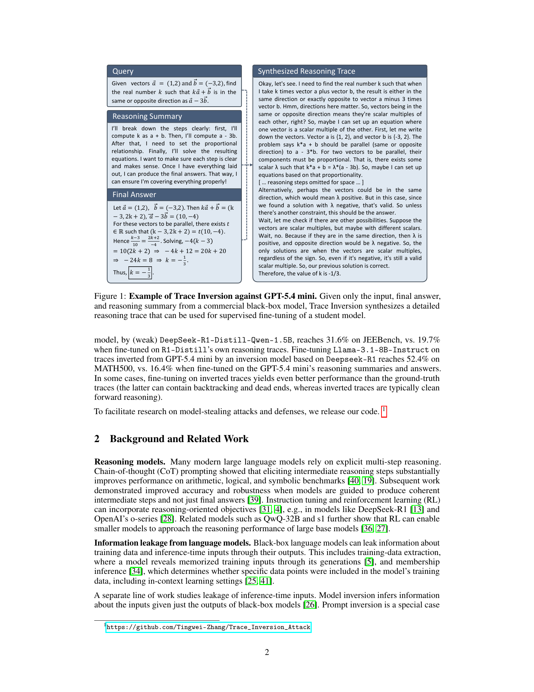
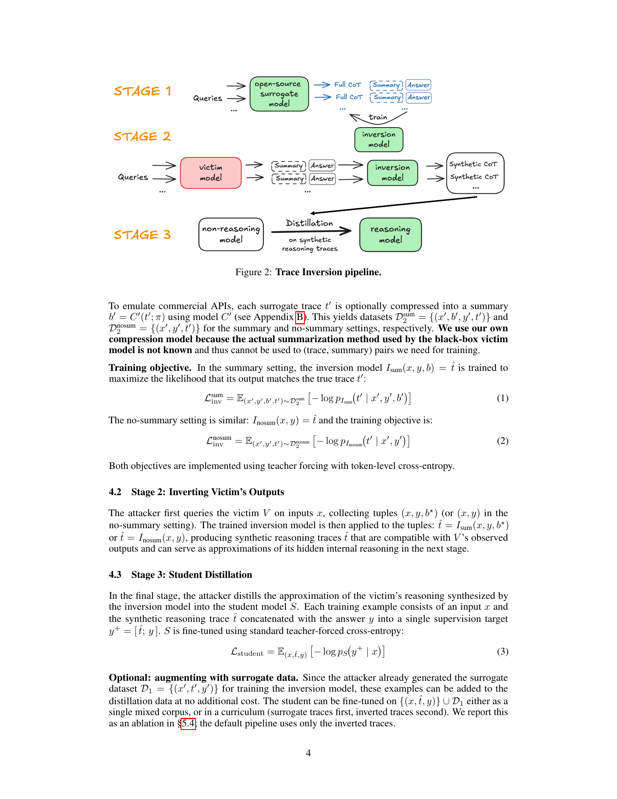
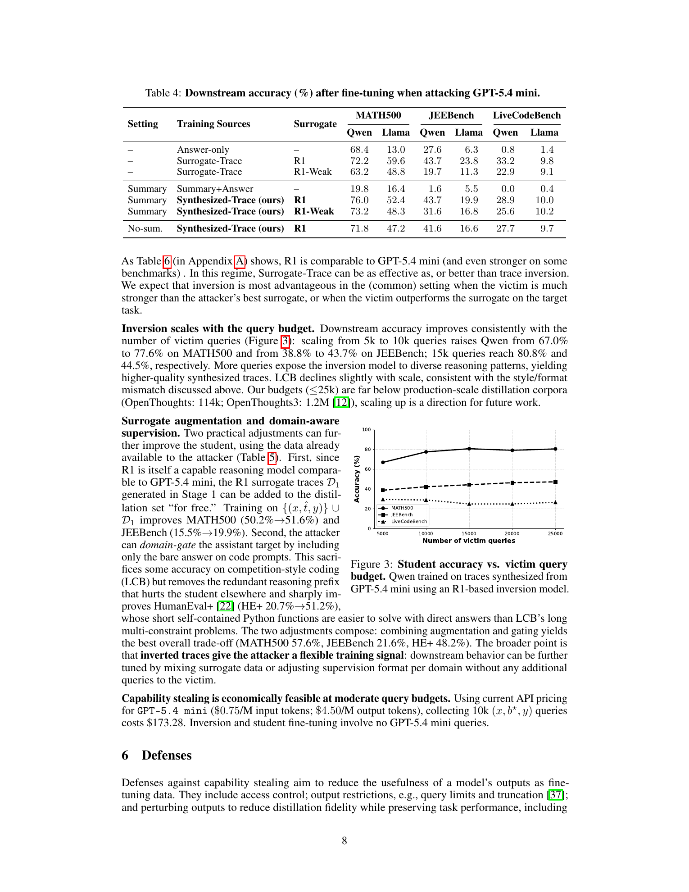
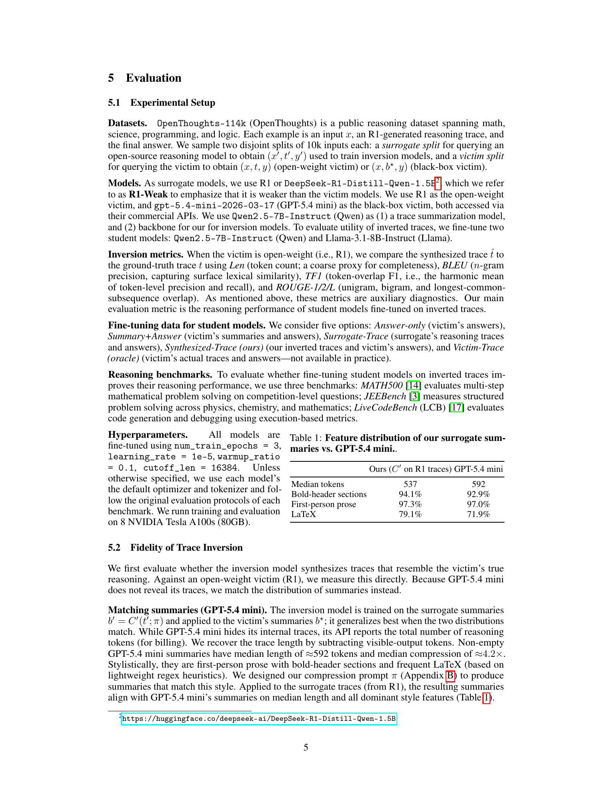
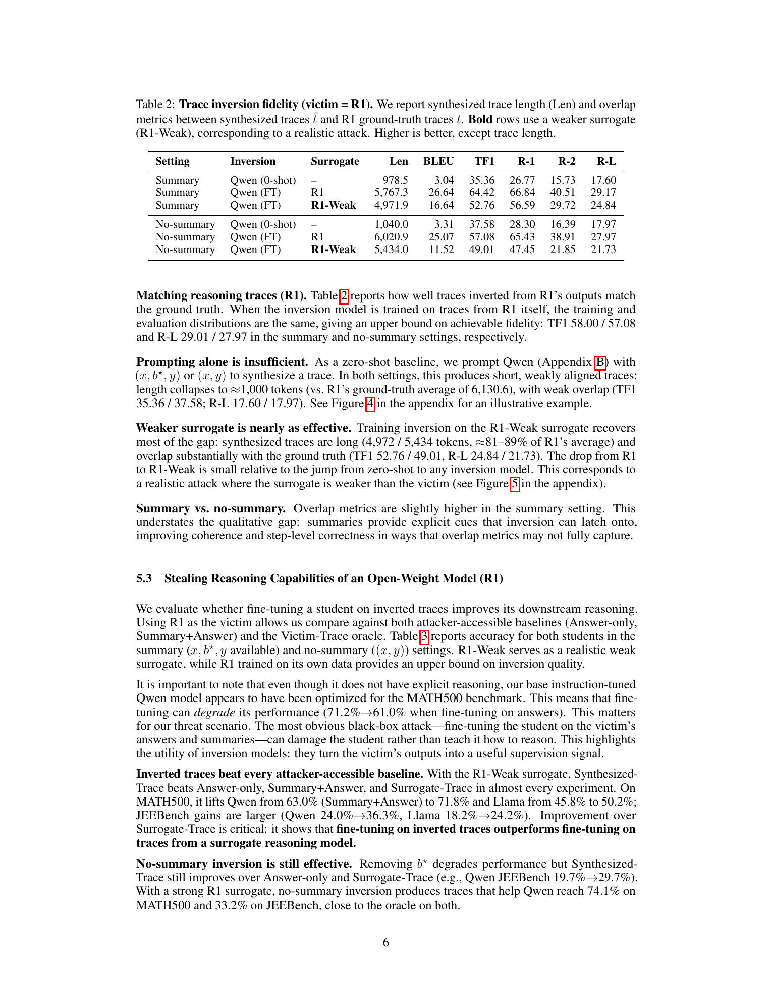
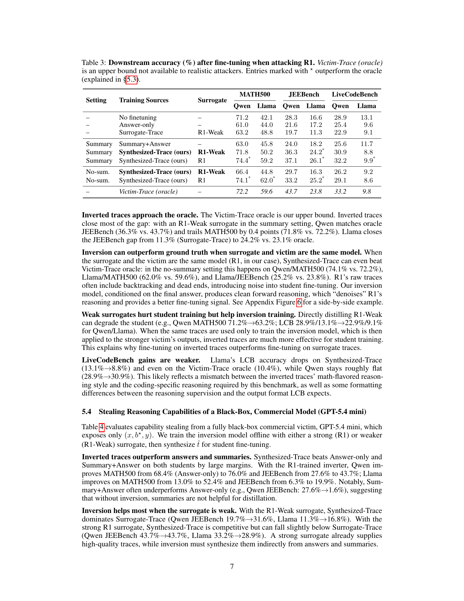

# How to Steal Reasoning Without Reasoning Traces

## TL;DR

This paper argues that hiding full chain-of-thought traces is not enough to prevent capability stealing from reasoning models. The authors introduce Trace Inversion: train an inversion model on public/surrogate reasoning traces, then use only a victim model's input, final answer, and optionally a short reasoning summary to synthesize long-form traces for student fine-tuning. In experiments, these inverted traces outperform direct fine-tuning on answers or summaries, often beat fine-tuning on weak surrogate traces, and can substantially improve Qwen-2.5-7B and Llama-3.1-8B students on MATH500 and JEEBench.

Source: [arXiv:2603.07267](https://arxiv.org/abs/2603.07267), [PDF](https://arxiv.org/pdf/2603.07267.pdf), [code](https://github.com/Tingwei-Zhang/Trace_Inversion_Attack)

## Background

Reasoning models often generate internal chains of thought but expose only final answers or short user-facing summaries. This is meant to reduce leakage of sensitive reasoning, safety policy details, private context, and proprietary capability. The implicit assumption is that summaries preserve user value while making distillation attacks less effective.

Prior work shows that fine-tuning a student on teacher-generated reasoning traces transfers more reasoning capability than fine-tuning on final answers alone. Therefore, if a deployed model exposes full chains of thought, attackers can use them as high-value supervised data. This paper studies the harder and more realistic setting where the victim does not expose those traces.

## Problem

The threat model has a black-box victim model \(V\). For an input \(x\), the victim internally produces a reasoning trace \(t\), but the user only sees the final answer \(y\) and optionally a compressed summary:

\[
b^\star = C(t), \qquad |b^\star| \ll |t|.
\]

The attacker wants to improve a student model \(S\) without access to \(V\)'s parameters, logits, training data, or true trace \(t\). The available resources are public reasoning datasets, a weaker surrogate reasoning model \(V'\), a compression model \(C'\), and trainable inversion/student models.

The central question is practical rather than philosophical: can synthetic traces \(\hat{t}\), inferred from only \((x, y)\) or \((x, b^\star, y)\), become useful enough supervision to transfer the victim's reasoning capability?

## Method

Trace Inversion is a three-stage pipeline.

First, the attacker trains an inversion model using a public reasoning dataset. Inputs \(x'\) are sent to a surrogate model \(V'\), producing surrogate traces and answers \((t', y')\). If the attack setting includes summaries, a compression model \(C'\) maps each surrogate trace into a synthetic summary \(b' = C'(t')\). This creates supervised inversion data:

\[
D_{\mathrm{sum}} = \{(x', b', y', t')\}, \qquad
D_{\mathrm{nosum}} = \{(x', y', t')\}.
\]

The summary-setting inverter is trained with teacher forcing:

\[
L_{\mathrm{inv}}^{\mathrm{sum}}
= \mathbb{E}_{D_{\mathrm{sum}}}
\left[-\log p_{I_{\mathrm{sum}}}(t' \mid x', y', b')\right].
\]

The no-summary setting uses the same objective without \(b'\):

\[
L_{\mathrm{inv}}^{\mathrm{nosum}}
= \mathbb{E}_{D_{\mathrm{nosum}}}
\left[-\log p_{I_{\mathrm{nosum}}}(t' \mid x', y')\right].
\]

Second, the attacker queries the victim model on selected inputs and receives only observable outputs: \((x, b^\star, y)\) or \((x, y)\). The trained inverter generates a synthetic reasoning trace:

\[
\hat{t} = I_{\mathrm{sum}}(x, y, b^\star)
\quad \text{or} \quad
\hat{t} = I_{\mathrm{nosum}}(x, y).
\]

Third, a student model is fine-tuned on the input and a target sequence that concatenates the synthetic trace and the victim answer:

\[
y^+ = [\hat{t}; y],
\qquad
L_{\mathrm{student}}
= \mathbb{E}_{(x,\hat{t},y)}
\left[-\log p_S(y^+ \mid x)\right].
\]

The paper also evaluates variants that mix in surrogate traces or gate the target format by domain, but the core result is that inverted traces are useful even without these additions.

## Experiments

The experiments use OpenThoughts-114k as the public reasoning source, with disjoint 10K-input splits for surrogate training and victim querying. The surrogate is either DeepSeek-R1 or a much weaker DeepSeek-R1-Distill-Qwen-1.5B, called R1-Weak. The open-weight victim is R1, and the black-box commercial victim is `gpt-5.4-mini-2026-03-17`, which exposes answers and short summaries. Student models are Qwen2.5-7B-Instruct and Llama-3.1-8B-Instruct.

For inversion fidelity against the open-weight R1 victim, a fine-tuned Qwen inverter trained on R1-Weak traces recovers long traces with substantial overlap: in the summary setting, average synthesized length is 4,971.9 tokens, token-overlap F1 is 52.76, and ROUGE-L is 24.84. Zero-shot prompting is far weaker, producing roughly 1,000-token traces and much lower overlap.

For downstream capability transfer from R1, inverted traces beat attacker-accessible baselines in most settings. With R1-Weak as the surrogate and summaries available, Qwen reaches 71.8% on MATH500 and 36.3% on JEEBench, compared with 63.0% and 24.0% for Summary+Answer, and 63.2% and 19.7% for direct Surrogate-Trace. Llama similarly improves from 45.8% to 50.2% on MATH500 and from 18.2% to 24.2% on JEEBench.

The black-box commercial setting is the most important result. For GPT-5.4 mini, fine-tuning directly on summaries and answers can be actively harmful: Qwen JEEBench drops to 1.6% in the reported table. In contrast, synthesized traces from an R1-trained inverter give Qwen 76.0% on MATH500 and 43.7% on JEEBench; for Llama, they give 52.4% on MATH500 and 19.9% on JEEBench. With the weaker R1-Weak surrogate, synthesized traces still dominate weak-surrogate direct distillation on JEEBench: Qwen improves from 19.7% to 31.6%, and Llama from 11.3% to 16.8%.

The attack scales with query budget. For Qwen trained on GPT-5.4-mini-derived inverted traces, increasing victim queries from 5K to 10K raises MATH500 from 67.0% to 77.6% and JEEBench from 38.8% to 43.7%; 15K queries reach 80.8% and 44.5%. The paper estimates 10K GPT-5.4 mini queries at $173.28 under the pricing used in the study.

LiveCodeBench is a weaker point. Improvements are smaller or negative for some Llama settings, which the authors attribute to mismatch between math-flavored inverted traces and coding-specific output formats.

## Critical Analysis

The paper's key insight is that exact reconstruction of hidden reasoning is not necessary. The inverted trace only needs to be a useful training target. That reframes the defense problem: hiding chains of thought may stop direct trace copying, but it does not stop attackers from manufacturing plausible traces aligned with the victim's answers.

The strongest evidence is the comparison against Surrogate-Trace. If direct fine-tuning on weak surrogate traces were enough, inversion would not matter. Instead, weak-surrogate traces become much more valuable when used to train an inverter that is then conditioned on a stronger victim's outputs.

The open-weight R1 experiments are also useful because they separate fidelity from utility. Inverted traces can have measurable overlap with true traces, but the student results matter more. In some cases, synthetic traces outperform ground-truth traces because they remove backtracking and dead ends, creating cleaner supervision.

There are important caveats. First, the reported black-box victim is a hypothetical or study-specific commercial model name; the result should be read as evidence about the mechanism rather than a public benchmark for a currently available API. Second, the attack uses curated reasoning datasets and supervised fine-tuning infrastructure, so it is not a casual user threat. It is a moderate-resource distillation threat.

Third, the evaluation focuses on math, science-style reasoning, and coding. The conclusion may not transfer equally to domains where answer correctness is hard to verify, tasks require private tools or hidden state, or reasoning traces need domain-specific conventions. The LiveCodeBench weakness already suggests that trace style and target format matter.

Finally, defenses are not resolved. Query limits and watermarking may help with detection or cost, but they do not directly address the fact that answer-only supervision can be transformed into richer synthetic supervision. A robust defense likely needs to combine access control, anomaly detection, data licensing, and model-side resistance to distillation rather than relying on hidden chain of thought alone.

## Implementation Notes

For model builders, the practical lesson is that "do not reveal chain of thought" should not be treated as a complete anti-distillation control. If final answers are high quality and summaries reveal even coarse reasoning structure, an external model can learn to fill in the missing steps.

The paper's pipeline can be viewed as supervised inverse modeling:

\[
(x, y, b) \mapsto \hat{t}.
\]

The inverter does not need access to the victim's true compression process. It only needs surrogate summaries with a similar distribution. The authors match GPT-5.4 mini summary style with a compression prompt and report similar median length, first-person prose rate, bold-header structure, and LaTeX frequency.

The student target is simple but powerful:

\[
[ \hat{t}; y ].
\]

This is why summaries alone underperform: they are not formatted as full reasoning supervision. The inverter converts the exposed signal into the kind of long-form target that supervised reasoning fine-tuning can exploit.

For evaluation, it is important to track both trace fidelity and student utility. BLEU/ROUGE-style overlap can diagnose whether inversion is learning trace shape, but the real security risk is downstream model improvement.

## Captured Figures and Tables

