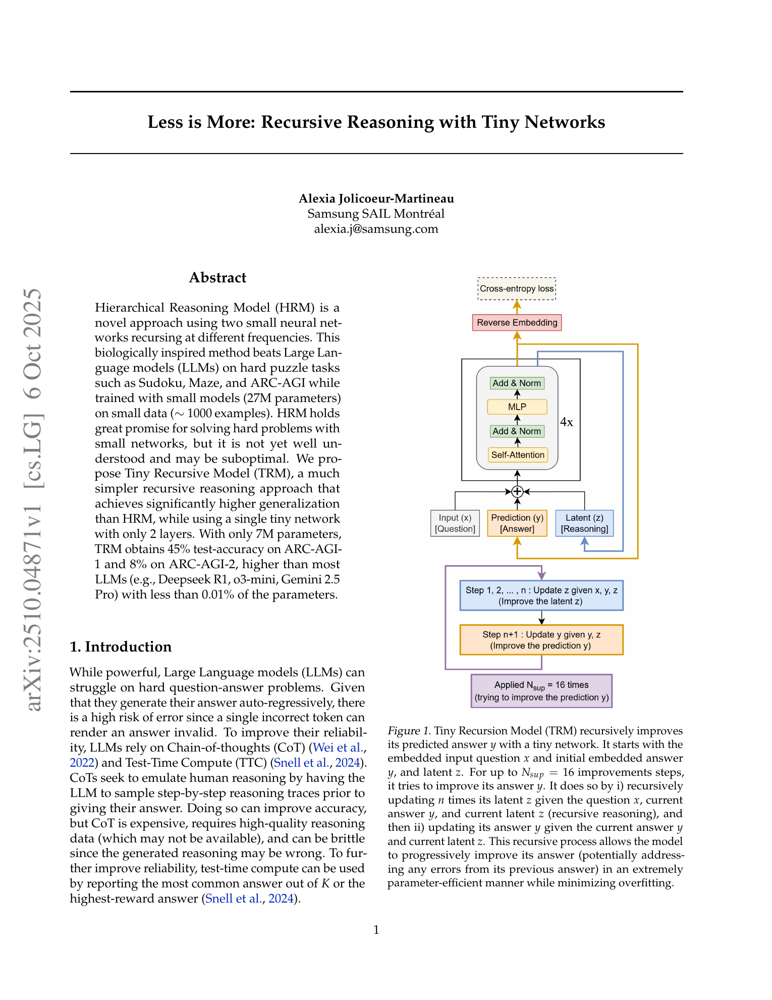
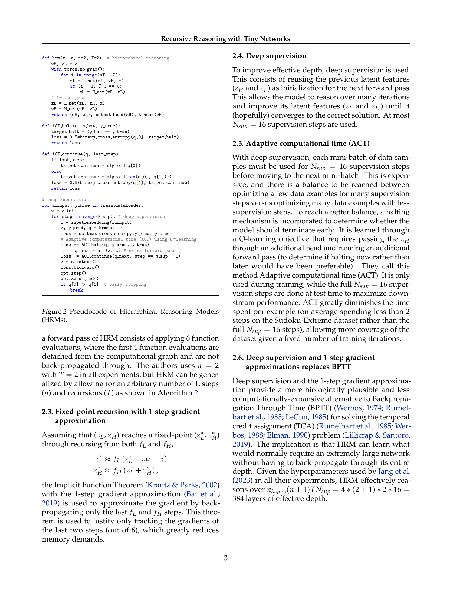
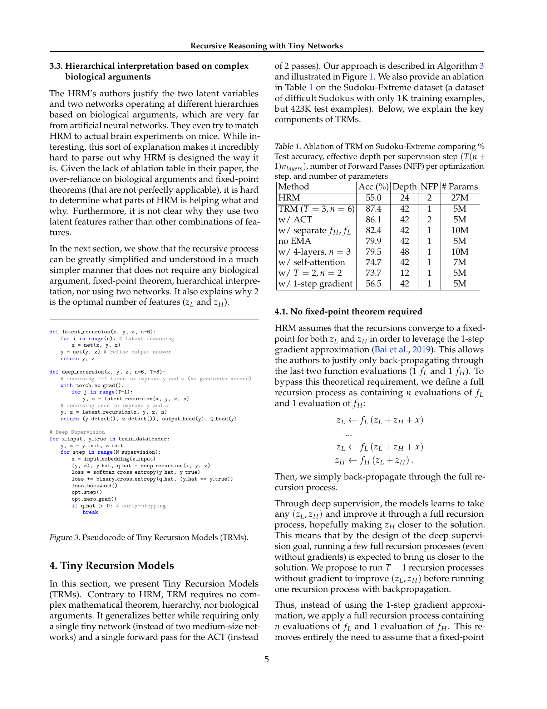
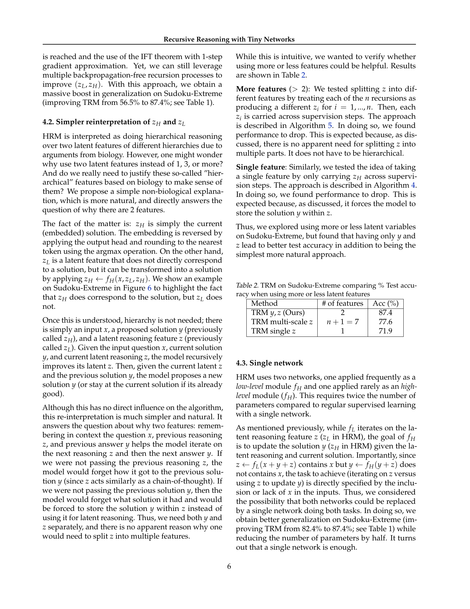

# Less is More: Recursive Reasoning with Tiny Networks

## TL;DR

Alexia Jolicoeur-Martineau가 제안하는 Tiny Recursive Model (TRM)은 단일 2층 트랜스포머 네트워크를 재귀적으로 반복 적용하여 어려운 퍼즐 문제를 푸는 방법이다. 기존 Hierarchical Reasoning Model (HRM)의 복잡한 계층 구조, 고정점 정리, 생물학적 정당화를 모두 제거하고 단일 소형 네트워크(7M 파라미터)만으로 Sudoku-Extreme, Maze-Hard, ARC-AGI-1/2에서 HRM(27M 파라미터)을 능가하는 성능을 달성했다. 특히 ARC-AGI-1에서 45%, ARC-AGI-2에서 8%의 테스트 정확도는 Deepseek R1, o3-mini, Gemini 2.5 Pro 등 대부분의 LLM을 파라미터의 0.01% 미만으로 능가한 결과다.

Source: [arXiv:2510.04871](https://arxiv.org/abs/2510.04871), [PDF](https://arxiv.org/pdf/2510.04871.pdf)

## Background

대규모 언어 모델(LLM)은 어려운 질문-응답 문제에서 여전히 어려움을 겪는다. Chain-of-Thought(CoT)와 Test-Time Compute(TTC)는 이러한 문제를 완화하기 위한 주요 기법이지만, CoT는 비용이 많이 들고 고품질 추론 데이터가 필요하며 생성된 추론이 틀릴 위험이 있다. ARC-AGI 벤치마크의 경우 2019년 이후 LLM이 상당한 진전을 보였지만 여전히 인간 수준의 정확도에 도달하지 못했으며, ARC-AGI-2에서는 Gemini 2.5 Pro조차 4.9%의 정확도에 그친다.

이와 대조적으로 Wang et al.(2025)이 제안한 Hierarchical Reasoning Model(HRM)은 두 개의 소형 신경망을 서로 다른 빈도로 재귀시키는 접근법으로 스도쿠, 미로, ARC-AGI 같은 퍼즐 작업에서 LLM을 크게 앞질렀다. HRM의 핵심은 1) 재귀적 계층 추론(recursive hierarchical reasoning)과 2) 심층 감독(deep supervision)이다. ARC Prize Foundation의 독립 분석에 따르면 심층 감독이 성능 향상의 주요 원인이며(19% → 39%), 재귀적 계층 추론의 기여는 상대적으로 미미했다(35.7% → 39.0%).

## Problem

HRM은 인상적인 성능을 보였지만 여러 문제점을 안고 있다:

1. **고정점 정리의 부적절한 적용**: HRM은 Implicit Function Theorem(IFT)과 1-step gradient approximation을 사용하여 마지막 2개 재귀 단계만 역전파한다. 그러나 실제로는 단 4번의 재귀 후에 고정점에 도달했다고 가정하는데, 저자들의 실험에서도 $z_L$의 잔차(residual)가 0에 가깝지 않음이 확인되었다. 따라서 IFT의 적용은 이론적으로 정당화되기 어렵다.

2. **ACT의 비효율성**: Adaptive Computational Time(ACT)은 Q-러닝 목적 함수를 사용하는데, continue loss를 계산하기 위해 추가적인 순전파가 필요하므로 최적화 단계당 2번의 순전파가 필요하다.

3. **불필요한 복잡성**: 계층 구조에 대한 생물학적 정당화, 두 개의 개별 네트워크($f_L$, $f_H$), 두 개의 잠재 변수($z_L$, $z_H$) 등 방법론이 지나치게 복잡하다.

4. **과적합**: 큰 모델은 데이터가 부족한 환경에서 쉽게 과적합된다.

## Method

Tiny Recursive Model(TRM)은 위 문제들을 다음과 같이 해결한다.

### 핵심 아이디어

TRM의 핵심은 질문 $x$, 현재 답변 $y$, 잠재 추론 $z$가 주어졌을 때, 단일 소형 네트워크가 $n$번의 잠재 재귀($z$ 업데이트) 후 답변 $y$를 개선하는 단순한 과정이다:

$$
\begin{aligned}
z_i &\leftarrow f_\theta(x, y, z_{i-1}) \quad \text{for } i = 1, \ldots, n \\
y' &\leftarrow f_\theta(y, z_n)
\end{aligned}
$$

### 심층 감독과 전체 재귀 역전파

HRM과 달리 IFT나 1-step gradient approximation이 필요 없다. $T$번의 재귀 과정 중 $T-1$번은 그래디언트 없이 순전파만으로 $y$와 $z$를 개선하고, 마지막 한 번만 전체 재귀를 역전파한다.

$$
\begin{aligned}
&\text{for } j = 1, \ldots, T-1: \\
&\qquad (y, z) \leftarrow \text{latent\_recursion}(x, y, z, n) \quad \text{# no grad} \\
&(y, z) \leftarrow \text{latent\_recursion}(x, y, z, n) \quad \text{# with grad}
\end{aligned}
$$

### 단일 네트워크

$z \leftarrow f_L(x + y + z)$는 $x$를 입력으로 받지만 $y \leftarrow f_H(y + z)$는 $x$를 받지 않는다는 점에 착안하여, 하나의 네트워크가 $x$의 유무에 따라 두 역할을 모두 수행할 수 있음을 발견했다. 단일 2층 네트워크로도 두 개의 4층 네트워크보다 더 나은 성능을 달성했다.

### 단순화된 ACT

Q-러닝 기반의 continue loss를 제거하고, 정답에 도달했는지만 예측하는 halting probability만 BCE 손실로 학습한다. 이로 인해 추가 순전파가 필요 없어져 최적화 단계당 1번의 순전파만으로 충분하다.

### EMA (Exponential Moving Average)

소규모 데이터에서 과적합과 발산을 방지하기 위해 EMA(0.999)를 도입했다.

### 주의 집중(Attention) 제거 가능

고정된 짧은 컨텍스트 길이($L \leq D$)를 가진 작업(예: Sudoku 9x9)에서는 self-attention을 MLP로 대체할 수 있다. MLP-Mixer에서 영감을 받은 이 접근법은 Sudoku-Extreme에서 self-attention 사용 시 74.7%에서 87.4%로 성능을 크게 향상시켰다.

## Experiments

### 데이터셋

- **Sudoku-Extreme**: 1K 훈련 샘플, 423K 테스트 샘플, 9x9 그리드
- **Maze-Hard**: 30x30 미로, 훈련/테스트 각 1000개, 최단 경로 길이 110 이상
- **ARC-AGI-1**: 800개 퍼즐 태스크, 최대 30x30 그리드
- **ARC-AGI-2**: 1120개 퍼즐 태스크

### 주요 결과

| Benchmark | HRM (27M) | TRM (7M) | 최고 LLM |
|-----------|-----------|----------|----------|
| Sudoku-Extreme | 55.0% | **87.4%** | 0.0% (LLMs) |
| Maze-Hard | 74.5% | **85.3%** | 0.0% (LLMs) |
| ARC-AGI-1 | 40.3% | **44.6%** | 37.0% (Gemini 2.5 Pro) |
| ARC-AGI-2 | 5.0% | **7.8%** | 4.9% (Gemini 2.5 Pro) |

TRM은 7M 파라미터로 HRM(27M)을 모든 벤치마크에서 능가했으며, ARC-AGI-2에서는 Gemini 2.5 Pro보다 59% 높은 정확도를 달성했다 (단, Grok-4 기반 Bespoke 모델은 29.4%로 더 높음).

### 소거 연구 (Ablation)

TRM의 핵심 설계 선택이 성능에 미치는 영향을 Sudoku-Extreme에서 분석했다:

- **전체 재귀 역전파 vs 1-step gradient**: 56.5% → 87.4% (+30.9%p)
- **단일 네트워크 vs 두 개의 네트워크**: 82.4% → 87.4% (+5.0%p)
- **MLP vs self-attention**: 74.7% → 87.4% (+12.7%p)
- **EMA 사용 vs 미사용**: 79.9% → 87.4% (+7.5%p)
- **2층 vs 4층**: 79.5% → 87.4% (+7.9%p)
- **단순화된 ACT vs Q-learning ACT**: 86.1% → 87.4% (+1.3%p)

### 하이퍼파라미터

- AdamW 옵티마이저 ($\beta_1=0.9, \beta_2=0.95$), learning rate 1e-4
- Batch-size 768, hidden-size 512
- $N_{sup} = 16$ 최대 감독 단계
- TRM: $n=6, T=3$, 2층 네트워크
- EMA 0.999, stable-max loss
- 1000배 데이터 증강 (Sudoku: 셔플링, ARC: 색상/정이면군/변환)

## Critical Analysis

### Strengths

1. **극적인 단순화**: HRM의 이론적/구현적 복잡성을 대부분 제거하면서도 더 나은 성능을 달성했다. 이는 "Less is More"라는 논문의 제목을 정당화한다.

2. **소규모 모델의 잠재력 입증**: 7M 파라미터의 2층 네트워크가 671B 파라미터의 Deepseek R1을 ARC-AGI에서 능가한 것은, 규모보다 아키텍처와 학습 패러다임이 중요함을 시사한다.

3. **생물학적 추측 제거**: HRM의 모호한 생물학적 정당화 대신 $z_H$는 단순히 현재 답변 $y$이고 $z_L$은 잠재 추론이라는 직관적인 해석을 제공한다.

4. **철저한 소거 연구**: 각 설계 선택의 기여도를 정량화하여 방법론의 이해와 향후 개선에 도움을 준다.

5. **매우 적은 데이터에서의 강건함**: 1000개 미만의 훈련 예제로도 학습이 가능하며, 데이터 증강과 EMA를 통해 과적합을 효과적으로 제어한다.

### Limitations

1. **ARC-AGI 한계**: TRM은 45% 정확도로 여전히 인간 수준(85% 이상 추정)에 크게 미치지 못한다. Grok-4 기반 모델(79.6%)과의 격차도 상당하다.

2. **생성적 작업 미지원**: TRM은 결정론적 지도 학습 방식으로, 하나의 입력에 여러 정답이 존재하는 생성적 작업(generative tasks)으로의 확장이 필요하다.

3. **아키텍처 선택의 데이터 의존성**: MLP 기반 아키텍처는 Sudoku-Extreme에서 탁월했지만 Maze-Hard와 ARC-AGI에서는 self-attention이 필요했다. 최적 아키텍처가 데이터셋에 크게 의존한다.

4. **재귀의 이론적 이해 부족**: TRM이 왜 깊고 큰 네트워크보다 재귀가 효과적인지에 대한 이론적 설명이 부족하다. 저자들은 과적합 때문일 것으로 추측하지만 확립된 이론은 아니다.

5. **계산 비용**: $n=6, T=3$의 설정에서 전체 재귀를 역전파하므로 $n$이 증가하면 메모리 부족(OOM)이 발생한다. HRM은 더 적은 역전파 단계로 유사한 깊이를 달성할 수 있었다.

6. **범용성**: TRM은 특정 퍼즐 도메인에 특화되어 있으며, 자연어 추론이나 일반적인 질문 응답과 같은 작업으로의 일반화는 검증되지 않았다.

## Implementation Notes

- **2층 네트워크가 최적**: 4층 이상의 깊이는 소규모 데이터에서 과적합을 유발한다. 데이터가 매우 적은 상황에서는 2층이 최선의 선택이다.

- **전체 재귀 역전파가 필수**: IFT나 1-step gradient approximation은 성능을 크게 저하시킨다. TRM의 성능 향상은 주로 전체 재귀에 대한 역전파에서 비롯된다.

- **$n=6, T=3$가 최적**: 재귀 횟수와 심층 감독 단계의 균형이 중요하다. Sudoku-Extreme에서 $T=3, n=6$ (42 재귀)이 메모리와 성능 사이의 최적점이었다.

- **EMA는 필수**: 특히 데이터가 매우 적은 상황에서 안정성과 일반화에 큰 도움이 된다.

- **데이터 증강**: Sudoku-Extreme에서 1000배 증강, ARC-AGI에서 1000배 증강 등 대규모 증강이 작은 데이터셋의 학습을 가능하게 한다.

- **ACT는 유지하되 단순화**: 정답 도달 예측을 통한 조기 종료(early stopping)는 학습 효율에 중요하다. Q-러닝 대신 BCE 손실로 충분하다.

- **컨텍스트 길이가 짧으면 MLP, 길면 Attention**: $L \leq D$인 경우 self-attention 대신 sequence MLP가 더 효과적이다.

## Captured Figures and Tables

