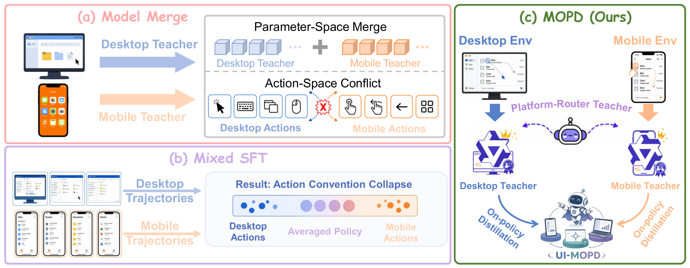
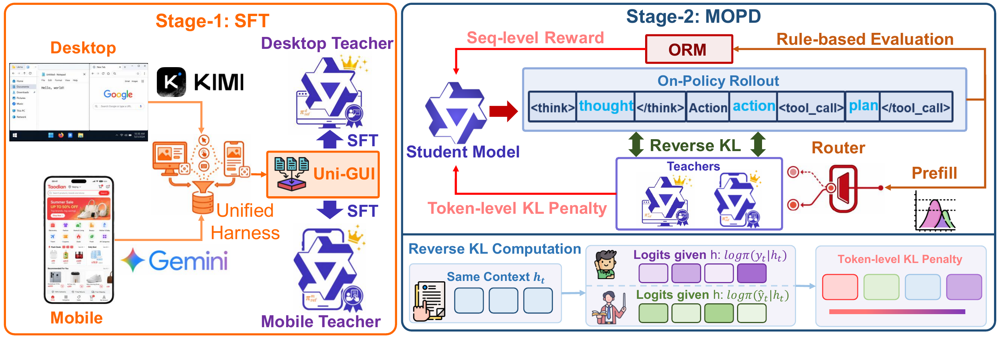
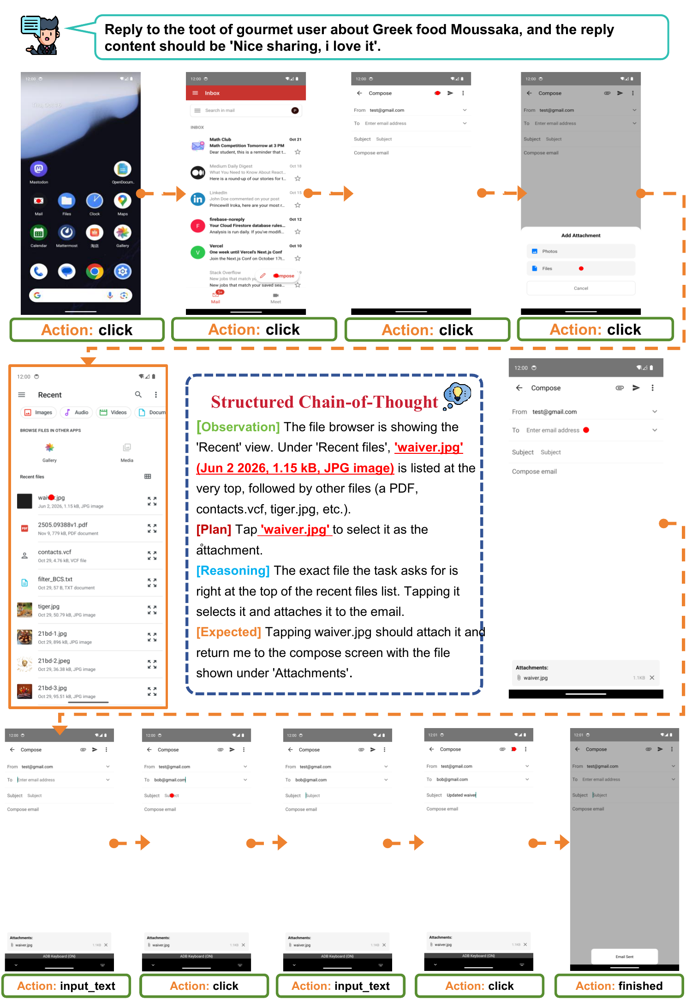

# UI-MOPD: Multi-Platform On-Policy Distillation for Continual GUI Agent Learning

**Authors:** Niu Lian, Alan Chen, Zhehao Yu, Chengzhen Duan, Fazhan Liu, Hui Liu, Pei Fu, Jian Luan, Yaowei Wang, Shu-Tao Xia, Jinpeng Wang

**Published:** 2026-07-05

**Tags:** gui-agent, continual-learning, knowledge-distillation, multi-platform, on-policy-distillation

## TL;DR

UI-MOPD trains a single 8B GUI agent that performs well on **both** desktop (OSWorld) and mobile (MobileWorld) environments without catastrophic forgetting. It uses platform-specific expert teachers (32B, SFT on 10K Uni-GUI trajectories) to provide **platform-conditioned on-policy KL distillation** during RL training of a shared student policy. The routed teacher signals prevent behavioral convention mixing between desktop and mobile interaction patterns. Result: 38.2% on OSWorld (+12.7% over base 8B) and 12.0% on MobileWorld (+55.8%), outperforming mixed SFT, model merging, and prior multi-platform GUI agents.

## Background

GUI agents have evolved from single-platform (web nav, computer automation) toward cross-platform interaction. Benchmarks like OSWorld (desktop, 361 tasks) and MobileWorld (mobile, 117 tasks) evaluate agents in interactive environments. Existing multi-platform approaches (mixed SFT, model merging, mixed RL) treat cross-platform learning as data aggregation, but desktop and mobile differ fundamentally in action semantics (mouse vs. tap/swipe), affordance structure, and navigation conventions. Naive mixing produces an averaged policy that underperforms on both platforms.

## Problem

Two bottlenecks: (1) high-quality cross-platform GUI trajectories are scarce — existing datasets are single-platform, noisy, or inconsistent in action granularity; (2) heterogeneous interaction conventions (e.g., "go back" = close window on desktop vs. press back button on mobile) cause behavioral pattern mixing and catastrophic forgetting when jointly trained. How can a **single** shared policy acquire platform-specific behavioral anchors for both desktop and mobile without interference?

## Method

**Uni-GUI dataset:** A unified cross-platform data-collection harness with a consistent action interface and logging format. ~110K desktop + ~50K mobile interaction steps collected using Kimi-K2.6 and Gemini-3.1-Pro, filtered to ~10K high-quality trajectories.

**UI-MOPD training (two stages):**

| Stage | What | Model |
|---|---|---|
| 1 | SFT on platform-specific Uni-GUI data → Expert teachers | Qwen3-VL-32B-Thinking (2 teachers: desktop + mobile) |
| 2 | Multi-teacher on-policy distillation (MOPD) + RL | Qwen3-VL-8B-Thinking (shared student) |

**Core innovation — Platform-Conditioned On-Policy KL Distillation:**
- Student samples rollouts online; teacher supervision is applied only on states actually visited by the student (on-policy, not static offline distillation).
- Each rollout is routed to its platform-specific teacher ($\pi_{\text{ref}}^{d}$ or $\pi_{\text{ref}}^{m}$) based on environment label.
- The K3 estimator efficiently approximates per-token KL divergence using only sampled-token log probabilities.
- Adaptive KL masking: disables teacher penalty when a rollout group already receives sufficient reward, preserving exploration.

**Reward:** Structured outcome reward based on action type correctness, coordinate matching, scroll direction, etc. (1.0 for perfect, -0.5 for partial, -1.0 for invalid).

**Training objective (simplified):** $\mathcal{L} = \mathcal{L}_{\text{PG}} + \beta \cdot \mathcal{L}_{\text{MOPD}}$, combining clipped PPO-style policy gradient with routed distillation.

## Experiments

*Figure 1: Motivation — naive mixing of desktop and mobile signals produces an averaged policy; UI-MOPD uses platform-conditioned routing and multi-teacher on-policy distillation.*

*Figure 2: UI-MOPD training pipeline. Stage 1: SFT on Uni-GUI → desktop & mobile expert teachers. Stage 2: multi-teacher on-policy distillation with platform-conditioned routing.*

*Figure 3: Mobile task execution example showing step-by-step action grounding.*

**Main results (OSWorld / MobileWorld):**

| Method | OSWorld | MobileWorld |
|---|---|---|
| Qwen3-VL-8B-Thinking (base) | 33.9% | 7.7% |
| Qwen3-VL-32B-Thinking | 41.0% | 9.4% |
| Mixed-SFT | 35.0% | 6.4% |
| Model Merge (TIES) | 36.8% | 0% |
| **UI-MOPD (8B student)** | **38.2%** | **12.0%** |
| Desktop Teacher (32B, reference) | 46.3% | — |
| Mobile Teacher (32B, reference) | — | 16.2% |

**Key findings:**
1. UI-MOPD beats all integration baselines (mixed SFT, weight averaging, TIES merging) on **both** platforms.
2. Single-platform SFT causes catastrophic forgetting: OSWorld-only SFT drops MobileWorld to 0%; MobileWorld-only SFT barely improves OSWorld.
3. UI-MOPD preserves general GUI grounding (ScreenSpot-Pro, ScreenSpotV2, OSWorld-G) where model merging causes clear degradation.
4. On AndroidControl*, UI-MOPD (80.05%) improves over base (78.73%) while TIES merging drops to 74.01%.

## Critical Analysis

**Strengths:**
- Clean formulation of multi-platform GUI learning as a conditional distillation problem — platform-conditioned teacher routing is intuitive and effective.
- On-policy (vs. static offline) distillation is well-motivated: teacher signals target the student's actual state distribution, not an offline buffer.
- Comprehensive evaluation: interactive benchmarks (OSWorld, MobileWorld), static grounding (ScreenSpot-Pro/V2, OSWorld-G), and static GUI understanding (AndroidControl*).
- Practical: uses only 8B student at inference, trained on 64 H100s (8 nodes).

**Weaknesses:**
- OSWorld/MobileWorld results are still low in absolute terms (38.2%/12.0%) — GUI agents remain far from reliable.
- Only one base model family (Qwen3-VL) — no evidence that UI-MOPD generalizes to other VLMs.
- Requires training separate 32B teachers per platform, which is expensive.
- Adaptive KL masking threshold $\tau_{\text{KL}}$ is a sensitive hyperparameter.
- No analysis of how many trajectories are needed for teacher SFT — 10K seems large; what's the data efficiency?
- Only two platforms (desktop + mobile); real multi-platform may include web, tablet, TV, etc.
- Continual learning aspect is underexplored — experiments are joint-training setup, not sequential.

## Implementation Notes

- **Framework:** verl + Megatron-Core (training backend) + SGLang (rollout engine)
- **Hardware:** 64 NVIDIA H100 GPUs (8 nodes × 8 GPUs)
- **Student:** Qwen3-VL-8B-Thinking; **Teachers:** Qwen3-VL-32B-Thinking
- **K3 estimator:** $\hat{D}_{\text{KL}} = \rho - \delta - 1$ where $\delta = \log \pi_{\text{ref}}(y_t) - \log \pi_\theta(y_t)$, $\rho = e^\delta$
- **Adaptive mask:** $\mu^{(i)} = 0$ if mean group reward $> \tau_{\text{KL}}$, else 1
- **Reward structure:** 1.0 (perfect action), -0.5 (partial match), -1.0 (invalid)
- **Data collection:** Kimi-K2.6 (desktop), Gemini-3.1-Pro (mobile); filtered to ~10K trajectories
