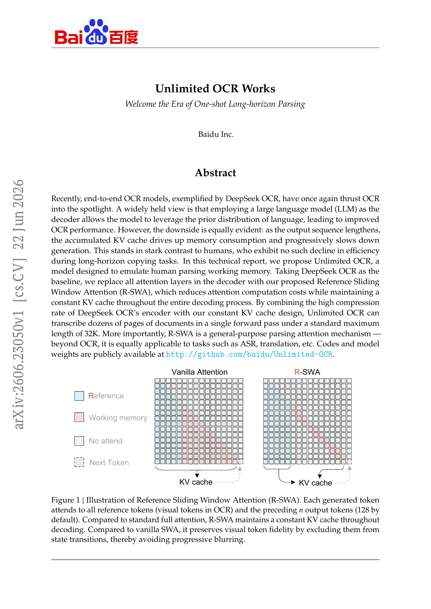
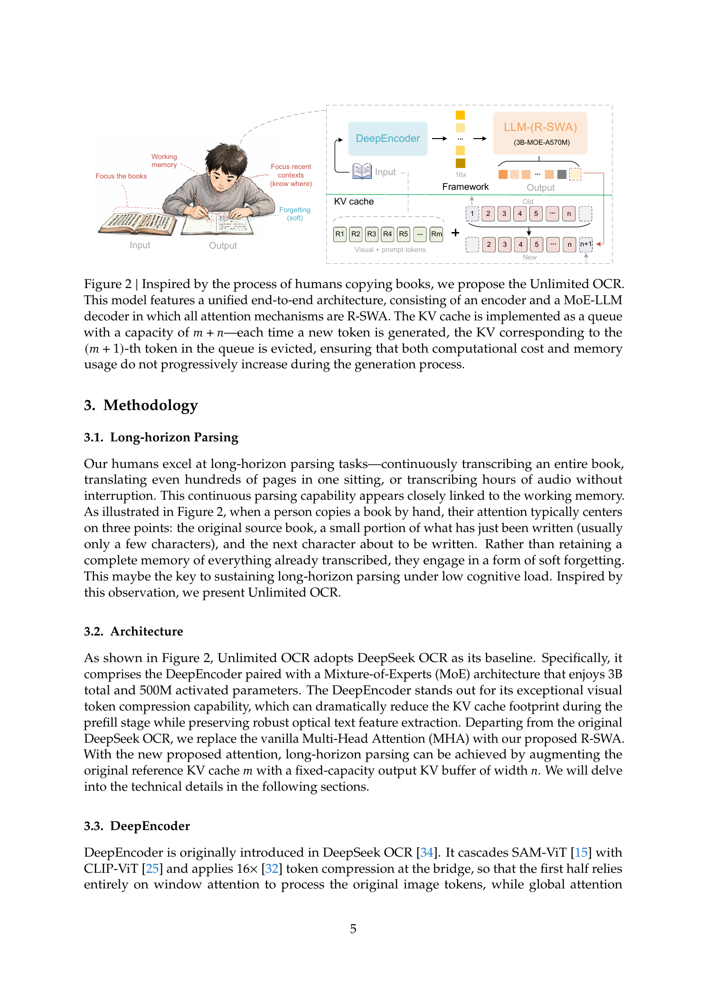
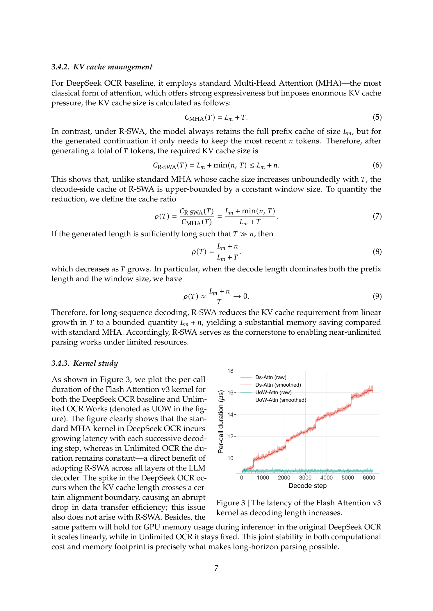
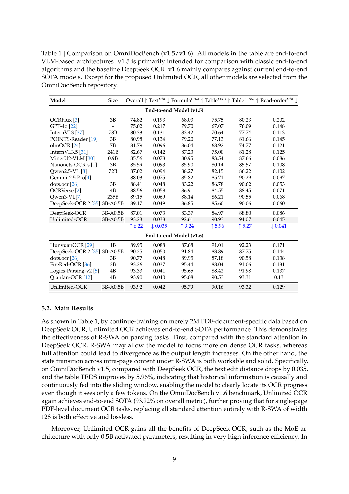
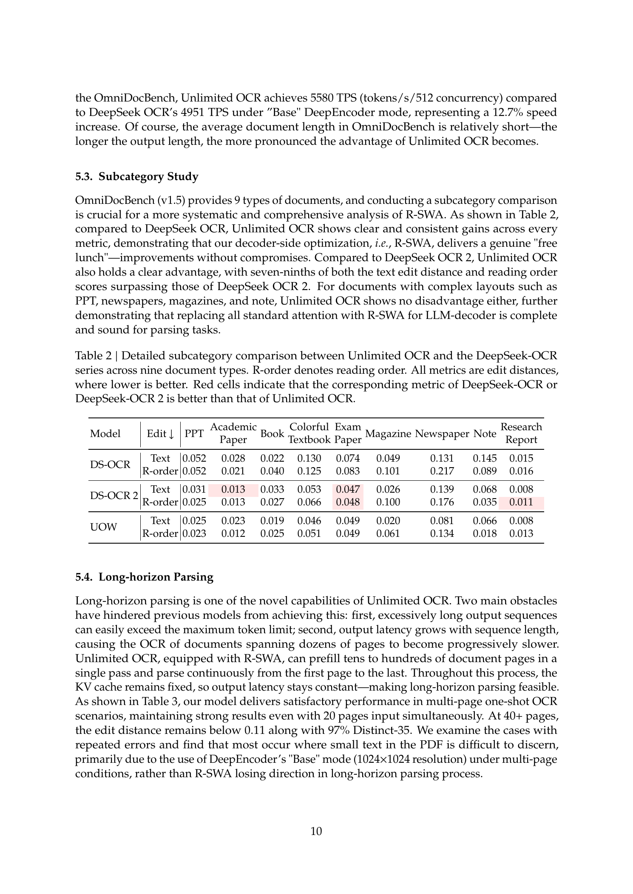
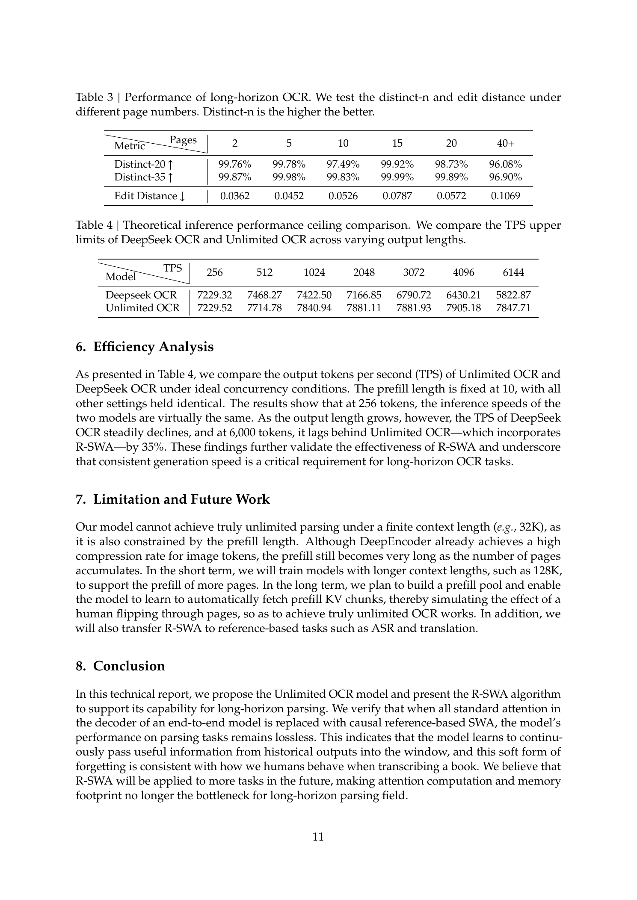

# Unlimited OCR Works

## TL;DR

Unlimited OCR replaces every decoder attention layer in DeepSeek OCR with Reference Sliding Window Attention (R-SWA). Each generated token can attend to the complete fixed reference prefix—visual tokens plus the prompt—but only the latest \(n=128\) generated tokens. This changes the decode-side KV cache from one that grows with output length to a fixed-size queue, enabling one-pass OCR over dozens of pages without progressively increasing per-token latency. The resulting 3B-parameter MoE model reports 93.23 on OmniDocBench v1.5, 93.92 on v1.6, and edit distance 0.1069 on an in-house 40+-page test.

Source: [arXiv:2606.23050](https://arxiv.org/abs/2606.23050), [PDF](https://arxiv.org/pdf/2606.23050.pdf), [code and model](https://github.com/baidu/Unlimited-OCR)

## Background

Modern end-to-end OCR systems often combine a visual encoder with an autoregressive language-model decoder. The encoder compresses document images into visual tokens, while the decoder emits structured text, formulas, tables, and reading order. This approach benefits from the decoder's language prior, but ordinary causal self-attention stores a key and value for every generated token. Memory and attention work therefore grow throughout a long transcription.

This is particularly restrictive for multi-page OCR. The paper estimates that 10,000 visual tokens, corresponding to roughly 20–30 pages at its chosen resolution, can require more than 100,000 output tokens. Processing pages independently avoids the long sequence, but it resets model state at every page and requires an external loop to manage the document.

Sliding-window attention bounds the generated-token history, but naive use can also discard the source representation. Unlimited OCR separates the two roles: reference tokens remain globally visible and immutable, while only the recent output history is retained as working memory. This pattern is well matched to source-grounded parsing, where the next output should depend primarily on the original document and enough recent text to preserve position and formatting continuity.

## Problem

Let the reference prefix contain \(L_m\) visual and prompt tokens, and let the model generate \(T\) output tokens. A standard multi-head attention decoder retains:

\[
C_{\mathrm{MHA}}(T) = L_m + T
\]

KV positions. The cache grows linearly with generation length, and each new token attends over an increasingly long history. This produces both rising memory use and falling generation throughput.

The desired attention pattern must satisfy three constraints:

- preserve direct access to every visual and prompt token;
- retain enough recent generated context to track transcription progress;
- keep decode-side memory and per-step attention cost independent of total output length.

The paper also targets a practical conversion path. Rather than designing a new OCR stack, it starts from DeepSeek OCR, retains its compressed visual encoder and MoE decoder weights, changes the attention mask and cache policy, and continues training on document data.

## Method

Unlimited OCR keeps DeepSeek OCR's DeepEncoder, which cascades SAM-ViT and CLIP-ViT and applies \(16\times\) token compression. In the Base multi-page mode, a \(1024 \times 1024\) page is represented by 256 visual tokens. The decoder is a roughly 3B-parameter MoE model with about 0.5B parameters activated per token.

The main change is Reference Sliding Window Attention. For decoding step \(t\), define a permanently visible prefix:

\[
P = \{1,\ldots,L_m\},
\]

and a causal window containing at most the latest \(n\) generated positions:

\[
D_n(t)=
\left\{
j \mid
\max(L_m+1,L_m+t-n)
\le j \le L_m+t-1
\right\}.
\]

The accessible positions are:

\[
\mathcal{N}(t)=P\cup D_n(t).
\]

Attention is otherwise ordinary scaled dot-product softmax over \(\mathcal{N}(t)\). Thus, R-SWA does not compress or recurrently update the reference representation. Every output token can still query the original visual evidence, while information from previous outputs must propagate through the rolling local window.

The cache is implemented as two regions: an immutable prefix cache of length \(L_m\) and a FIFO output cache of capacity \(n\). Its size after \(T\) generated tokens is:

\[
C_{\mathrm{R\text{-}SWA}}(T)
= L_m+\min(n,T)
\le L_m+n.
\]

For long outputs, the cache ratio relative to full attention is:

\[
\rho(T)
=
\frac{L_m+n}{L_m+T}.
\]

The decode-side advantage grows as \(T\) increases. Total autoregressive attention work changes from a term quadratic in output length to approximately:

\[
O\!\left(T(L_m+n)d\right),
\]

where \(d\) represents the attention dimension. The cost is linear in generated length when \(L_m\) and \(n\) are fixed, although it still scales with the reference prefix.

Training starts from the DeepSeek OCR checkpoint. The authors freeze DeepEncoder and train the decoder for 4,000 steps on about two million document samples, including roughly 200,000 synthesized multi-page examples containing 2–50 pages. Samples are packed to 32K tokens. Training uses a global batch size of 256, AdamW with initial learning rate \(10^{-4}\), and 128 A800 GPUs arranged as \(8\times16\).

## Experiments

The primary evaluation uses OmniDocBench v1.5 and v1.6, which cover text, formulas, tables, and reading order. On v1.5, Unlimited OCR scores 93.23 overall versus 87.01 for the DeepSeek OCR baseline. Text edit distance improves from 0.073 to 0.038, formula CDM from 83.37 to 92.61, table TEDS from 84.97 to 90.93, and reading-order edit distance from 0.086 to 0.045. On v1.6, it reports 93.92 overall, narrowly above the other systems listed in the paper.

The subcategory results cover academic papers, PPT slides, books, colorful textbooks, exam papers, magazines, newspapers, notes, and research reports. Unlimited OCR generally improves text and reading-order edit distance over the original DeepSeek OCR and is competitive with DeepSeek OCR 2 across document types.

For long-horizon evaluation, the authors construct an in-house set of novels, documents, and papers grouped by page count. Edit distance is 0.0362 for two pages, 0.0526 for ten pages, 0.0572 for twenty pages, and 0.1069 for 40+ pages. Distinct-35 remains 96.90% in the 40+-page group, suggesting that the model usually avoids repetitive degeneration over long outputs. The paper attributes many remaining errors to small text lost by the fixed \(1024\times1024\) Base encoder resolution.

The efficiency measurements show the expected divergence with output length. With a fixed prefill length of 10 under ideal concurrency, DeepSeek OCR throughput declines from 7,229 tokens/s at 256 output tokens to 5,823 tokens/s at 6,144 tokens. Unlimited OCR remains near 7,800–7,900 tokens/s, reaching 7,848 tokens/s at 6,144 tokens. On the shorter OmniDocBench workload at concurrency 512, the reported gain is 12.7%, from 4,951 to 5,580 tokens/s. A FlashAttention v3 microbenchmark also shows R-SWA per-call latency remaining approximately constant while dense attention latency increases with decode step.

## Critical Analysis

The strongest contribution is the alignment between task structure and memory policy. OCR is mostly reference-grounded generation: the source image should remain available, while distant generated text often matters less than recent context. R-SWA expresses that inductive bias with a simple attention mask and cache queue, so it can use standard softmax attention without learned retrieval, recurrent compression, or a specialized sparse index.

The reported accuracy is also important. A 128-token output window could have caused lost position, repeated text, or broken document structure. Instead, the benchmark and multi-page results indicate that local state propagation is sufficient for many OCR cases. The architecture is therefore more than a systems optimization; it may regularize the decoder toward visual evidence rather than its full generated history.

However, the paper does not isolate the source of the accuracy gain. Unlimited OCR receives continued training on two million document samples, while the baseline numbers come from the original DeepSeek OCR. There is no matched continued-training baseline with full attention, no window-size ablation, and no controlled comparison of R-SWA against ordinary sliding-window attention. The 6.22-point v1.5 improvement therefore cannot be attributed to R-SWA alone.

The long-horizon evidence is preliminary. The in-house test set has at least ten books per page-count category but is not described in enough detail to reproduce, and it lacks comparisons against page-wise processing or other long-document OCR systems. Distinct-\(n\) helps detect repetition, but it does not measure cross-page continuity, structural fidelity, page-boundary errors, or whether content was silently omitted.

The efficiency claims also need careful interpretation. The throughput table fixes prefill length at 10, so it isolates decode behavior rather than measuring end-to-end multi-page OCR. In the actual application, the permanent prefix grows with page count. R-SWA bounds only the generated-token cache:

\[
C_{\mathrm{R\text{-}SWA}} \le L_m+n,
\]

not the full workload independently of document size. The paper explicitly acknowledges that a 32K context still limits prefill length. “Unlimited” therefore means generation does not become progressively more expensive with output length; it does not mean arbitrarily many input pages can currently be processed.

Finally, generalization to ASR and translation is plausible but untested. Those tasks can require long-range target-side consistency, terminology, discourse, or speaker state that a 128-token window may not preserve. R-SWA is most convincing when the complete source remains compact enough to stay globally visible and the output can be generated using local target-side state.

## Implementation Notes

R-SWA can be implemented with an attention mask and a two-part KV cache:

1. Prefill the visual and prompt prefix and retain all of its keys and values.
2. Allocate a circular or FIFO buffer for \(n\) generated-token KV entries per layer.
3. At each decode step, attend over the concatenation of the immutable prefix cache and occupied output buffer.
4. Insert the new KV entry and evict the oldest generated entry once the buffer is full.

Correct position handling is essential. Evicting a KV entry must not reset logical token positions; rotary or other positional encodings should continue to use the token's absolute decoding position even though physical cache slots are reused.

Training must use the same reference-plus-local mask as inference. Otherwise, the model can learn dependencies on distant output tokens that will disappear at deployment. Multi-page packing and explicit page separators are also important because they teach the model to pass progress state through the short window across page boundaries.

The practical memory ceiling remains controlled by the encoder compression ratio and prefix length. At 256 visual tokens per page, reference KV storage still grows linearly with page count. A deployment should therefore validate:

- maximum pages and image resolution under the model's context limit;
- accuracy sensitivity to \(n\), especially for tables and long structured outputs;
- end-to-end latency including image encoding and prefill, not only decoding;
- repetition, omission, and page-order failures beyond aggregate edit distance.

The public implementation includes Transformers cache management and SGLang support, which are the relevant places to inspect when reproducing the queue semantics and optimized serving path.

## Captured Figures and Tables

