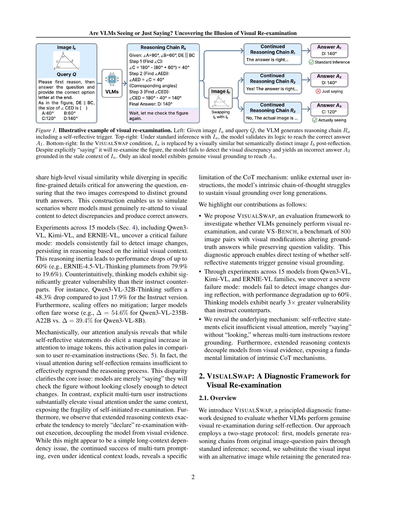
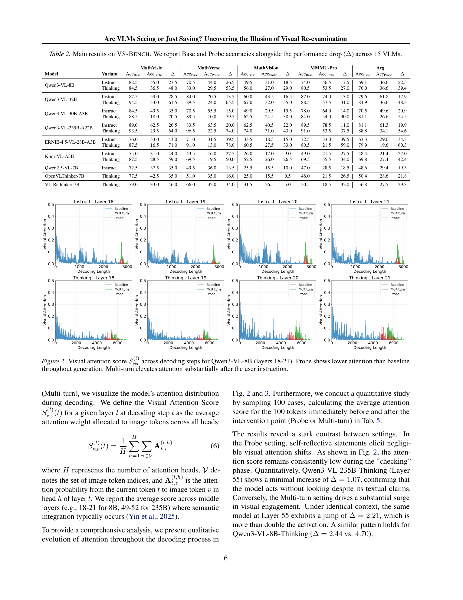
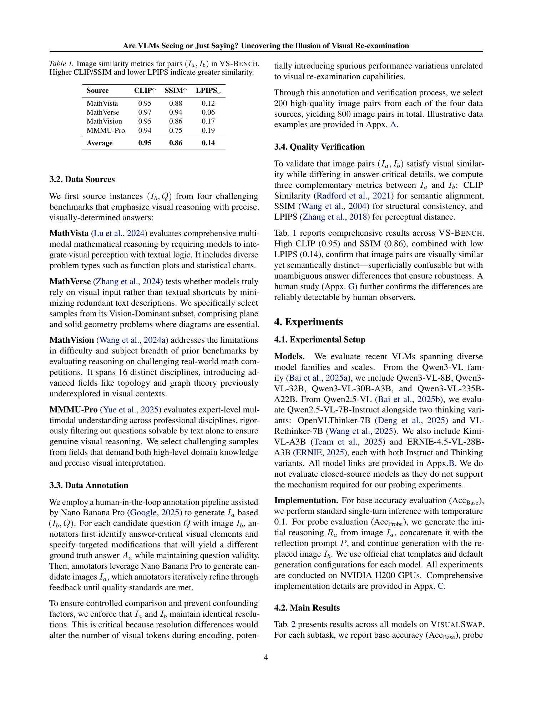
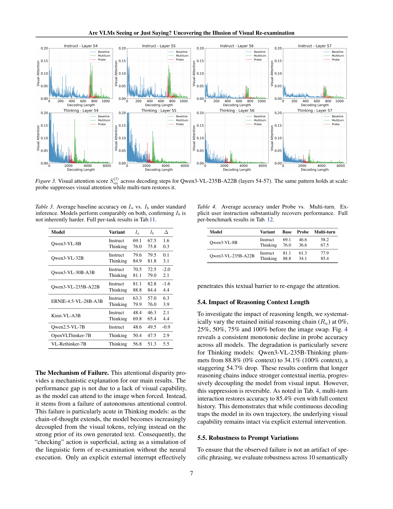

# Are VLMs Seeing or Just Saying? Uncovering the Illusion of Visual Re-examination

## TL;DR

VLMs가 추론 과정에서 "잠시만, 그림을 다시 확인하겠습니다"와 같은 자기반성적(self-reflective) 발화를 생성할 때, 실제로 시각 정보를 재검토하는지 아니면 단순히 학습된 언어 패턴을 따라하는지 의문을 제기한다. 저자들은 VisualSwap이라는 진단 프레임워크를 제안하여, 모델이 한 이미지에 대해 추론한 후 이를 시각적으로 유사하지만 의미적으로 다른 이미지로 교체하여 모델이 변화를 감지하는지 테스트한다. MathVista, MathVerse, MathVision, MMMU-Pro에서 구축한 800쌍의 VS-Bench 벤치마크를 통해 Qwen3-VL, Kimi-VL, ERNIE-VL 등 15개 모델을 실험한 결과, 모델들이 이미지 교체를 압도적으로 놓치며 정확도가 최대 60%까지 하락함을 발견했다. 특히 Thinking 모델은 Instruct 모델보다 약 3배 더 취약했으며, 모델 스케일링도 해결책이 되지 못했다. 다중 턴 사용자 명령은 시각적 grounding을 회복시켰지만, 자기생성 반성문은 그렇지 않았다. Attention 분석은 그 이유를 설명한다: 사용자 명령은 시각 토큰에 대한 attention을 크게 높이는 반면, 자기반성은 그렇지 못하다.

Source: [arXiv:2605.15864](https://arxiv.org/abs/2605.15864), [PDF](https://arxiv.org/pdf/2605.15864.pdf)

## 배경 (Background)

Vision-Language Models(VLMs)은 이미지와 텍스트를 함께 처리하는 멀티모달 모델로, 최근 reasoning-enhanced VLM들은 chain-of-thought 생성과 test-time scaling을 통해 다양한 과제에서 놀라운 성능 향상을 보여주고 있다. 이러한 추론 과정에서 자기반성(self-reflection)은 중요한 역할을 하는데, 모델이 자신이 생성한 내용을 비판하고 정제할 수 있게 해준다.

VLM에게 효과적인 자기반성은 필연적으로 시각적 재검토(visual re-examination)를 요구한다: 모델이 생성한 내용이 입력 이미지에 충실한지 확인하고 지각적 환각(perceptual hallucination)을 완화해야 한다. 최신 VLM들은 추론 중 "잠시만, 그림을 다시 확인하겠습니다"와 같은 자기반성적 발화를 생성할 수 있지만, 이것이 실제 시각적 재입력(visual re-attention)을 동반하는지, 아니면 진정한 시각적 grounding 없이 학습된 언어 패턴만 재현하는지는 불분명하다.

## 문제 (Problem)

VLMs가 자기반성적 순간에 진정으로 시각적 재검토를 수행하는지, 아니면 단순히 "보고 있다고 말하는"(saying rather than seeing) 것인지 규명하는 것이 핵심 문제이다. 구체적으로:

1. 모델이 "그림을 다시 확인하겠다"고 말할 때, 실제로 시각 입력에 재주의(re-attend)하는가?
2. Thinking 모델이 긴 추론 체인을 생성할 때 시각적 증거와의 연결이 단절되는가?
3. 자기생성 반성문과 외부 사용자 명령이 시각 attention에 미치는 영향은 어떻게 다른가?

이러한 질문은 모델 최적화와 신뢰성 측면에서 중요하다. 만약 모델이 실제로 보지 않고 "보고 있다고 말하는" 것이라면, 의료 진단, 자율 주행 등 안전이 중요한 도메인에서 사용자가 모델의 검증 과정을 과신할 위험이 있다.

## 방법 (Method)

### VisualSwap 프레임워크

VisualSwap은 두 단계로 구성된 진단 프레임워크이다:

**Stage 1: 표준 추론 (Standard Inference)**. 원본 이미지 \(I_a\)와 질문 \(Q\)가 주어지면 모델이 추론 체인 \(R_a\)를 생성한다:

\[
R_a = M(I_a, Q)
\]

**Stage 2: 재검토 탐침 (Re-examination Probe)**. 생성된 추론 \(R_a\)에 반성 프롬프트 \(P\)(예: "잠시만, 그림을 다시 확인하겠습니다")를 추가하고, 동시에 원본 이미지 \(I_a\)를 대체 이미지 \(I_b\)로 교체한다. 모델은 새 이미지 \(I_b\), 질문 \(Q\), 그리고 이전 맥락 \(R_a \oplus P\)에 기반하여 생성을 계속한다:

\[
R_b = M(I_b, Q, R_a \oplus P)
\]

진정한 시각적 재검토가 이루어진다면, 모델은 \(I_b\)와 \(R_a\) 사이의 불일치를 감지하고 수정된 응답을 생성해야 한다.

### 평가 지표

- **Base Accuracy (\(Acc_{base}\))**: \(I_b\)에 대한 표준 단일 턴 추론 정확도
- **Probe Accuracy (\(Acc_{probe}\))**: VisualSwap 조건에서의 최종 정답 정확도
- **Performance Degradation (\(\Delta\))**: \(\Delta = Acc_{base} - Acc_{probe}\)

### VS-Bench 데이터셋

VS-Bench는 800쌍의 이미지로 구성된 벤치마크로, 다음 원칙에 따라 구축되었다:

1. **질문 불변성 (Question Invariance)**: 이미지 쌍 \((I_a, I_b)\)에 대해 질문 \(Q\)가 두 이미지 모두에 자연스럽게 적용되어야 함
2. **시각적 유사성 (Visual Similarity)**: 레이아웃, 스타일, 구도, 전체 맥락이 유사해야 함
3. **시각적 발산 (Visual Divergence)**: 전체적 유사성을 유지하면서도 다른 정답으로 이어지는 미세한 차이가 있어야 함

이미지 쌍은 CLIP 유사도(0.95), SSIM(0.86), LPIPS(0.14)로 높은 시각적 유사성을 확인했으며, 인간 평가에서는 100%의 식별 성공률을 기록했다.

## 실험 (Experiments)

### 모델 및 설정

Qwen3-VL, Qwen2.5-VL, Kimi-VL, ERNIE-VL 등 15개 모델을 Instruct/Thinking 변형으로 나누어 평가했다. Inference는 vLLM으로 NVIDIA H200 GPU에서 수행되었으며, sampling temperature \(\tau = 0.1\)이 사용되었다.

### 주요 결과

**1. 모든 모델이 이미지 교체를 감지하지 못함.** Probe 정확도가 기준 대비 급격히 하락했다. Qwen3-VL-235B-Thinking은 88.8%에서 34.1%로 추락했다.

**2. Thinking 모델이 Instruct 모델보다 약 3배 더 취약함.** Qwen3-VL-32B-Instruct의 평균 하락이 17.9%인 반면, Thinking 변형은 48.3% 하락했다.

**3. 스케일링이 해결책이 아님.** Qwen3-VL-8B-Thinking(\(\Delta = 39.4\%\))보다 Qwen3-VL-235B-A22B-Thinking(\(\Delta = 54.6\%\))의 하락이 더 컸다.

**4. 다중 턴 사용자 명령이 grounding을 회복시킴.** Qwen3-VL-235B-Thinking은 Probe 34.1%에서 Multi-turn 85.4%로 회복되어 거의 기준치(88.8%)에 근접했다.

**5. Attention 분석이 메커니즘을 설명함.** 자기반성 발화 후 시각 attention 증가는 미미한 반면(\(\Delta = 1.07\)), 사용자 명령은 큰 증가를 보였다(\(\Delta = 2.21\)).

**6. 추론 컨텍스트 길이가 증가할수록 성능이 단조 감소함.** Thinking 모델에서 이 현상이 특히 심각했다.

**7. Attention 증폭(2×)이 성능을 부분적으로 회복시킴.** Thinking 변형에서 +18.2% 향상되어, 인과적 증거를 제공했다.

## 비판적 분석 (Critical Analysis)

### 강점

- **독창적인 진단 방법론**: 기존 벤치마크가 정적 시각 이해를 평가하는 데 비해, VisualSwap은 VLMs의 자기반성 과정에서 실제 시각적 재검토가 일어나는지를 직접 테스트하는 독창적인 프레임워크를 제공한다.
- **풍부한 분석**: 단순히 성능 하락을 보고하는 데 그치지 않고, attention 분석, 컨텍스트 길이 실험, 프롬프트 변형 실험, 자연 반성 시점 실험 등을 통해 현상의 메커니즘을 다각도로 분석했다.
- **실용적 시사점**: "통제의 실패이지 능력의 실패가 아니다"라는 발견은 모델 아키텍처 개선에 중요한 방향성을 제시한다. 즉, 모델이 시각 정보를 처리할 능력은 있지만 자발적으로 주의를 기울이지 못하는 문제라는 점에서, attention 제어 메커니즘의 개선이 핵심 과제임을 시사한다.

### 한계점

- **제한된 모델 범위**: 오픈소스 모델(Qwen, Kimi, ERNIE)에 한정되어 있으며, GPT-4V, Gemini와 같은 클로즈드소스 모델은 실험에서 제외되었다. 폐쇄형 모델이 필요한 메커니즘(attention 조작 등)을 지원하지 않기 때문이라는 설명이지만, 실제로 더 강력한 모델에서도 동일한 현상이 나타나는지 확인할 필요가 있다.
- **제한된 태스크 도메인**: 수학적/과학적 시각 추론(MathVista, MathVerse 등)에 집중되어 있어, 일상적 장면 이해, OCR, 문서 이해 등 다른 VLM 태스크로의 일반화 가능성이 검증되지 않았다.
- **Attention 증폭 실험의 실용성 부족**: Attention 증폭(2×)이 효과를 보였지만, 이는 추론 시 attention 가중치를 수동으로 조작하는 방식으로 실제 배포 시나리오에서 적용하기 어렵다.
- **근본 원인 vs. 증상**: 논문은 attention 부족을 실패의 메커니즘으로 지목하지만, 왜 자기반성이 attention을 충분히 활성화하지 못하는지에 대한 더 근본적인 설명(학습 데이터의 분포, RL 목표 함수의 특성 등)은 부족하다.

## 구현 참고사항 (Implementation Notes)

1. **VisualSwap 프레임워크 재현**: 핵심은 이미지 교체 시 full re-prefill을 수행하여 모델이 새 시각 표현을 처음부터 다시 계산하도록 하는 것이다. KV-cache 조작이 아닌 전체 컨텍스트 재입력이 필요하다.

2. **프롬프트 설계**: 추론 탐침(Probe) 설정에서 반성 프롬프트는 모델의 생성과 동일한 assistant turn 내에 위치해야 한다. 다중 턴 설정과의 유일한 차이는 turn 경계의 유무이다:
   - Probe: `[User] Ib Q [Response] Ra P Rb`
   - Multi-turn: `[User] Ib Q [Response] Ra [User] U [Response] Rb`

3. **Attention 분석**: Visual Attention Score는 특정 레이어 \(l\)의 디코딩 단계 \(t\)에서 이미지 토큰에 할당된 attention 가중치의 평균으로 계산한다:
   \[
   S_{vis}^{(l)}(t) = \frac{1}{H} \sum_{h=1}^{H} \sum_{v \in V} A_{t,v}^{(l,h)}
   \]
   중간 레이어(8B 모델의 경우 18-21, 235B 모델의 경우 49-52)에서 집계하는 것이 효과적이다.

4. **데이터셋 구축**: Nano Banana Pro(Google)를 활용한 인간-루프 어노테이션 파이프라인을 통해 원본 이미지 \(I_b\)와 질문 \(Q\)에서 대체 이미지 \(I_a\)를 생성한다. 이미지 해상도를 일치시켜 시각 토큰 수의 변화로 인한 혼동 변수를 제거하는 것이 중요하다.

## 캡처된 그림과 표 (Captured Figures and Tables)

