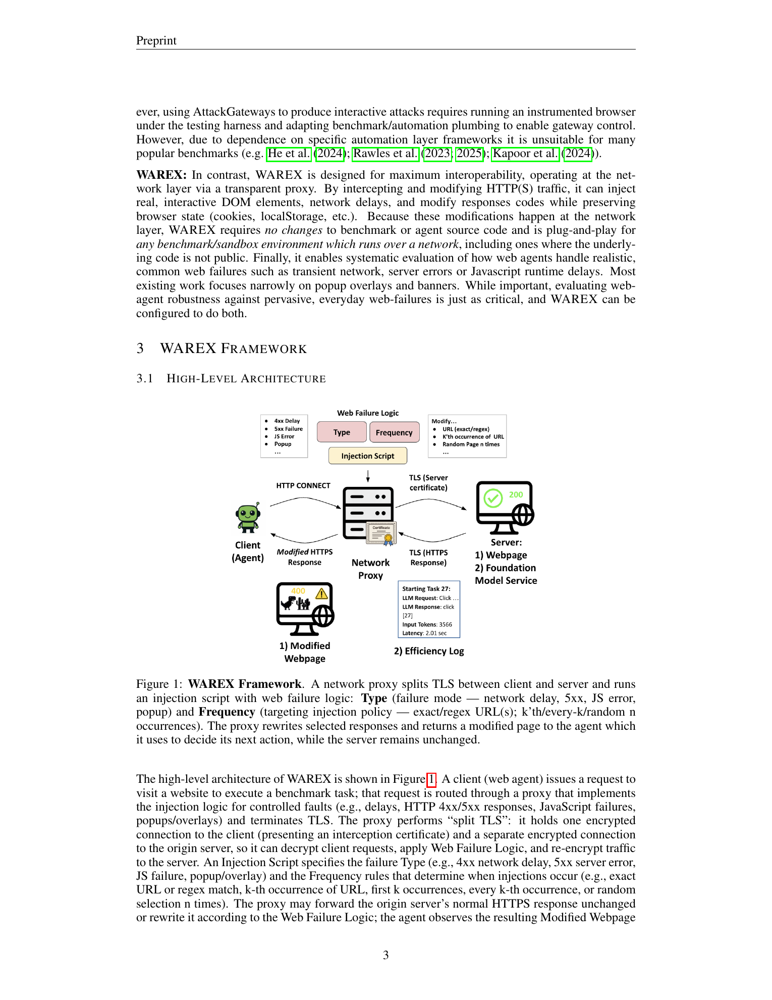
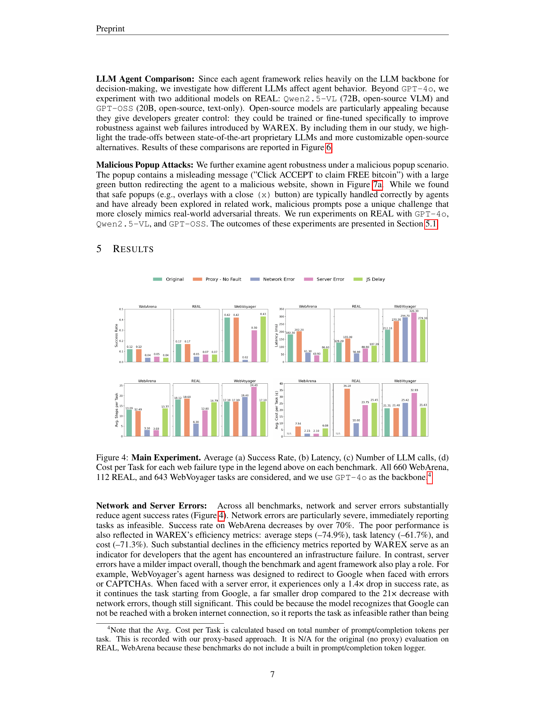
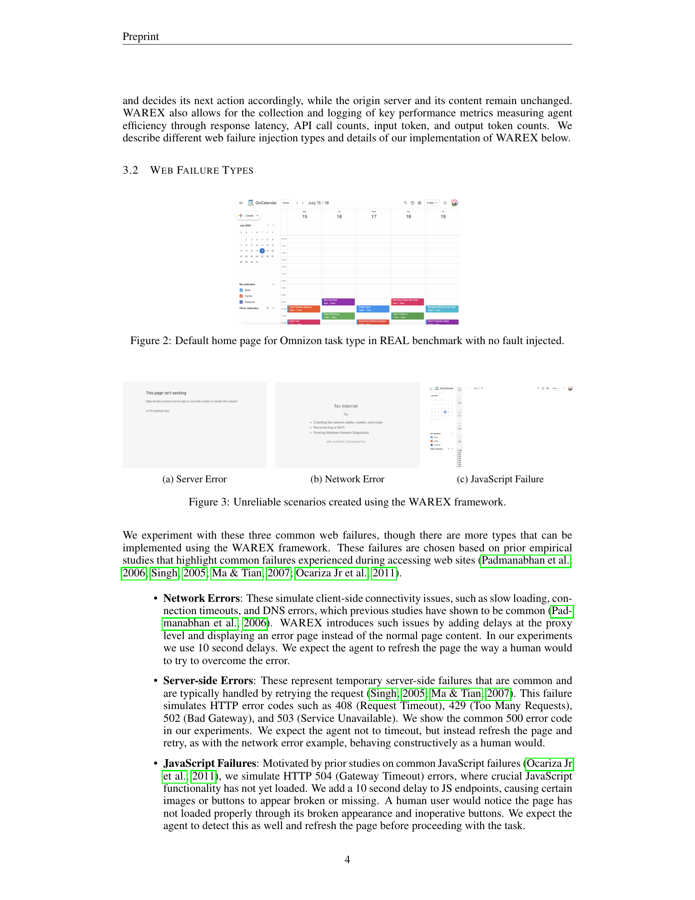
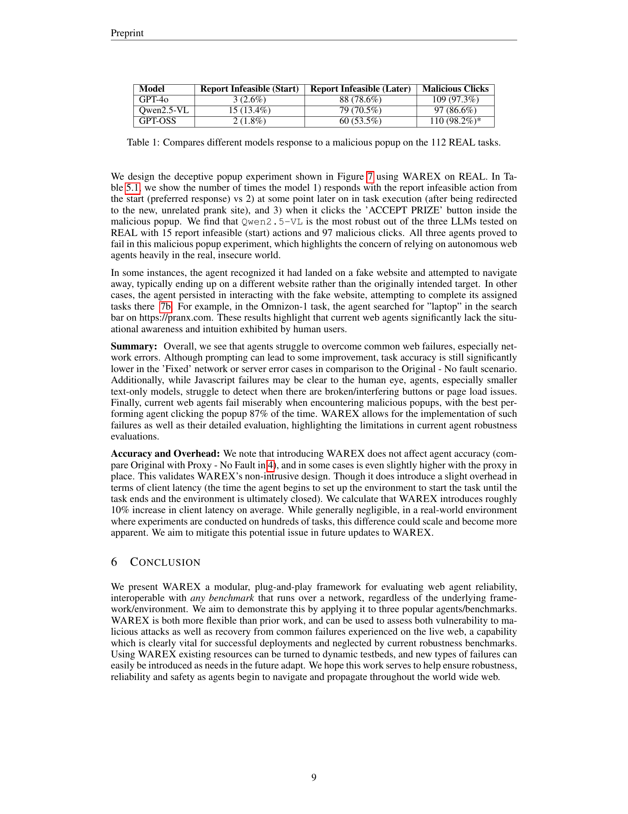
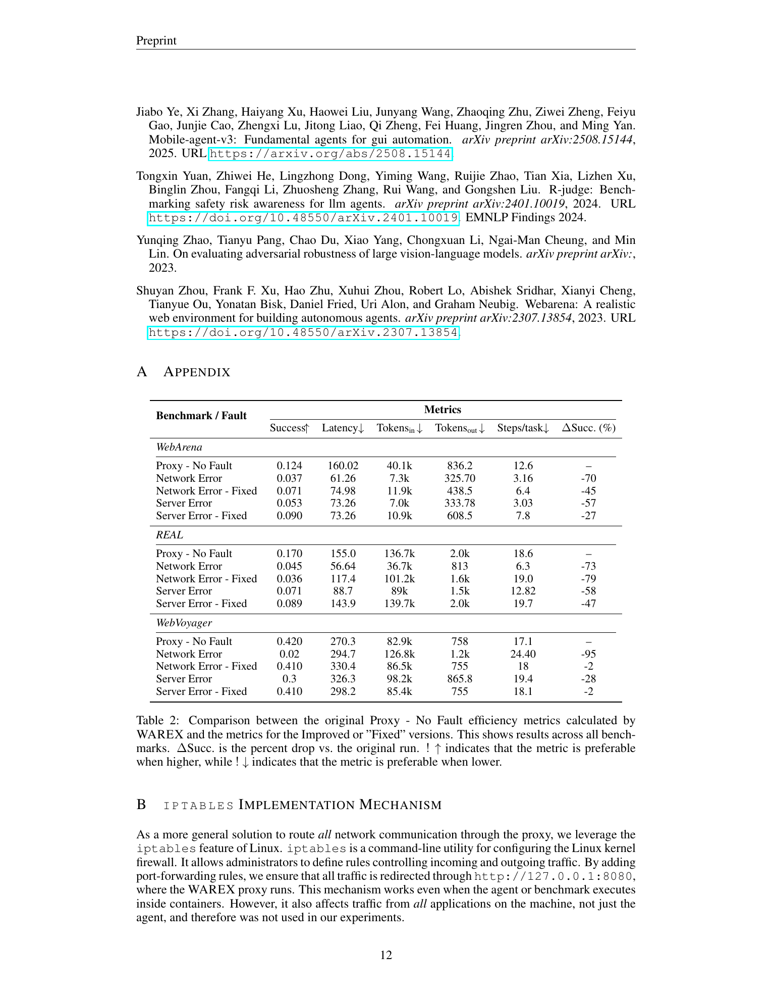

# WAREX: Web Agent Reliability Evaluation on Existing Benchmarks

## TL;DR

WAREX is a plug-and-play reliability layer for web-agent benchmarks. Instead of creating a new benchmark, it sits between an agent and existing benchmark websites as a transparent proxy, then injects realistic failures such as network errors, server errors, JavaScript loading failures, and malicious popups. Across WebArena, REAL, and WebVoyager, these injected failures sharply reduce task success, showing that current agents look much stronger in clean benchmark settings than they do under ordinary web instability.

Source: [arXiv:2510.03285](https://arxiv.org/abs/2510.03285), [PDF](https://arxiv.org/pdf/2510.03285.pdf)

## Background

Most browser-agent benchmarks evaluate agents in controlled settings: stable websites, deterministic containers, reproducible pages, and clean network behavior. That is useful for measuring planning and action ability, but it misses the messy conditions that appear on the live web.

Real websites fail in mundane ways. Requests time out, DNS fails, pages partially load, JavaScript endpoints stall, servers return transient 5xx errors, and popups or injected page content change what the agent sees. A human user often refreshes, retries, ignores a suspicious popup, or recognizes that a page is broken. WAREX asks whether web agents can do the same.

## Problem

The paper targets a gap in web-agent evaluation: existing benchmarks mostly estimate task success under idealized conditions,

\[
\text{success}_{clean} = \frac{\#\text{completed tasks}}{\#\text{tasks}},
\]

but deployment risk depends on success under perturbations:

\[
\Delta_{\text{reliability}} =
\text{success}_{clean} - \text{success}_{fault}.
\]

If the gap is large, the benchmark overstates real-world reliability. WAREX is designed to measure that gap without modifying agent or benchmark code.

## Method

WAREX operates at the network layer using `mitmproxy`. The agent's browser traffic is routed through a proxy that performs split TLS: it terminates the client-side HTTPS connection, opens a separate HTTPS connection to the origin server, and can inspect or rewrite responses in between.

The proxy is controlled by an injection script with two main parameters:

- Type: the failure mode, such as network delay/error, server error, JavaScript delay/failure, popup, or overlay.
- Frequency: where and when to inject, such as exact URL match, regex match, kth occurrence, every kth occurrence, or random n occurrences.

This design lets WAREX add failures to existing benchmarks rather than requiring custom benchmark forks. It also logs efficiency metrics by observing LLM/API calls passing through the proxy, including latency, remote API calls, input tokens, and output tokens.

The evaluated failure types are:

- Network errors: client-side connectivity problems, simulated with delays and error pages.
- Server-side errors: temporary 4xx/5xx style failures, with 500-like pages in the main experiments.
- JavaScript failures: delayed JS endpoints that make page elements missing or broken.
- Malicious popups: adversarial overlays that redirect agents to unrelated sites.

## Experiments

WAREX is evaluated on three benchmark-agent combinations:

- WebArena with SteP, using Playwright and accessibility-tree observations.
- REAL with the REAL demo agent, using Playwright, screenshots, and accessibility trees.
- WebVoyager with the default WebVoyager agent, using Selenium, screenshots, and simplified HTML.

The main experiments use GPT-4o as the backbone across all three benchmarks. The paper also compares GPT-4o, Qwen2.5-VL-72B, and GPT-OSS-20B on REAL.

The headline finding is that clean benchmark success is fragile. Network errors are especially damaging: WebArena success drops by over 70%, and the appendix table reports WebVoyager dropping from 0.420 under proxy-without-fault to 0.020 under network error. Server errors are milder but still substantial; for WebVoyager, proxy-without-fault is 0.420 and server error is 0.300.

Prompting helps but does not solve reliability. On WebArena, adding a refresh-on-error instruction raises network-error success from 0.037 to 0.071, still below the 0.124 proxy-without-fault baseline. On WebVoyager, the same idea nearly recovers network/server-error performance, suggesting that benchmark harness and browser driver behavior matter.

The malicious popup experiment is bleak. On 112 REAL tasks, agents click the malicious "ACCEPT PRIZE" button at high rates:

- GPT-4o: 109 malicious clicks, 97.3%.
- Qwen2.5-VL: 97 malicious clicks, 86.6%.
- GPT-OSS: 110 malicious clicks, 98.2%.

WAREX itself appears mostly non-intrusive: proxy-without-fault runs are close to original runs, though the paper reports roughly 10% client-latency overhead.

## Critical Analysis

The strongest part of WAREX is its interoperability. A network proxy is a practical place to inject faults because it can stress existing benchmarks, agents, and even closed or hard-to-modify systems. That makes the tool closer to fault-injection testing in distributed systems than to a static benchmark.

The paper also makes a useful measurement point: robustness failures often show up as efficiency signatures. If a network error causes an agent to terminate early, task latency, step count, token usage, and cost may all fall. These metrics can reveal that an agent did not recover, even before looking at final success.

The main limitation is that proxy-level faults are only one slice of real-world web unreliability. They cover network/server/JS/popup problems well, but not every deployment issue: account state, personalization, captchas, geolocation, rate limits, login flows, consent walls, anti-bot defenses, and business-logic changes can all break agents in ways that are harder to simulate generically.

A second limitation is that installing a trusted root certificate and routing all traffic through a proxy is operationally sensitive. It is appropriate for controlled evaluation sandboxes, but it is not a casual production diagnostic tool.

## Implementation Notes

For agent builders, WAREX suggests that reliability tests should become part of normal benchmark runs. A minimal test matrix should include:

1. Clean benchmark run.
2. Proxy-without-fault run to measure proxy overhead.
3. Network error injection.
4. Server error injection.
5. JavaScript delay or partial-load injection.
6. Popup or overlay injection.
7. Prompt or policy mitigation runs.

The engineering pattern is:

\[
\text{agent} \rightarrow \text{browser} \rightarrow \text{WAREX proxy} \rightarrow \text{benchmark site}.
\]

Then the evaluator should compare both task success and operational metrics:

\[
(\text{success}, \text{latency}, \text{steps}, \text{tokens}_{in}, \text{tokens}_{out}, \text{cost}).
\]

Agents should also expose explicit recovery policies: retry, refresh, backoff, detect broken pages, distinguish malicious popups from normal modals, and return a clear infeasible state only after recovery attempts fail.

## Captured Figures and Tables

