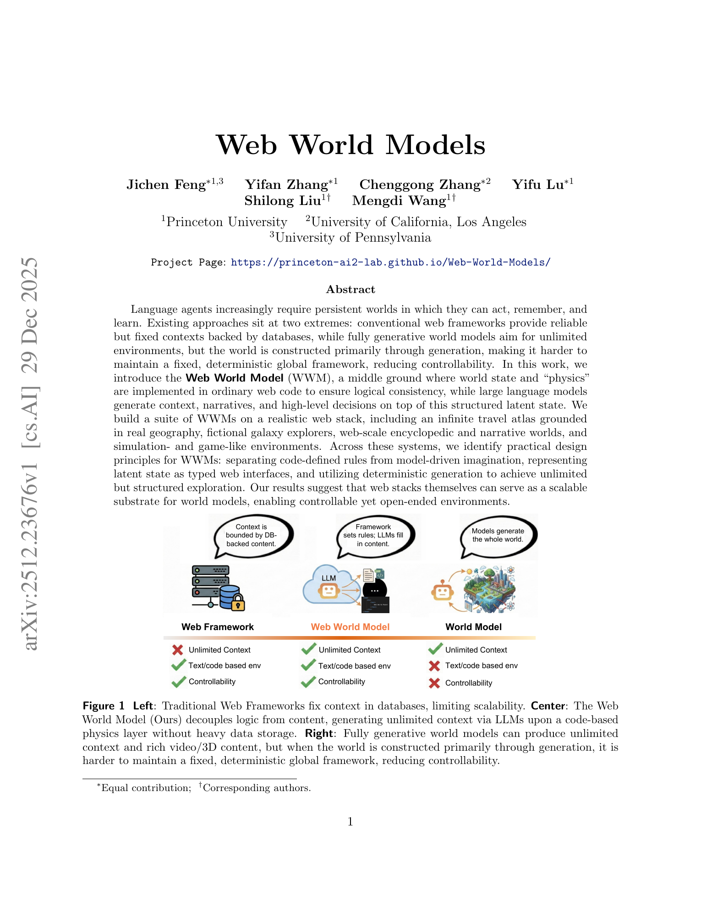
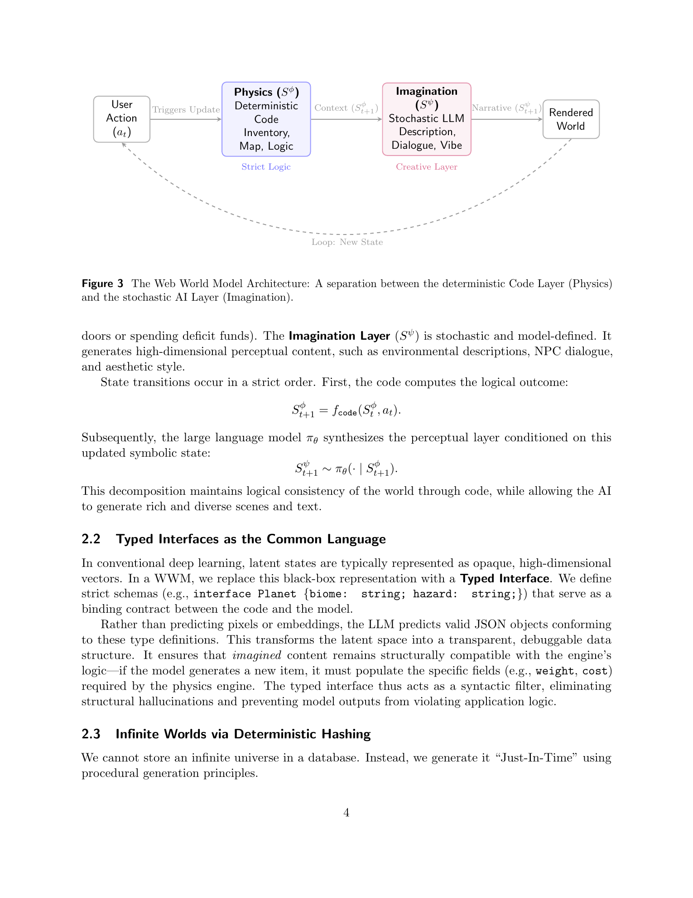
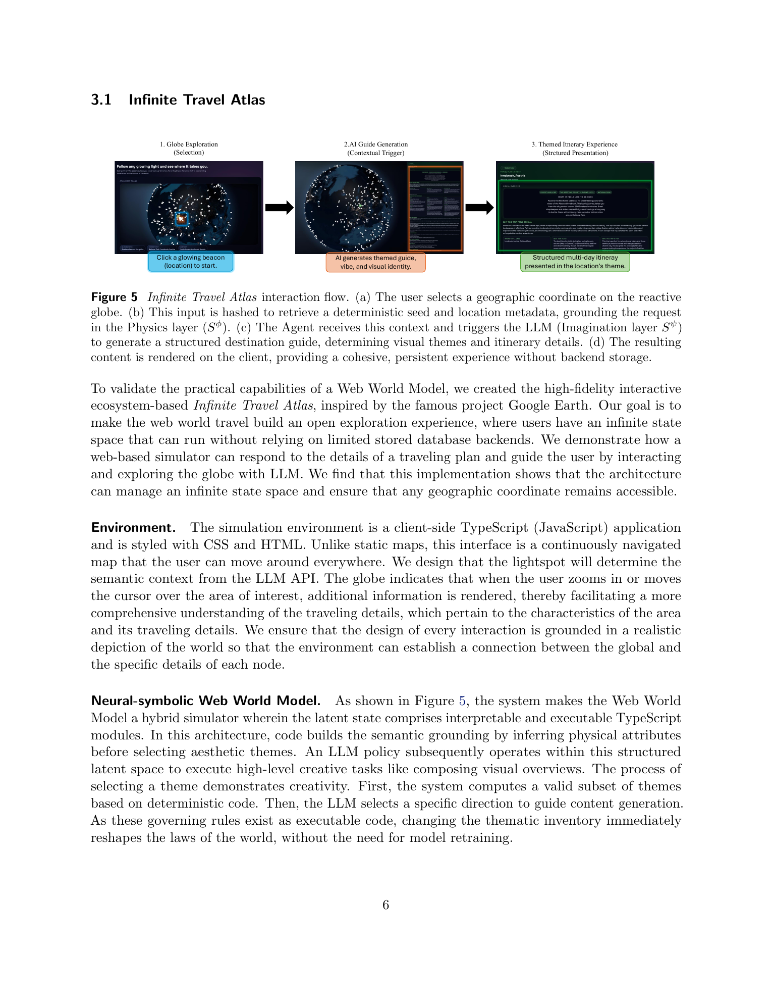

# Web World Models

## TL;DR

Web World Models (WWMs) propose a practical middle layer between ordinary database-backed web apps and fully generative world models. The paper's core move is to put persistent state, rules, and invariants in ordinary web code, while using LLMs only for descriptions, narratives, and high-level content generation. The result is less a benchmark than an architectural pattern: typed web interfaces and deterministic procedural generation can make open-ended agent environments more controllable, debuggable, and deployable.

Source: [arXiv:2512.23676](https://arxiv.org/abs/2512.23676), [PDF](https://arxiv.org/pdf/2512.23676.pdf), [project page](https://princeton-ai2-lab.github.io/Web-World-Models/), [code](https://github.com/Princeton-AI2-Lab/Web-World-Models)

## Background

Language agents increasingly need environments that last longer than a single prompt. They need places to act, revisit, observe, remember, and learn from. Current systems often fall into two awkward categories.

Traditional web applications provide reliable state through databases, schemas, APIs, routing, permissions, and frontend rendering. That stack is easy to test and operate, but the environment is bounded by the content and schema that developers explicitly created.

Fully generative world models promise open-ended environments, but they can be difficult to control. If the model is responsible for the whole world, then object permanence, state transitions, safety constraints, and debugging become model-behavior problems rather than engineering problems.

WWMs are the paper's proposed middle ground. They treat the web stack as a substrate for world modeling. Code defines what can exist and how it changes; the LLM fills in context, style, prose, missions, explanations, and other rich perceptual details.

## Problem

The paper targets a design problem rather than a narrow metric problem: how can developers build open-ended environments for agents without giving up the operational discipline of normal software?

A WWM must satisfy several constraints:

- persistent objects should remain stable when revisited;
- state transitions should follow explicit rules;
- generated content should fit typed interfaces that the renderer and simulator can consume;
- the system should continue functioning when model calls are slow, expensive, or unavailable;
- the environment should expand beyond a static database of prewritten entries.

The paper frames world state as two coupled parts:

\[
S_t = (S_t^\phi, S_t^\psi)
\]

where \(S_t^\phi\) is the deterministic physics layer implemented in code, and \(S_t^\psi\) is the imagination layer generated by the model. The key claim is that the model should not own the rules of the world. It should operate inside boundaries defined by code.

## Method

The WWM architecture separates "Physics" from "Imagination." For a user action \(a_t\), code first computes the next logical state:

\[
S_{t+1}^{\phi} = f_{\mathrm{code}}(S_t^\phi, a_t).
\]

Only after that deterministic transition does the LLM generate the perceptual or narrative layer:

\[
S_{t+1}^{\psi} \sim \pi_\theta(\cdot \mid S_{t+1}^{\phi}).
\]

This ordering matters. If a player spends a resource, opens a locked door, moves to a coordinate, or triggers a reaction, that transition is checked by symbolic code before the model writes a story around it.

The second design principle is typed interfaces. Instead of asking the LLM for unconstrained prose or opaque latent vectors, the system asks for JSON objects matching explicit TypeScript-style schemas. A generated planet, card, relic, element, itinerary, or article section must have fields the engine understands. This turns generation into a contract-bound service rather than an unconstrained source of application state.

The third principle is deterministic generation. Infinite worlds cannot be fully stored in a database, so the system uses coordinates or object identifiers to derive stable seeds:

\[
h(x) \rightarrow \mathrm{seed}.
\]

The same location can then regenerate the same structured state later, giving object permanence without storing every object in advance.

Finally, WWMs need graceful degradation. At high fidelity, the LLM generates fresh content. At lower fidelity, the system can serve cached content or deterministic templates. Since code owns the physics layer, the environment remains usable even if the imagination layer is unavailable.

## Experiments

The paper does not present a benchmark with quantitative task scores. Its evidence is a suite of prototype WWMs implemented on a realistic web stack.

The Infinite Travel Atlas maps arbitrary geographic coordinates into persistent travel destinations. Code handles globe interaction, beacon generation, location metadata, and stable identifiers; the LLM generates themed guides, itineraries, and visual identity. The demonstration covers places such as Nairobi, Honolulu, Rio de Janeiro, Los Angeles, and Innsbruck.

The Galaxy Travel Atlas applies the same pattern to a fictional universe. Procedural code generates galaxy layouts, star lanes, planets, risk profiles, and stable node identifiers. The LLM then fills in mission briefs, hazards, lore, and route narratives while respecting typed schemas.

AI Spire explores game mechanics. A React/TypeScript combat engine owns HP, energy, deck state, relics, status effects, and enemy intent. Gemini Flash is used as a constrained card or relic designer, returning schema-shaped effects that the symbolic game engine validates and executes.

AI Alchemy applies WWM ideas to a falling-sand cellular automaton. The simulator owns physics categories such as powder, liquid, and gas. When unknown element combinations collide, the LLM proposes a schema-constrained reaction, which is cached and integrated into the update loop.

Cosmic Voyager uses WebGL for a navigable solar-system environment. Code handles scene state, camera modes, navigation, and rendering, while the LLM provides view-aware educational narration. WWMPedia turns web retrieval and rendering into the physics layer and uses an LLM to compose Wikipedia-like pages from retrieved evidence. Bookshelf treats long-form fiction as a WWM, where code owns pagination, tags, style constraints, and session state while the LLM streams local prose.

## Critical Analysis

The strongest part of the paper is its engineering framing. It does not ask developers to replace application logic with a model. Instead, it argues that existing web abstractions - schemas, APIs, deterministic renderers, procedural generators, caches, and typed contracts - are already useful world-model machinery.

That framing is especially relevant for agent environments. Many agent failures are not caused by weak prose generation; they come from unstable state, implicit rules, missing affordances, and inconsistent observations. WWMs address those failure modes by making the environment inspectable and testable.

The typed-interface principle is also practical. Structured outputs are not just a prompt formatting trick here; they are the boundary between model creativity and executable state. This is a good design habit for any LLM-backed app where generated content must later be interpreted by code.

The main limitation is that the paper's evidence is mostly demonstrative. The prototypes show breadth, but there is no systematic evaluation of consistency, latency, user experience, agent performance, or failure recovery. For example, it would be useful to measure whether deterministic hashing plus LLM generation actually preserves perceived object permanence under repeated visits, model changes, or prompt changes.

The "world model" term also deserves care. These systems model environments in a software-architectural sense, not necessarily in the learned predictive-model sense used in reinforcement learning or video generation. The paper is most convincing when read as a web architecture for persistent generated environments, less as a claim that web stacks replace learned dynamics models.

Finally, typed schemas reduce structural hallucination, but they do not guarantee semantic correctness. A model can emit valid JSON with implausible lore, inconsistent facts, weak game balance, or poor educational content. WWMs make those failures easier to localize, but they do not eliminate the need for validation, moderation, testing, and content-quality checks.

## Implementation Notes

The most reusable implementation pattern is to keep the model behind a narrow adapter:

\[
\mathrm{typed\ input} \rightarrow \mathrm{LLM} \rightarrow \mathrm{validated\ typed\ output}.
\]

The application should then execute only known effect codes or validated fields. For game-like domains, this means the LLM may propose a card effect, but deterministic code decides how that effect changes HP, energy, block, status, or inventory.

For persistent worlds, seed design is central. A coordinate, route node, object id, or narrative session id should map to a stable procedural seed. If the prompt, model, or schema changes later, the system needs a migration story; otherwise "same seed" may not imply "same world" across deployments.

The graceful-degradation ladder should be designed from the start. A practical WWM should define high-fidelity generation, cached generation, and template fallback paths for every user-facing model call. That makes the product resilient to provider outages and prevents the model from becoming a hidden single point of failure.

For agent benchmarks, WWMs suggest a useful environment-building recipe: expose a typed action API, deterministic state transitions, structured observations, and separate generated surface text from authoritative state. That keeps the world rich enough for language agents while preserving reproducibility.

## Captured Figures and Tables

No tables were captured from this paper.
