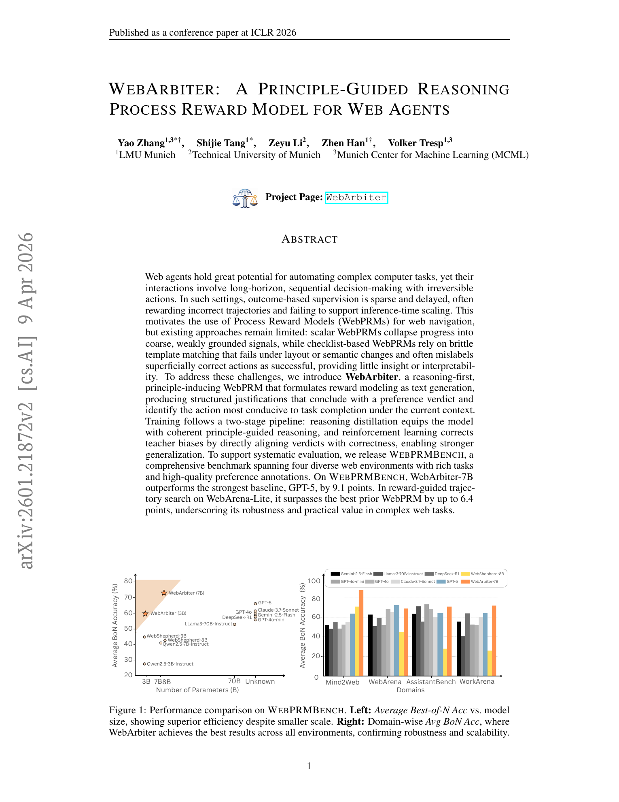
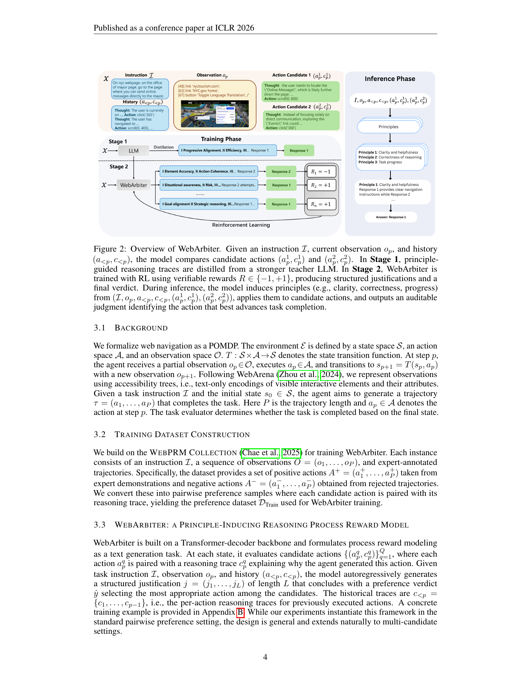
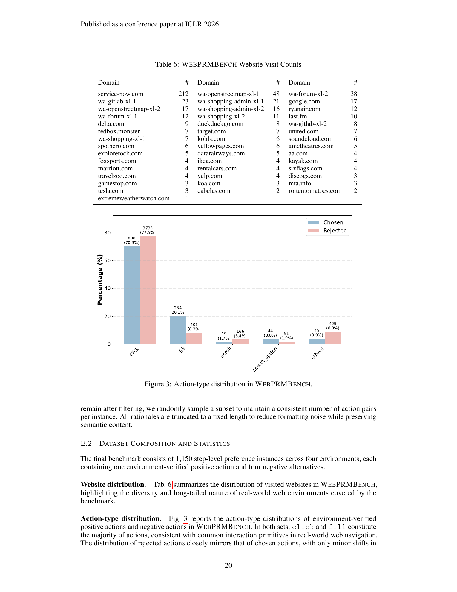
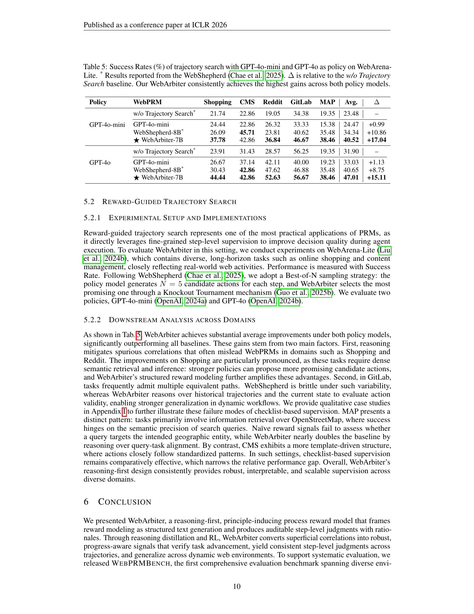
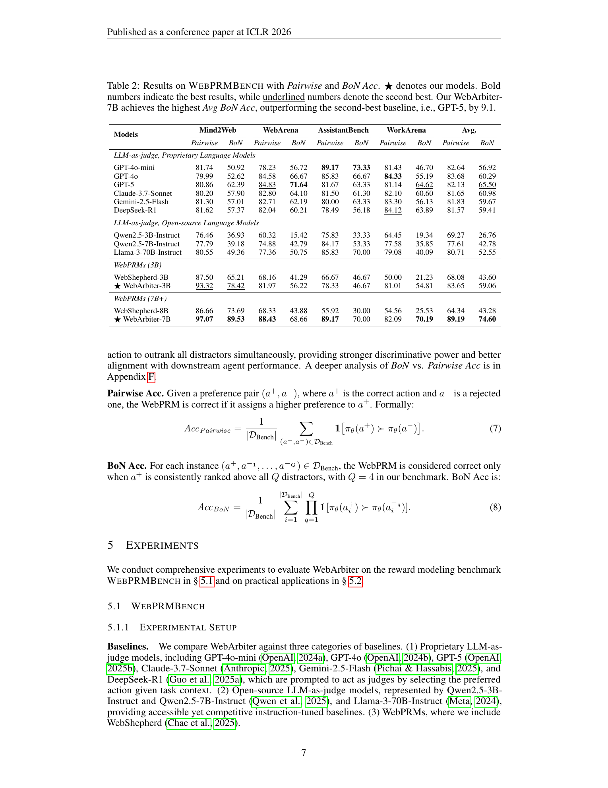
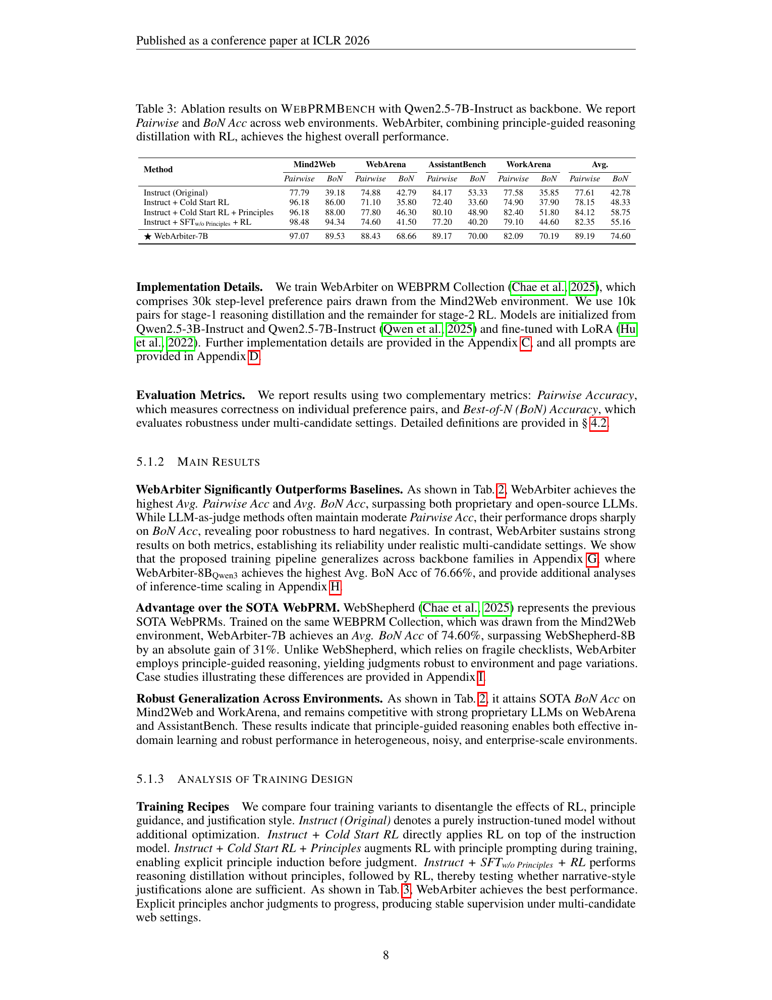

# WebArbiter: A Principle-Guided Reasoning Process Reward Model for Web Agents

## TL;DR

WebArbiter is a process reward model for web agents that judges candidate next actions by generating principle-guided reasoning before a preference verdict. Instead of returning only a scalar score or matching fixed checklists, it derives task-specific principles from the instruction, current browser state, trajectory history, and candidate actions. The paper also introduces WebPRMBench, a 1,150-instance benchmark across Mind2Web, WebArena, AssistantBench, and WorkArena. On WebPRMBench, WebArbiter-7B reaches 74.60% average Best-of-N accuracy, beating GPT-5 by 9.1 points and WebShepherd-8B by 31.32 points; in WebArena-Lite trajectory search, it improves GPT-4o-mini and GPT-4o policies by 17.04 and 15.11 success-rate points over no search.

Source: [arXiv:2601.21872](https://arxiv.org/abs/2601.21872), [PDF](https://arxiv.org/pdf/2601.21872.pdf). The reviewed manuscript is arXiv v2, revised on 2026-04-09, and marked as an ICLR 2026 conference paper.

## Background

Web agents operate in long-horizon browser environments where many intermediate decisions matter. A final success label is often sparse and delayed: the agent may complete or fail a task only after many clicks, form fills, searches, and irreversible submissions. That makes ordinary outcome reward models poorly suited for guiding inference-time search or training.

Process reward models try to score progress at the step level. Existing web PRMs tend to be either scalar models, which compress progress into a coarse number, or checklist-style generative models, which compare actions against fixed templates. Both can fail when page layout, state, or task semantics change.

WebArbiter takes a different route: it turns reward modeling into a reasoning and preference-generation task. The model explains which principles matter in the current context, applies them to candidate actions, and then chooses the action that best advances the task.

## Problem

The paper formalizes web navigation as a partially observable process. At step \(p\), the agent has instruction \(I\), observation \(o_p\), prior actions \(a_{<p}\), and reasoning traces \(c_{<p}\). The reward model receives two candidate action-reasoning pairs:

\[
x = (I, o_p, a_{<p}, c_{<p}, (a^1_p, c^1_p), (a^2_p, c^2_p)).
\]

The goal is to predict the preferred action:

\[
\hat{y} \in \{a^1_p, a^2_p\}.
\]

For a practical web agent, this preference model should do more than identify the locally plausible action. It must decide which candidate truly advances the instruction under the current state, while resisting superficial cues from the candidate's own reasoning trace.

## Method

WebArbiter is built on a decoder-only transformer backbone and trained to generate a structured justification \(j\) before the final verdict. It models:

\[
\pi_\theta(j \mid x) = \prod_{\ell=1}^{L} \pi_\theta(j_\ell \mid x, j_{<\ell}).
\]

The training pipeline has two stages.

First, reasoning distillation uses a stronger teacher model to produce principle-guided justifications. These justifications derive criteria from the instruction and state, compare candidate actions against those criteria, and end with the preferred action. This stage teaches the model a judgment format grounded in progress rather than surface plausibility.

Second, reinforcement learning aligns the final verdict with verifiable preference labels. The model receives a binary correctness reward:

\[
R(x,\hat{y}) \in \{-1, +1\},
\]

and optimizes reward while staying close to the distilled reference policy:

\[
\max_{\pi_\theta} \mathbb{E}[R(x,\hat{y}) - \beta D_{\mathrm{KL}}(\pi_\theta \| \pi_{\mathrm{ref}})].
\]

The paper uses Group Relative Policy Optimization for this stage. The important design choice is that RL supervises the verdict, while the distilled reasoning keeps the judgment process interpretable and less shortcut-driven.

## Experiments

WebPRMBench contains 1,150 step-level preference instances. Each instance has one environment-verified positive action and four rejected alternatives, collected across Mind2Web, WebArena, AssistantBench, and WorkArena. The paper evaluates with Pairwise accuracy and Best-of-N accuracy. BoN is stricter: the correct action must outrank all four distractors.

The main benchmark results are strong. WebArbiter-7B reaches 89.19% average Pairwise accuracy and 74.60% average BoN accuracy. The strongest proprietary baseline, GPT-5, reaches 82.13% Pairwise and 65.50% BoN. WebShepherd-8B, the prior WebPRM baseline, reaches 64.34% Pairwise and 43.28% BoN. The 3B WebArbiter model also beats WebShepherd-8B on average BoN, despite being much smaller.

The ablation table supports the two-stage design. A Qwen2.5-7B instruct model starts at 42.78% average BoN. Cold-start RL improves Mind2Web sharply but remains unstable out of domain, reaching only 48.33% average BoN. Adding principles improves to 58.75%, while reasoning without principles reaches 55.16%. Full WebArbiter with principle-guided distillation plus RL reaches 74.60%, suggesting that both explicit principles and RL alignment matter.

The downstream WebArena-Lite search experiment is the most deployment-relevant result. With GPT-4o-mini as the policy, no trajectory search scores 23.48% average success, WebShepherd-8B-guided search reaches 34.34%, and WebArbiter-7B reaches 40.52%. With GPT-4o as the policy, the same sequence is 31.90%, 40.65%, and 47.01%. The gains are largest in domains where candidate actions require semantic grounding or multiple valid paths, such as Shopping, Reddit, GitLab, and MAP.

## Critical Analysis

The strongest contribution is the framing of process reward modeling as auditable preference generation. Web tasks are full of cases where an action can look reasonable but fail the underlying instruction. A scalar score hides that uncertainty, while a fixed checklist can be brittle. WebArbiter's generated principles make the reward decision easier to inspect.

The benchmark is also useful. WebPRMBench evaluates across four environments and uses hard multi-candidate ranking, so it is closer to how a PRM is used during action selection than a simple pairwise-only test. The BoN metric is especially appropriate because a search policy needs the correct action to beat several plausible distractors.

There are two caveats. First, WebArbiter is text-only: it relies on accessibility-tree representations rather than visual observations. The paper's own limitations and case studies note that layout, spatial cues, and element-reference grounding can still break text-based PRMs. Second, training is English-only and evaluation remains bounded by the selected web-agent environments.

The paper also depends on teacher-generated reasoning in stage 1. RL can correct verdict bias, but the model's reasoning style and principle vocabulary still inherit assumptions from the teacher and prompt design. That is not a flaw, but it means the interpretability should be treated as a useful diagnostic signal rather than guaranteed faithful causality.

## Implementation Notes

For a web-agent stack, WebArbiter suggests a clean separation between the policy model and the reward model. The policy generates \(N\) candidate actions; the PRM compares candidates using the current observation and history; a tournament or ranking procedure selects the next action.

The practical prompt contract should include:

- the user instruction,
- current accessibility tree or browser state,
- prior actions and prior reasoning,
- candidate actions,
- candidate reasoning traces,
- required final verdict format.

If adopting this design, track both Pairwise and BoN metrics. Pairwise accuracy can look healthy while BoN exposes weakness against hard distractors. Also keep environment-level slices: a reward model that works on Mind2Web-style pages may fail on enterprise workflow states or visually grounded tasks.

The most important production guardrail is disagreement handling. When the PRM's generated principles conflict, the top candidates are close, or the action is irreversible, the agent should use a safer fallback such as asking the user, requesting another policy sample, or escalating to a stronger judge.

## Captured Figures and Tables

