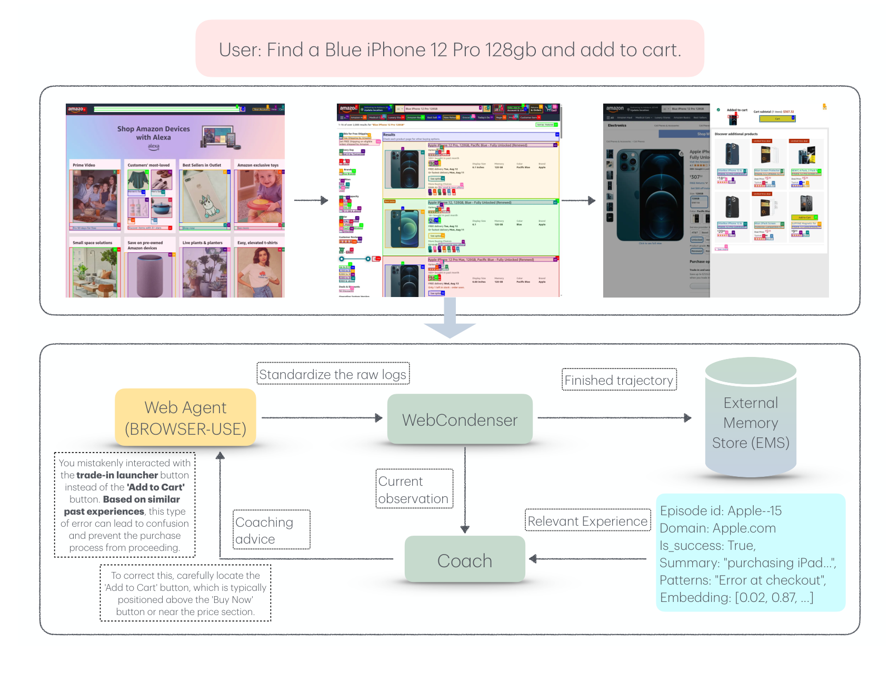
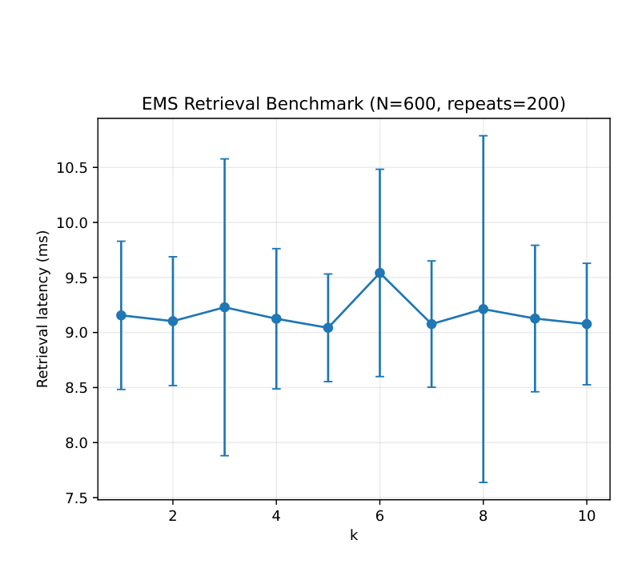
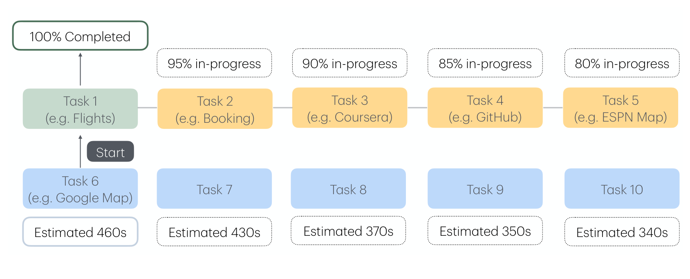
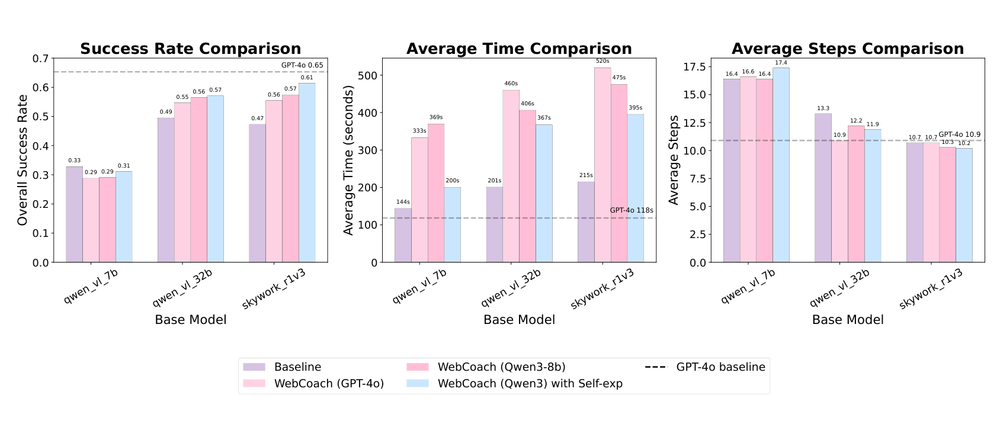
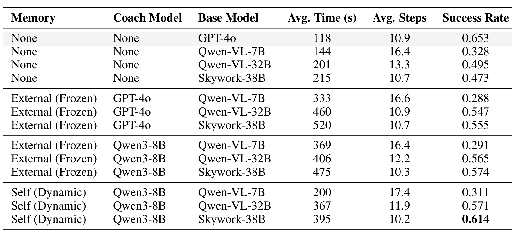
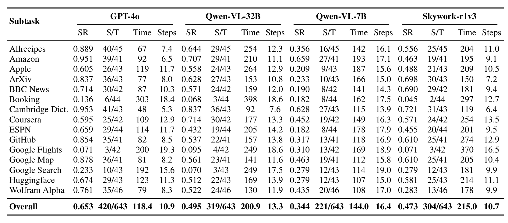
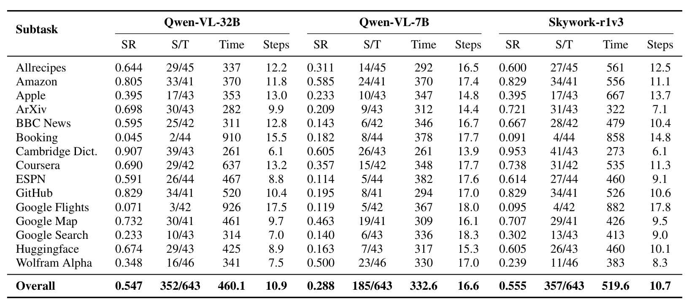
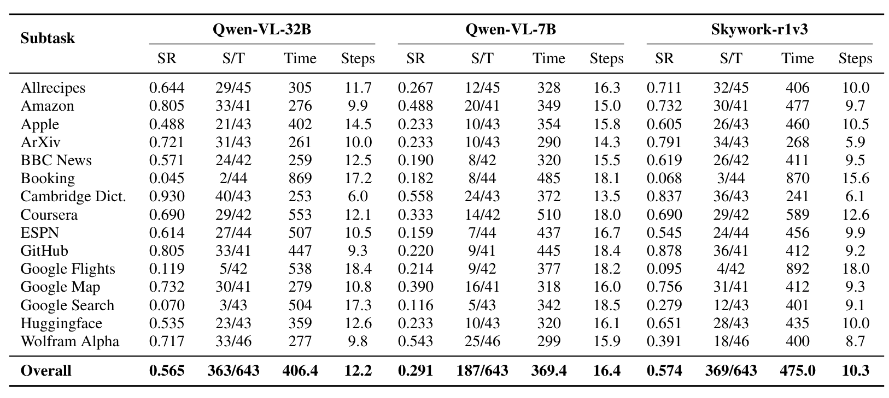

# WebCoach: Self-Evolving Web Agents with Cross-Session Memory Guidance

## TL;DR

WebCoach bolts persistent cross-session memory onto an existing web agent without touching its policy. Three decoupled modules: a WebCondenser that normalizes raw trajectory logs into summaries plus embeddings, an External Memory Store (FAISS/HNSW) holding completed episodes, and a Coach (8B LLM) that retrieves the top-5 similar past episodes and decides whether to inject a sentence or two of advice into the actor's prompt as a system message. On WebVoyager's 643 live tasks, Skywork-38B goes from 47.3% to 61.4% success and Qwen-VL-32B from 49.5% to 57.1%, with flat or lower step counts — but at roughly 2x wall-clock cost, and the 7B backbone gets *worse*. ICLR 2026.

## Background

Web agents waste steps on failures they have already made: revisiting the same links, stalling at login gates, triggering CAPTCHAs. Prior fixes operate within a single episode (back-tracking, progress rewards, Reflexion-style self-critique) or compress history to fit context. Neither carries knowledge across sessions. Meanwhile, retraining approaches (RL curricula, self-evolving fine-tuning) buy cross-episode improvement at the cost of long training cycles and a policy that is no longer model-agnostic.

## Problem

Agents have no memory beyond the current task, which caps sample efficiency and robustness. The authors want cross-episode learning that (a) requires no gradient updates to the actor, (b) wraps any agent framework through trajectory hooks, and (c) starts producing useful advice from a small seed corpus rather than after a long training run.

## Method

WebCoach is a plug-in layer over an actor agent (here, BROWSER-USE). The three modules communicate by function call and require no change to the actor's workflow.

### WebCondenser

After every environment step the actor writes a structured log of the partial trajectory T₁:ₜ = {(oᵢ, aᵢ, rᵢ)}. The rewards are not necessarily numeric — they can be the agent's own self-assessment of task status. A small LLM (≤8B) maps the raw trace to a fixed schema:

- `summary_text` — 3–5 sentences on the high-level outcome so far
- `embedding` — 1536-d OpenAI embedding of the summary
- `final_success` — true/false/null (null = still running)
- `fail_modes` or `success_workflows` — key steps as evidence, for error analysis

The Condenser deliberately performs no reasoning or intervention; it is a schema-normalizing filter, which is what makes the layer framework-agnostic (BROWSER-USE, Nova-Act, or anything else).

**Routing** is the notable design decision: partial trajectories are streamed to the Coach for real-time use but *not* stored; only completed episodes are persisted. This keeps the memory free of half-finished transient states while still giving the Coach live context.

### External Memory Store

Records are ⟨embedding, summary_text, meta⟩, where meta holds episode_id, domain/URL root, user goal, model name, total steps, and timestamp. Retrieval is a FAISS vector index with HNSW-128, ranked by normalized dot product between the current partial-trace embedding and stored embeddings.

The store is agnostic to which model, dataset, or domain an episode came from, so it doubles as a cross-actor knowledge repository and can be **cold-started** by seeding it with episodes from a stronger agent.

A retrieval benchmark at N=600 trajectories (200 repeats) shows latency flat at roughly 9.0–9.5 ms across k = 1…10, so k is not latency-constrained. The authors pick **k = 5** on the grounds that five examples give enough variety to spot patterns without drowning out the current state in the Coach's context.

### Coach

An 8B LLM that runs at each step with two inputs: the Condenser summary of the current partial trace, and the top-5 EMS summaries. It uses both the content and the success/failure labels of retrieved episodes, so advice is grounded in outcomes ("Avoid clicking 'Next' — previous agents got stuck in a loop here").

**Intervention is selective.** The Coach returns `"intervene": false` unless it predicts high failure probability (loops, CAPTCHA, HTTP 4xx) or finds a faster path in memory. When it does intervene, the advice JSON is appended synchronously to the actor's message history as a system message before the next action selection. No gradients flow; the actor's policy is untouched.

Notably, the authors considered DPO fine-tuning of the Coach and **decided against it** after finding that GPT-4o did not consistently beat Qwen3-8B as a coach — they concluded that trajectory-level reasoning, not complex instruction following, is what the role demands. So the deployed Coach is zero-shot prompted.

## Experiments

### Setup

WebVoyager: 643 live tasks over 15 subdomains, real Chromium in Docker on an A100, 30 s per-step timeout, hard cap of 50 steps. Base agents are Qwen2.5-VL-7B, Qwen2.5-VL-32B, and Skywork-r1v3-38B served on vLLM/SGLang, with GPT-4o as a ceiling reference. Thinking/CoT modes are disabled — they added latency without navigation gains. Apart from injected system messages, the stock BROWSER-USE prompt is used.

Success is determined by "browser-use agent's evaluation capability by checking the resulting state of their last action against the initial user query."

**Leakage control:** retrieval explicitly excludes any episode whose WebVoyager task ID matches the current task, so only distinct tasks or prior runs of different subtasks can be retrieved.

**Throughput engineering:** an asynchronous scheduler runs 5 subdomains in parallel with an LPT (longest-processing-time-first) heuristic, pulling the longest remaining job whenever a worker frees up. For Qwen-VL-32B this cut a 82-hour sequential evaluation to under 14 hours, an 83% reduction.

### Configurations

1. **Baseline** — no coaching
2. **Frozen EMS, GPT-4o coach** — memory seeded with GPT-4o trajectories
3. **Frozen EMS, Qwen3-8B coach** — same seeded memory, smaller coach
4. **Dynamic EMS, Qwen3-8B coach** — each agent grows its own memory from its own trajectories

### Main results (Table 1)

| Memory | Coach | Base model | Avg. time (s) | Avg. steps | Success |
|---|---|---|---|---|---|
| None | — | GPT-4o | 118 | 10.9 | 0.653 |
| None | — | Qwen-VL-7B | 144 | 16.4 | 0.328 |
| None | — | Qwen-VL-32B | 201 | 13.3 | 0.495 |
| None | — | Skywork-38B | 215 | 10.7 | 0.473 |
| External (frozen) | GPT-4o | Qwen-VL-7B | 333 | 16.6 | 0.288 |
| External (frozen) | GPT-4o | Qwen-VL-32B | 460 | 10.9 | 0.547 |
| External (frozen) | GPT-4o | Skywork-38B | 520 | 10.7 | 0.555 |
| External (frozen) | Qwen3-8B | Qwen-VL-7B | 369 | 16.4 | 0.291 |
| External (frozen) | Qwen3-8B | Qwen-VL-32B | 406 | 12.2 | 0.565 |
| External (frozen) | Qwen3-8B | Skywork-38B | 475 | 10.3 | 0.574 |
| Self (dynamic) | Qwen3-8B | Qwen-VL-7B | 200 | 17.4 | 0.311 |
| Self (dynamic) | Qwen3-8B | Qwen-VL-32B | 367 | 11.9 | 0.571 |
| Self (dynamic) | Qwen3-8B | Skywork-38B | 395 | 10.2 | **0.614** |

Headline gains: Skywork-38B +14.1 points (0.473 → 0.614), closing most of the gap to the GPT-4o ceiling (0.653); Qwen-VL-32B +7.6 points (0.495 → 0.571). Step counts stay flat or drop (Skywork 10.7 → 10.2), which the authors read as better-informed decision paths rather than brute-force exploration.

**Self-experience beats borrowed experience.** Dynamic EMS outperforms frozen GPT-4o-seeded EMS on all three backbones despite starting from an empty database. The explanation offered is representational: an agent retrieving its own prior trajectories gets embeddings aligned with its own inductive biases, while GPT-4o traces "occasionally inject stylistic mismatches."

**The 7B backbone gets worse** under every configuration (0.328 baseline vs 0.288 / 0.291 / 0.311). The authors propose a *cognitive threshold*: memory guidance helps at the boundary of partial competence, not total ignorance, because a weak model lacks the grounding to exploit cross-episode advice.

**Latency.** Coaching roughly doubles wall-clock time (Skywork 215 s → 395 s in the best configuration, 520 s with the GPT-4o coach). The authors argue the navigation efficiency gain outweighs it and that HNSW keeps retrieval cost logarithmic as memory grows.

## Critical Analysis

**Strengths:**

- The architecture is genuinely modular and the interface is narrow — trajectory hooks in, system message out — so the model-agnostic claim is credible rather than aspirational, and each of the three modules is independently replaceable.
- Storing only completed episodes while streaming partial ones to the Coach is a clean resolution of a real tension: the Coach needs live context, but memory needs finalized outcomes.
- The self-experience-versus-seeded-memory comparison is the most interesting result in the paper and is the right experiment to run. It is also the one with a counter-intuitive answer, since the seeded memory comes from a strictly stronger agent.
- Leakage control is stated explicitly and implemented at the task-ID level, which is more than many memory-augmented agent papers bother with.
- Reporting the negative 7B result rather than dropping the backbone is honest, and the retrieval-latency benchmark (Figure 2) is exactly the kind of measurement that justifies a hyperparameter choice instead of asserting it.

**Weaknesses:**

- **Single runs on a live, non-stationary benchmark, with no variance reported.** Every number is one pass over WebVoyager against real websites that drift between runs. Configurations were necessarily evaluated at different times, and a 14-point claim rests on 643 unrepeated tasks with no confidence intervals.
- **Self-graded success.** Task success is judged by the browser-use agent's own evaluation of its last state against the query, rather than the independent GPT-4o judge WebVoyager ships with. Since the Coach injects advice into the same agent that then reports whether it succeeded, this is the wrong place to economize.
- **The subdomain analysis does not survive checking against the appendix.** The paper claims the largest improvements appear on "Apple, ArXiv, and BBC News." Only ArXiv holds. On Apple, Qwen-VL-32B goes 0.558 (baseline) → 0.395 (GPT-4o coach) → 0.488 (Qwen3-8B coach) — a regression under both. On BBC News, Skywork goes 0.690 → 0.667 → 0.619, also a regression under both.
- **The "simpler domains" explanation is inverted.** Booking.com and Google Flights are described as simple, atomic button-clicking domains that therefore gain little. They are in fact the two hardest domains in the benchmark for every model tested (success 0.045–0.18 throughout), so their flat deltas are a floor effect, not evidence about what memory is good for.
- **Table 1 and Table 2 disagree on the 7B baseline.** The main table reports 0.328; the appendix reports 0.344 (221/643) with identical time and step values. The discrepancy matters because this is precisely the number the cognitive-threshold argument is built on — under the appendix figure the decline is larger, not smaller.
- **The cognitive threshold is a post-hoc hypothesis with one data point below the threshold.** One 7B model regressing does not establish a threshold, and no intermediate scale is tested to locate it.
- **The best configuration has no per-subdomain breakdown.** Appendix Tables 2–4 cover baseline and the two frozen-EMS variants; the dynamic self-experience runs that produce the headline 61.4% are absent, so the claim that self-experience transfers better cannot be examined at domain level.
- **The cost is understated.** Two extra LLM calls per step roughly double wall-clock time and add an 8B condenser plus an 8B coach to the serving footprint. Framing this as transient because HNSW is logarithmic conflates retrieval cost (negligible, ~9 ms) with inference cost (dominant).
- **"Trainable Coach" oversells what was deployed.** The Coach is introduced as a trainable LLM and described as "explicitly trained or prompted," but DPO fine-tuning was abandoned and the shipped system is zero-shot prompting.

## Implementation Notes

- Condenser and Coach are both ≤8B (Qwen3-8B used for both roles in the best configuration); embeddings are 1536-d OpenAI vectors, and consistency of the embedding model across EMS entries is the only hard requirement.
- FAISS with HNSW-128; retrieval ~9.0–9.5 ms at N=600 regardless of k ∈ [1, 10], so k=5 is a context-budget choice, not a latency one.
- Only completed episodes are persisted; partial traces stream to the Coach and are discarded.
- Advice is injected as a system message appended to the actor's message history before the next action selection — no policy change, no gradients.
- Evaluation guardrails: 30 s per-step timeout, 50-step hard cap per task, Docker-isolated Chromium per run.
- The LPT-scheduled async evaluation queue (5 parallel subdomain workers) cut evaluation wall-clock by ~83%; useful independently of the memory contribution.
- Code: https://github.com/genglinliu/WebCoach

## Captured Figures and Tables

**Figures:**

*Figure 1. Overview of WebCoach. The Condenser converts raw navigation histories into standardized summaries stored in the External Memory Store, from which the Coach retrieves relevant prior experiences and issues task-specific guidance to the web agent.*

*Figure 2. EMS retrieval latency versus k with 600 stored trajectories, 200 repeats per point. Latency averages 9.0–9.5 ms across k = 1…10, so k is chosen on context budget rather than speed.*

*Figure 3. Asynchronous evaluation pipeline. WebVoyager's 15 subdomains are distributed across 5 parallel queues; a freed worker immediately pulls the next task instead of waiting for the batch, cutting total evaluation time by over 80%.*

*Figure 4. Success rate, average time, and average steps across the three backbones and four configurations. Success improves for the 32B and 38B models at roughly flat step counts, but average time rises substantially.*

**Tables:**

*Table 1. Success rate, average time, and average steps across all WebVoyager configurations, organized by memory type and coach model.*

*Table 2. Baseline per-subtask results without WebCoach across base models, with GPT-4o as the ceiling reference. SR = success rate, S/T = successful vs. total tasks.*

*Table 3. Per-subtask results with WebCoach using GPT-4o-seeded frozen EMS and GPT-4o as coach.*

*Table 4. Per-subtask results with WebCoach using GPT-4o-seeded frozen EMS and Qwen3-8B as coach.*
