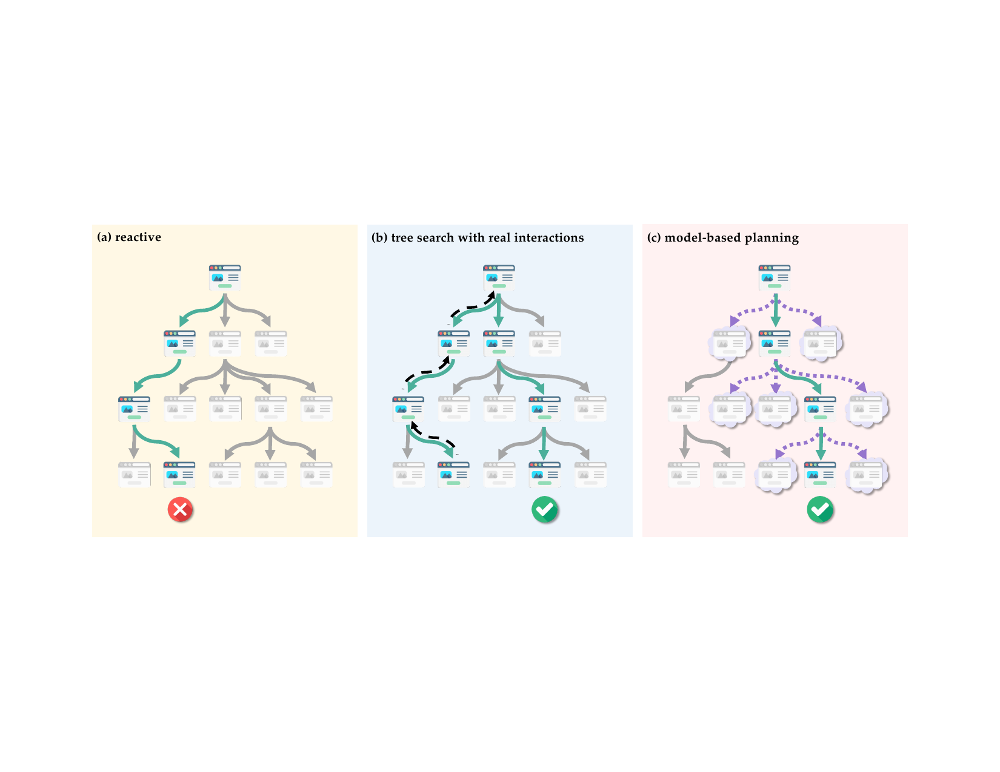
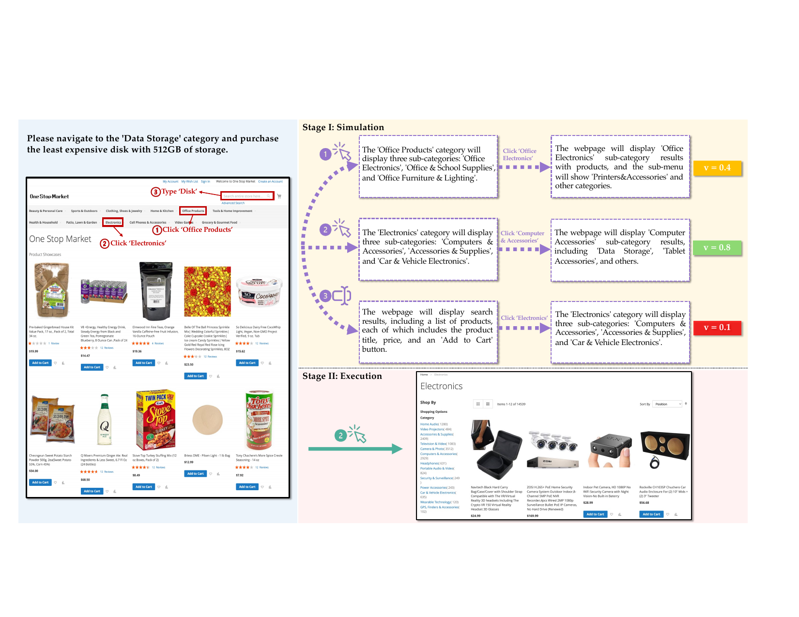
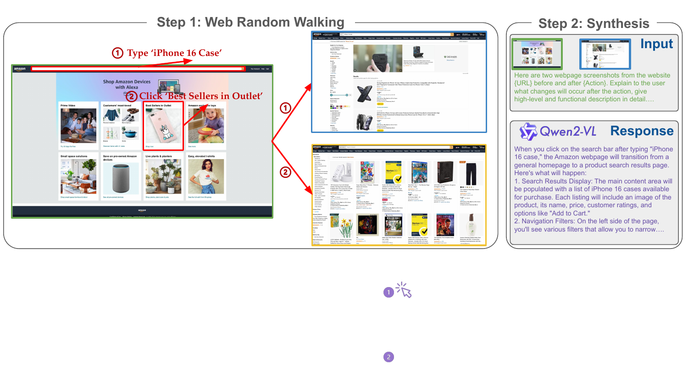

# Is Your LLM Secretly a World Model of the Internet? Model-Based Planning for Web Agents

**Authors:** Yu Gu, Kai Zhang, Yuting Ning, Boyuan Zheng, Boyu Gou, Tianci Xue, Cheng Chang, Sanjari Srivastava, Yanan Xie, Peng Qi, Huan Sun, Yu Su  
**Published:** 2024-11-10 (v2: 2025-04-01)  
**Tags:** web-agents, world-models, model-based-planning, multimodal-llm, visualwebarena, mind2web, test-time-planning

## TL;DR

WebDreamer is a model-based planning framework for web agents. Instead of exploring many branches through real, potentially irreversible browser interactions, it asks an LLM world model to simulate the likely state change for each candidate action, scores the simulated trajectory, and executes only the best first action. The authors train Dreamer-7B, a specialized transition model, from more than 3.1 million synthetic web interactions. Across VisualWebArena, Online-Mind2Web, and Mind2Web-Live, WebDreamer improves over a reactive agent; with GPT-4o it reaches 23.6%, 37.0%, and 25.0% success, while Dreamer-7B reaches 21.9%, 35.0%, and 24.0%. On VisualWebArena it is close to real-interaction tree search but uses roughly 4–5× less wall-clock time. Domain-specific continual training on only 25K interactions per site can bring the 7B model to or above GPT-4o on some environments.

Source: [arXiv:2411.06559](https://arxiv.org/abs/2411.06559), [PDF](https://arxiv.org/pdf/2411.06559.pdf), [code](https://github.com/OSU-NLP-Group/WebDreamer)

## Background

Reactive web agents choose an action from the current screenshot or page state and immediately execute it. This is simple and often efficient, but local decisions can be shortsighted. Tree-search agents improve planning by exploring alternative action sequences, yet they pay for every exploratory click and rely on resetting the environment to backtrack. Resetting is possible in a sandbox such as VisualWebArena, but not on a live website where actions can submit orders, change settings, or create accounts.

World models offer a middle ground: predict what the environment will look like after an action, plan in the predicted states, and reserve real interactions for the chosen path. The Internet is unusually difficult for this purpose because pages are open-ended, dynamic, visually diverse, and only partially observable. The paper asks whether pretrained multimodal LLMs contain enough web knowledge to serve as practical transition and value models, and whether a smaller specialized model can be trained from synthetic interaction data.

## Problem

Each web task is modeled as a POMDP ((\mathcal{S}, \mathcal{A}, \mathcal{O}, T, R, \Omega)). The agent sees an observation (o=\Omega(s)), chooses an action such as clicking, typing, or navigating, and receives a binary task-completion reward. The challenge is to select actions that make long-horizon progress while minimizing real browser interactions.

A useful simulator must be action-relevant rather than a pixel-perfect browser emulator: it should predict the important state changes, support scoring of possible futures, and avoid hallucinating actions that are not available in the predicted page. Errors compound with planning horizon, so the system must balance lookahead depth against simulation reliability.

## Method

### WebDreamer planning loop

WebDreamer uses a model-predictive-control style loop:

1. Propose top-(k) candidate actions from the current instruction and screenshot.
2. Self-refine the candidates to remove irrelevant or redundant actions.
3. For each remaining action, use `sim(o,a)` to predict the state change and recursively imagine a trajectory of horizon (H).
4. Use `score(\tau)` to assign each simulated trajectory one of three progress values: complete (1.0), on track (0.5), or incorrect (0).
5. Average scores over multiple simulations and execute the first action of the highest-scoring trajectory.
6. Repeat after observing the real next page; stop on a stop action, the maximum step count, or an action repeated three times.

The simulator has two components. A transition module describes the effects of the proposed action in concise natural language, while an action-proposal module imagines the next action from the predicted state. GPT-4o can provide both modules, or the transition module can be replaced by Dreamer-7B. The main experiments use (H=1), since longer simulated chains suffer from action hallucination and error accumulation.

### Synthetic world-model data

To train a deployable model, the authors sample starting URLs from the October 2024 Common Crawl index and perform heuristic random walks: clicking, hovering, typing, and selecting options. Action probabilities favor common interactions while preserving coverage and prioritize newly revealed elements to create causal dependencies. Search queries are generated with GPT-3.5-turbo.

For every interaction, screenshots before and after the action are sent to Qwen2-VL-72B, which writes a textual description of the state change. Failed, blocked, and potentially harmful interactions are filtered, leaving more than 3.1M training instances. Dreamer-7B initializes from Qwen2-VL-7B and learns next-state descriptions with a next-token objective. An intrinsic evaluation set is used for checkpoint selection without running the full downstream benchmarks at every checkpoint.

## Experiments

### Benchmarks and setup

- **VisualWebArena (VWA):** 233 human-verified tasks on Classifieds, Shopping, and Reddit, with screenshots plus Set-of-Mark grounding.
- **Online-Mind2Web:** 100 tasks sampled from 30 easy, 40 medium, and 30 hard tasks across real websites; automatic evaluation has 85% agreement with human judgment.
- **Mind2Web-Live:** 104 tasks on 69 real websites, requiring all annotated key nodes to be completed.

All methods are implemented under the same settings. The real-interaction tree-search baseline is reported only on VWA because resetting and replaying states is not feasible on live websites.

### Main results

| Method | World model | VisualWebArena | Online-Mind2Web | Mind2Web-Live |
| --- | --- | ---: | ---: | ---: |
| Reactive | — | 17.6 | 26.0 | 20.2 |
| Tree search | — | 26.2 | — | — |
| WebDreamer | GPT-4o | 23.6 | 37.0 | 25.0 |
| WebDreamer | Qwen2-VL-7B | 17.2 | 31.0 | 19.2 |
| WebDreamer | Qwen2-VL-72B | 21.0 | 31.0 | 18.3 |
| WebDreamer | Dreamer-7B | 21.9 | 35.0 | 24.0 |

GPT-4o WebDreamer improves over the reactive baseline by 34.1% relative on VWA, 42.3% on Online-Mind2Web, and 23.8% on Mind2Web-Live. Fine-tuning Qwen2-VL-7B into Dreamer-7B adds 4.7, 4.0, and 4.8 percentage points respectively over the untuned 7B model and is comparable to GPT-4o on both online benchmarks.

### Efficiency and analysis

On VWA, tree search takes about three times as many action steps as the reactive agent and roughly ten times its wall-clock latency. WebDreamer keeps action counts close to reactive execution and is 4–5× faster than tree search. With GPT-4o, average completion times for Classifieds, Reddit, and Shopping are 183.6s, 233.7s, and 179.4s, compared with 749.2s, 972.1s, and 785.7s for tree search.

The ablation confirms that simulation—not only reranking candidate actions—is responsible for most of the gain. Removing simulation and asking the reward model to score actions directly gives only a small improvement over reactive execution. Removing self-refinement also hurts because irrelevant candidates add simulation noise. Increasing the planning horizon from (H=1) to 2 or 3 lowers effectiveness as imagined action proposals become less distinguishable and hallucinated.

Scaling the synthetic data improves online benchmark performance, with diminishing returns on Mind2Web-Live. Continual training on 25K in-domain interactions for each VWA site raises the total VWA score from 21.9% to 23.2%; Classifieds and Shopping benefit most, while dense, text-heavy Reddit remains unchanged.

## Critical Analysis

The paper makes a compelling systems argument: simulated consequences can provide much of the planning benefit of tree search without taking irreversible real actions. The same framework works with a frontier model and a small specialized model, and the live-website results are important because they test a setting where conventional reset-based search is difficult to deploy.

The explicit separation between transition prediction and value scoring is also useful. It lets a model produce concise, action-relevant state changes while a separate scorer decides whether a trajectory is promising. Self-refinement is a small but meaningful engineering component that reduces the candidate set before expensive simulation.

The main risk is simulator bias. A language description can omit a disabled button, invent a navigation path, or predict a plausible but unavailable action. Errors compound with horizon, and the paper's best configuration is (H=1), so the method is still mostly one-step model-predictive control rather than deep planning. The scoring labels (1/0.5/0) are coarse and GPT-4o-based, which may introduce evaluator bias. Random walks from Common Crawl may not match task-driven interaction distributions, and generated descriptions inherit Qwen2-VL-72B's perception and safety errors. Finally, the benchmark subsets are relatively small, and real-world websites change over time; the reported success and latency may not persist without continual data collection.

## Implementation Notes

- Represent the simulator output as a constrained, concise state-change description. Include newly available elements, navigation outcomes, and task-relevant content, while explicitly stating when an action has no effect.
- Keep candidate generation and self-refinement separate from simulation. This limits cost and prevents a large set of low-probability actions from contaminating the value comparison.
- Start with (H=1). Increase the horizon only after measuring whether the world model preserves action availability; otherwise hallucinated future actions can make all branches look equally good.
- Average multiple simulations per candidate when the transition model is stochastic, and log both predicted and observed state changes so simulator failures can be audited.
- Use a hard termination policy for repeated actions, stop actions, and maximum steps. On live websites, add confirmation gates for state-changing operations that cannot be undone.
- For adaptation, synthesize broad interaction data first, then continue training on a small, leakage-filtered in-domain set. Site-specific training is especially valuable for structured shopping/classifieds pages but may not solve dense text layouts.
- Track real browser steps, model calls, and wall-clock time separately. A method can preserve action count while still becoming expensive if simulation calls are serialized or use a large frontier model.

## Captured Figures and Tables

The main quantitative results are reproduced in the review text; no standalone table images were captured because the available TeX compiler was not installed.
