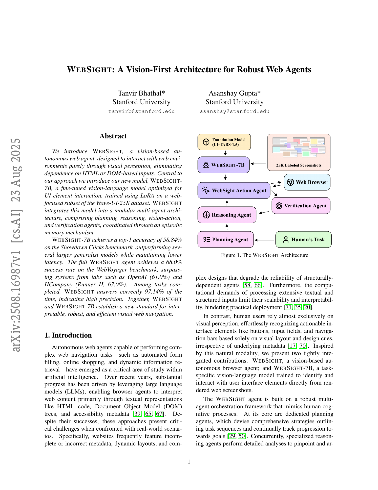
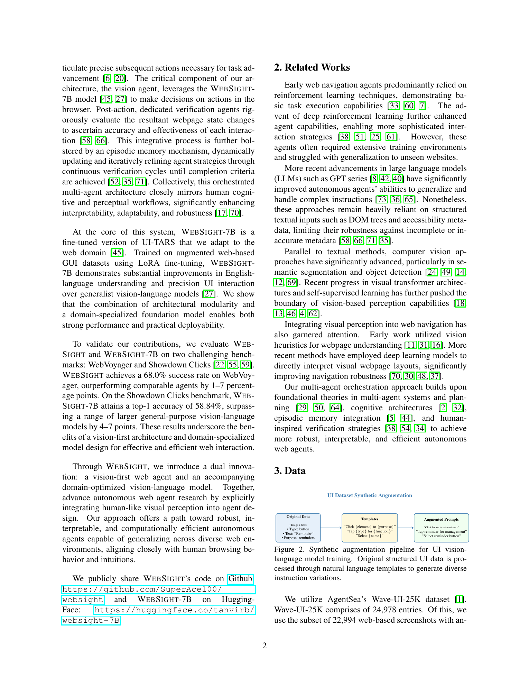
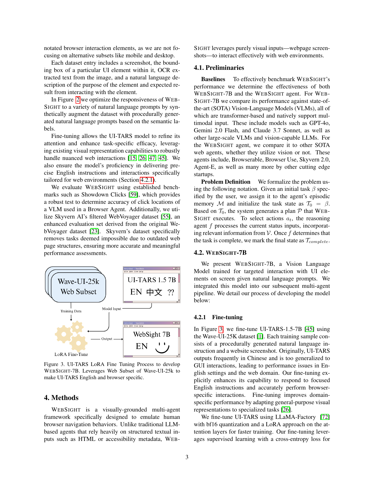
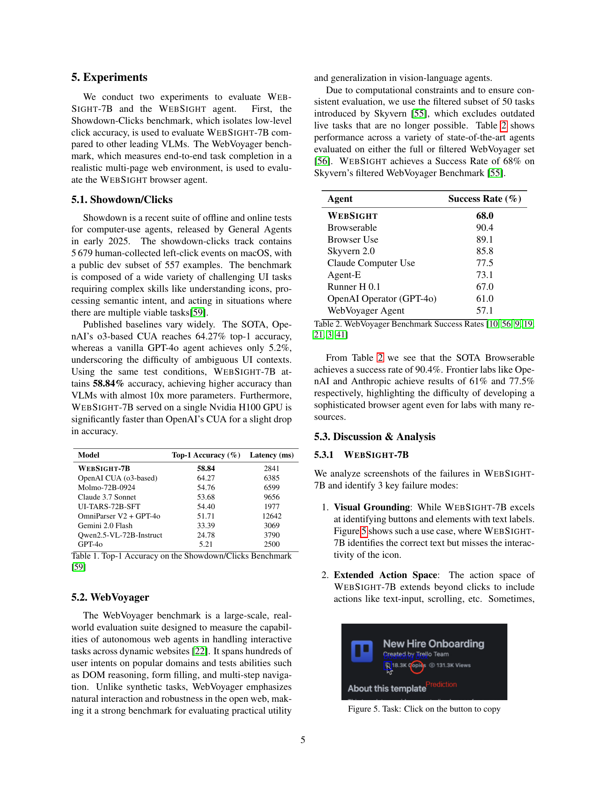
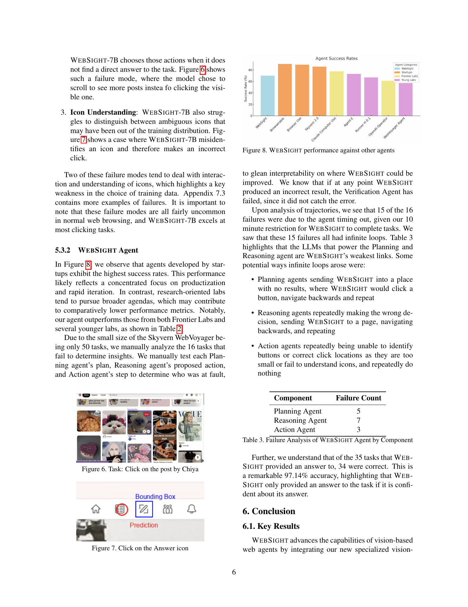

# WebSight: A Vision-First Architecture for Robust Web Agents

## TL;DR

WebSight is a browser agent that tries to operate like a human user: it looks at rendered screenshots instead of relying on HTML, DOM trees, or accessibility metadata. The system combines a specialized visual action model, WebSight-7B, with planning, reasoning, verification, and episodic memory agents. The main result is that WebSight-7B reaches 58.84% top-1 accuracy on Showdown/Clicks, while the full WebSight agent reaches 68.0% success on the filtered WebVoyager benchmark and 97.14% correctness among tasks it answers.

Source: [arXiv:2508.16987](https://arxiv.org/abs/2508.16987), [PDF](https://arxiv.org/pdf/2508.16987.pdf), [code](https://github.com/SuperAce100/websight), [model](https://huggingface.co/tanvirb/websight-7B)

## Background

Many web agents consume structured page representations: HTML, DOM trees, accessibility trees, text extraction, or a mixture of those signals. That can work well when the structure is clean, but real websites often have missing metadata, dynamic layouts, misleading labels, custom components, or UI states that only make sense visually.

WebSight takes the opposite bias. It treats the browser screenshot as the primary observation and asks a vision-language model to select UI interactions directly from pixels. The motivation is simple: human users usually do not inspect the DOM. They infer buttons, fields, menus, and icons from visual layout and context.

## Problem

The paper targets autonomous web navigation where a user gives a task and the agent must complete it through browser actions. The key constraint is that interaction should be driven by visual perception rather than structural web-page metadata.

The paper separates two evaluation questions:

- Can the visual model click the right UI element when given a natural-language instruction?
- Can the full multi-agent system complete multi-step web tasks reliably?

The first question is measured with Showdown/Clicks. The second is measured with a filtered WebVoyager benchmark.

## Method

WebSight has two main pieces.

The first is WebSight-7B, a fine-tuned version of UI-TARS-1.5-7B. The authors train it on the web subset of Wave-UI-25K, using 22,994 web-based screenshots with annotated UI elements. They synthetically augment prompts from structured fields such as element type, text, bounding box, and purpose, then fine-tune with LoRA through LLaMA-Factory. The goal is to make the model more English-oriented and browser-specific than the base UI-TARS model.

The second is the WebSight agent loop. The architecture decomposes browser control into specialized agents:

- Planning agent: creates a high-level task plan.
- Reasoning agent: decides the next precise action from the plan, current page, and history.
- Action agent: uses WebSight-7B to turn that instruction into visual browser interaction.
- Verification agent: checks whether the page changed in the intended direction.
- Episodic memory: stores recent action-outcome state so the system can update plans and avoid repeated mistakes.

The loop can be summarized as:

\[
M = M \cup \{(a_t, \Delta V_t, T_t, T_{t+1})\},
\]

where \(M\) is episodic memory, \(a_t\) is the action, \(\Delta V_t\) is the visual state change, and \(T_t\) is the task state. If verification detects progress, the task state advances; otherwise the plan is updated.

## Experiments

On Showdown/Clicks, WebSight-7B achieves 58.84% top-1 accuracy with 2841 ms latency. It trails OpenAI's o3-based CUA at 64.27%, but is faster in the reported setup and outperforms several larger generalist VLMs, including Molmo-72B, Claude 3.7 Sonnet, UI-TARS-72B-SFT, OmniParser V2 plus GPT-4o, Gemini 2.0 Flash, Qwen2.5-VL-72B-Instruct, and vanilla GPT-4o.

On the filtered 50-task WebVoyager subset, the full WebSight agent reaches 68.0% success. That is below product-oriented systems such as Browserable, Browser Use, Skyvern 2.0, and Claude Computer Use in the paper's table, but above Runner H 0.1, OpenAI Operator (GPT-4o), and the original WebVoyager Agent.

The failure analysis is more informative than the leaderboard number. Of 16 failed WebVoyager tasks, 15 are attributed to timeout loops under a 10-minute limit. The component attribution is:

- Planning agent: 5 failures.
- Reasoning agent: 7 failures.
- Action agent: 3 failures.

The paper also reports that WebSight answered 35 tasks, and 34 of those answers were correct, giving 97.14% correctness among answered tasks. In other words, the system is relatively precise when it terminates with an answer, but it still struggles with loops and task completion.

## Critical Analysis

The strongest part of the paper is the clean vision-first design. It is useful to test how far a web agent can get without DOM or accessibility metadata, especially because those structures are often noisy or unavailable in real deployments. A domain-specific UI action model also makes sense: click localization and icon interpretation are different from general image captioning.

The main limitation is the end-to-end evaluation size. The filtered WebVoyager benchmark has only 50 tasks, and the comparison table mixes systems evaluated on either full or filtered WebVoyager variants. That makes the 68.0% success rate useful as a directional signal, not a definitive ranking.

A second limitation is that removing structured page inputs is a tradeoff, not an obvious free win. Vision can be more robust to bad metadata, but DOM/accessibility signals can expose hidden text, form semantics, exact links, disabled states, and machine-readable structure. A strong production system may need a fusion strategy rather than a strict visual-only policy.

The failure analysis points to an architectural bottleneck: the visual action model is not the only weak point. Planning and reasoning cause more failures than the action component, mostly through infinite loops. This suggests that better loop detection, progress metrics, and plan revision may matter as much as improving click accuracy.

## Implementation Notes

For builders, WebSight suggests a practical modular design:

1. Keep the visual action model narrow: instruction plus screenshot to concrete action.
2. Keep planning and reasoning separate from click localization.
3. Add verification after every browser action.
4. Store recent action-outcome tuples and use them to detect repeated behavior.
5. Measure both low-level action accuracy and full task success.

The most important engineering lesson is to define progress explicitly. A verifier should not only ask whether the page changed; it should ask whether the task state improved:

\[
T_{t+1} \succ T_t.
\]

If the same page state and same action pattern recur, the system should trigger a new plan or stop with a clear failure mode. The paper's timeout-loop failures show why this matters.

## Captured Figures and Tables

