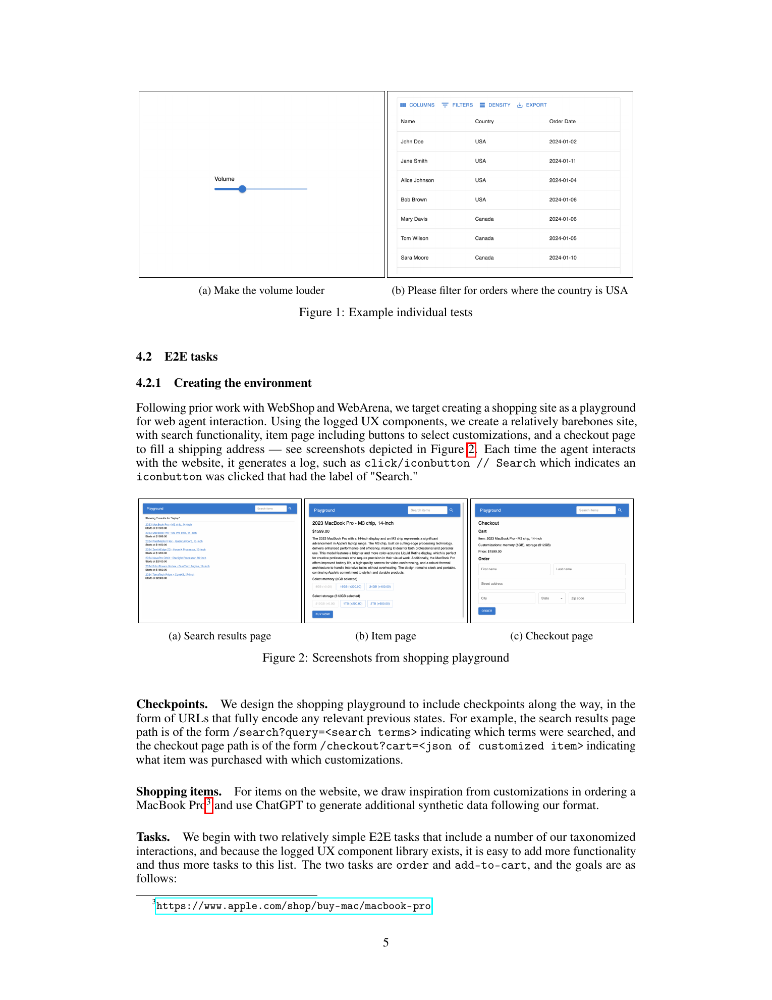
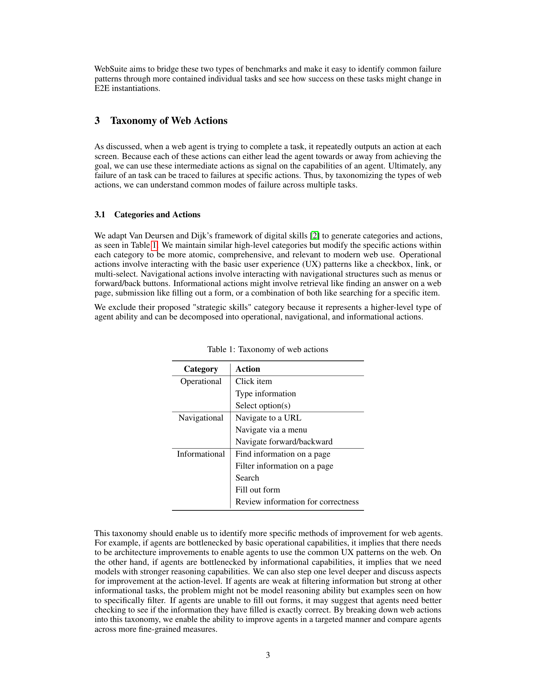
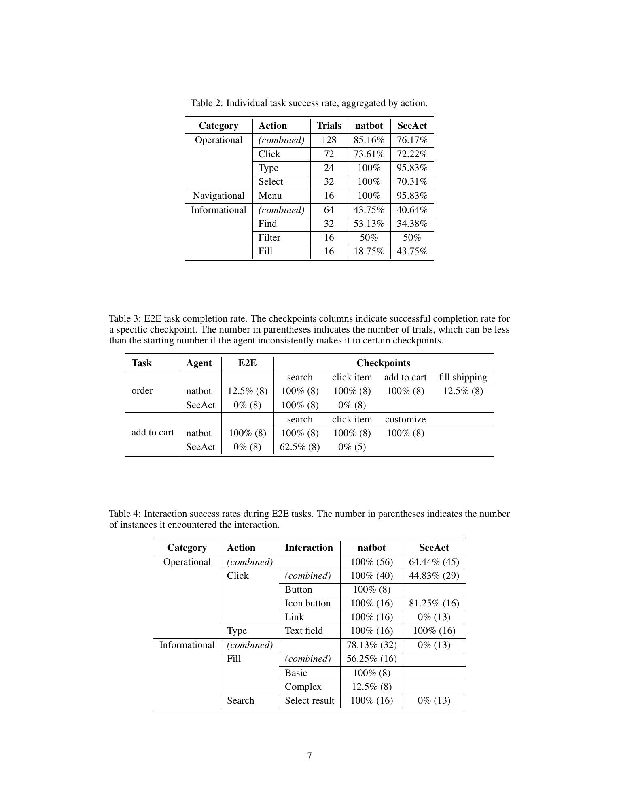

# WebSuite: Systematically Evaluating Why Web Agents Fail

## TL;DR

WebSuite is a diagnostic benchmark for web agents. Instead of only asking whether an agent completes a whole task, it breaks web behavior into a taxonomy of actions and interactions, then uses logged components and checkpoints to attribute failures to specific web skills. The paper evaluates natbot and SeeAct and shows different failure signatures: natbot is mostly blocked by complex form filling, while SeeAct fails badly on link selection in the end-to-end shopping tasks.

Source: [arXiv:2406.01623](https://arxiv.org/abs/2406.01623), [PDF](https://arxiv.org/pdf/2406.01623.pdf), [code](https://github.com/erichli1/websuite)

## Background

Web-agent benchmarks often sit at two extremes. Low-level benchmarks test narrow actions like clicking a specific button, while end-to-end benchmarks test broad goals like buying an item or finding information across sites. Both are useful, but neither directly answers the debugging question: what kind of web action caused the failure?

WebSuite is built around that missing diagnostic layer. It treats an agent trajectory as a sequence of web actions. If a task fails, the benchmark should help identify whether the problem was a click, a select, a menu navigation, a search result choice, a form-fill step, or another interaction type.

## Problem

The core problem is failure attribution. Given an agent goal and a browser trajectory, standard benchmarks usually produce one bit:

\[
\text{success} \in \{0, 1\}.
\]

That signal is too coarse for improving agents. WebSuite instead asks for per-action and per-interaction success rates, so developers can tell whether failures come from operational actions, navigational actions, or informational actions.

The paper's taxonomy has three main categories:

- Operational: click item, type information, select options.
- Navigational: navigate to URL, navigate via menu, navigate forward/backward.
- Informational: find, filter, search, fill forms, review information for correctness.

## Method

WebSuite has two complementary task types.

Individual tasks isolate one interaction. The authors build a logged UX component library on top of Material UI. Components write logs to a Flask backend when the agent interacts with them, so a task can be judged by checking logged behavior or submitted content. Examples include using a slider, filtering a datagrid, toggling a switch, selecting options, or filling forms.

End-to-end tasks are built in a small shopping playground with search results, item pages, customization controls, a cart, and checkout. The environment uses checkpoints encoded in URLs, such as search query state or checkout cart state. Each checkpoint has golden logs describing the expected interactions. This lets WebSuite measure both final task completion and the interaction that broke the path.

The E2E verifier can be sketched as:

\[
\text{E2E success} = \mathbf{1}[\text{final URL and query state match the target task}].
\]

The diagnostic part comes from comparing generated logs against golden logs at each checkpoint.

## Experiments

The paper evaluates two agents:

- natbot: a simple text-based open-source web agent.
- SeeAct: a recent multimodal web agent.

Each agent is run eight times per task across both individual and E2E evaluations.

On individual tasks, both agents are much better at operational and navigational actions than informational actions. Aggregated action success rates include:

- natbot: 85.16% operational, 100% menu navigation, 43.75% informational.
- SeeAct: 76.17% operational, 95.83% menu navigation, 40.64% informational.

At the action level, natbot gets 100% on typing and selecting in the aggregate, but only 18.75% on fill tasks. SeeAct gets 95.83% on typing but 70.31% on selecting and 43.75% on fill tasks.

The E2E shopping tasks show sharper differences. natbot completes the add-to-cart task in 100% of trials but only completes the order task in 12.5%, mostly because filling shipping details fails. SeeAct completes 0% of both E2E tasks. In the interaction logs, SeeAct has 0% success on link clicks in E2E contexts and 0% on selecting search results, despite doing better on some isolated click tasks.

## Critical Analysis

The paper's main strength is that it turns benchmark failure into structured data. "The agent failed the shopping task" becomes "this agent failed the complex form checkpoint" or "this agent selected the wrong search result link." That is much more actionable for system builders.

The benchmark also highlights a useful distinction between isolated capability and embedded capability. SeeAct can perform some link-clicking in individual tasks, but fails link selection in the E2E setting. This is exactly the kind of gap that pure low-level tests miss.

The main limitation is environment realism. WebSuite is intentionally small and controlled, with Material UI components, limited styling, and a simplified shopping site. The taxonomy is valuable, but the measured success rates may not transfer directly to messy production websites with ads, custom controls, popups, anti-bot behavior, or unusual layouts.

A second limitation is scale. The initial evaluation uses only two agents and two E2E tasks. That is enough to demonstrate the benchmark's diagnostic value, but broader conclusions about agent families would need more agents, more sites, and more task diversity.

## Implementation Notes

The benchmark design is directly useful for anyone evaluating web agents:

1. Instrument UI components so actions produce machine-readable logs.
2. Define a taxonomy before running agents, not after manually inspecting failures.
3. Add checkpoint-level golden logs for multi-step tasks.
4. Override noisy primitive labels when a higher-level interaction is the real failure unit.
5. Report both isolated interaction success and E2E interaction success.

For production web-agent evaluation, WebSuite suggests a logging pattern like:

\[
\ell_t = (\text{category}, \text{action}, \text{interaction}, \text{target}, \text{value})
\]

Then final failures can be grouped by missing or incorrect log entries rather than by ad hoc manual review. This also makes it easier to compare two agents that reach the same final failure through different broken interactions.

## Captured Figures and Tables

