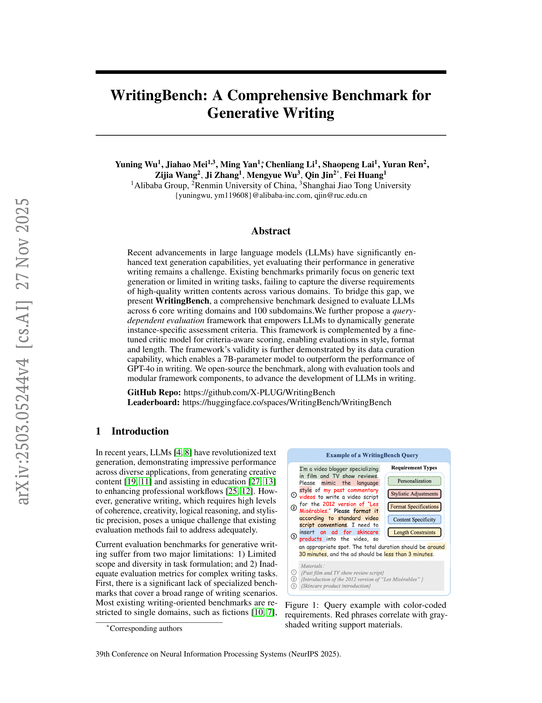
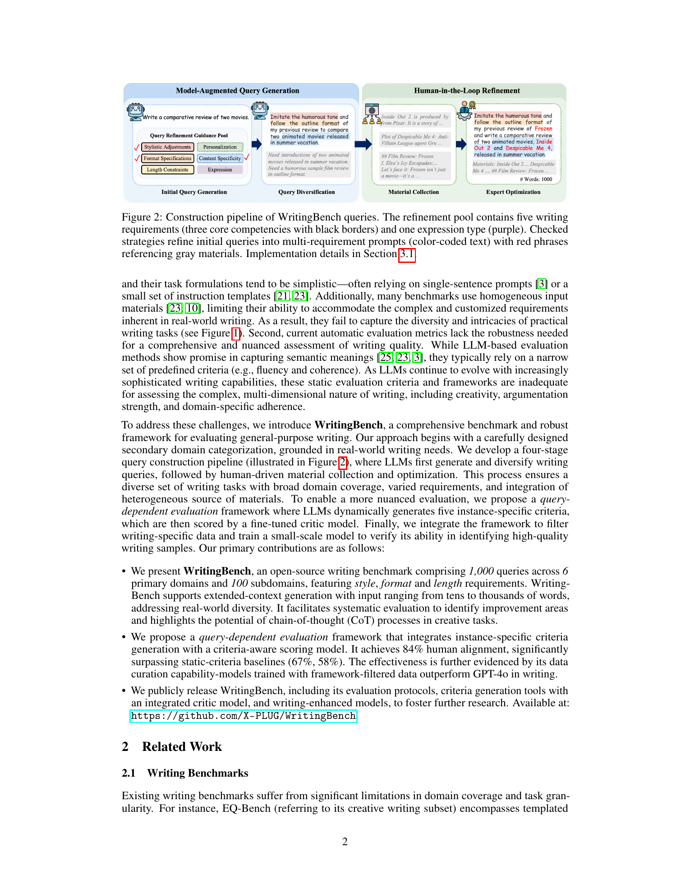
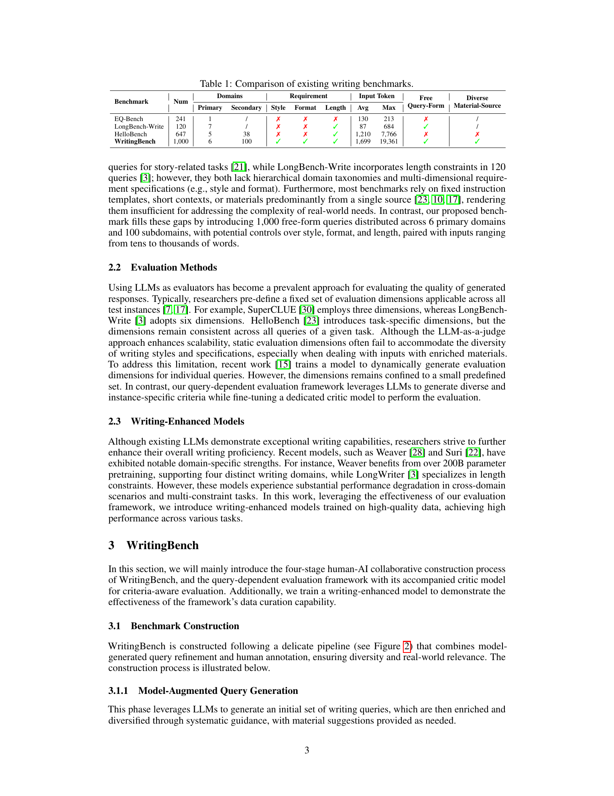
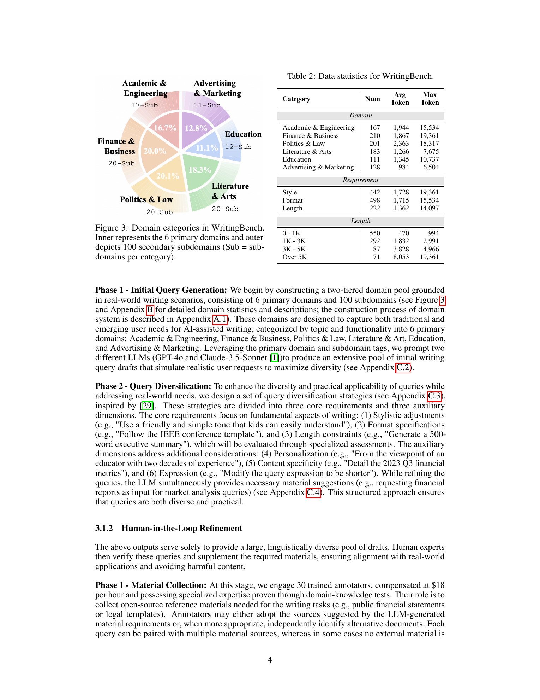
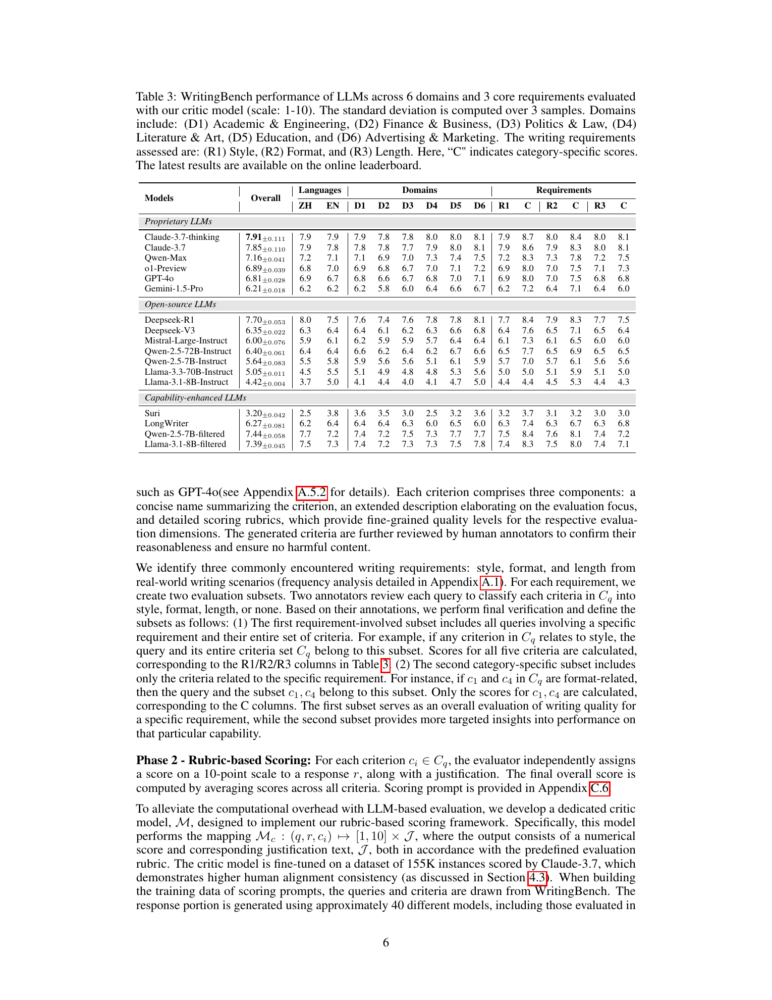

# WritingBench: A Comprehensive Benchmark for Generative Writing

## TL;DR

WritingBench is a 1,000-query benchmark for evaluating LLMs on realistic generative writing tasks. It covers 6 primary domains, 100 subdomains, Chinese and English prompts, long reference materials, and explicit style, format, and length constraints. The paper also proposes a query-dependent evaluator: an LLM generates five instance-specific criteria for each query, then a fine-tuned critic model scores responses against those criteria. The main finding is that static writing rubrics are too coarse for diverse writing tasks, while dynamic criteria improve human alignment and can filter training data well enough for 7B models to outperform GPT-4o on the authors' benchmark.

Source: [arXiv:2503.05244](https://arxiv.org/abs/2503.05244), [PDF](https://arxiv.org/pdf/2503.05244.pdf). The reviewed manuscript is arXiv v4, revised on 2025-11-27.

## Background

LLM writing evaluation is hard because "good writing" is not a single capability. A legal memo, a product launch post, a children's science explanation, a bid proposal, and a screenplay need different evidence, tone, structure, constraints, and success criteria. Many existing benchmarks narrow the problem to short prompts, single-domain creative writing, or fixed templates, which makes automatic scoring easier but misses the diversity of real writing requests.

The paper argues that evaluation should move closer to how writing is actually requested: users provide a goal, context materials, stylistic preferences, format requirements, and sometimes exact length constraints. A useful benchmark must therefore test long-context use, material grounding, domain knowledge, and constraint following at the same time.

WritingBench sits in that gap. It is both a benchmark and an evaluation framework: the benchmark supplies varied writing tasks, while the framework generates per-query rubrics so the scoring criteria can follow the actual request instead of relying on one global checklist.

## Problem

The paper targets two coupled problems:

1. Existing writing benchmarks do not cover enough domains, subdomains, input-material types, or writing requirements.
2. Existing automatic evaluators usually use static criteria such as fluency, coherence, and helpfulness, which fail to capture query-specific constraints.

For a writing query \(q\), response \(r\), and generated criteria set

\[
C_q = \{c_1, c_2, \ldots, c_5\},
\]

the paper's evaluation objective is to score the response by applying a criterion-aware critic model:

\[
M_c(q, r, c_i) \rightarrow [1, 10] \times J_i,
\]

where \(J_i\) is the justification for criterion \(c_i\). The final score averages the five criterion scores:

\[
S(q, r) = \frac{1}{|C_q|}\sum_{i=1}^{|C_q|} M_c(q, r, c_i).
\]

This formulation makes the evaluator conditional on the actual writing task. A screenplay prompt can be judged on scene structure and pacing; a finance prompt can be judged on whether it uses provided financial data; a legal prompt can be judged on clause-specific reasoning and format compliance.

## Method

WritingBench is built through a four-stage human-AI pipeline. First, the authors create a two-tier taxonomy with 6 primary domains and 100 subdomains: Academic & Engineering, Finance & Business, Politics & Law, Literature & Art, Education, and Advertising & Marketing. GPT-4o and Claude-3.5-Sonnet generate initial writing-query drafts for these categories.

Second, the initial queries are diversified with strategies covering style, format, length, personalization, content specificity, and expression. The core evaluated requirements are style, format, and length. The auxiliary dimensions make prompts more realistic by adding perspective, specificity, and varied phrasing.

Third, 30 trained annotators collect or verify open-source reference materials for queries that need external context, such as reports, statutes, templates, or factual background. Fourth, five experts screen and optimize the data by removing unrealistic or harmful items, clarifying ambiguous instructions, pruning irrelevant material, and adding high-quality original queries.

The resulting benchmark has 1,000 queries, with 445 Chinese and 555 English prompts. It is materially longer and more diverse than earlier writing benchmarks: the paper reports an average input length of 1,699 tokens and a maximum of 19,361 tokens. It also explicitly tracks style, format, and length requirements, with 442 style-related, 498 format-related, and 222 length-related queries.

For evaluation, the framework has two phases. In the first phase, Claude-3.7 generates five criteria for each query. Each criterion includes a name, a description, and detailed scoring rubrics. Human annotators review criteria for reasonableness and safety. In the second phase, a Qwen-2.5-7B-Instruct-based critic model scores each response against each criterion. The critic is trained on about 155K Claude-3.7-scored examples drawn from WritingBench queries, generated responses, and generated criteria.

The authors also test whether the evaluator can curate training data. They generate 24K writing queries, produce responses with Deepseek-R1, score them with the query-dependent evaluator, keep the top 50 percent per subdomain, and fine-tune Qwen-2.5-7B-Instruct and Llama-3.1-8B-Instruct on the filtered 12K examples.

## Experiments

The benchmark evaluates 17 models, including proprietary models, open-weight models, writing-specialized models, and the authors' filtered-data fine-tunes. The strongest overall model in Table 3 is Claude-3.7-thinking at 7.91, followed by Claude-3.7 at 7.85 and Deepseek-R1 at 7.70. GPT-4o scores 6.81. The filtered Qwen-2.5-7B model scores 7.44, and the filtered Llama-3.1-8B model scores 7.39, both far above their base versions.

The domain analysis is useful. Education and Advertising & Marketing are easier for most models, while Academic & Engineering and Finance & Business are harder because they require stronger source integration, domain knowledge, and long-form consistency. The paper also identifies difficult subdomains such as bid proposals, financial reports, and white papers.

The requirement analysis shows that style is generally easier than format, while length is the weakest requirement. The paper reports that many models still struggle with section-level length constraints and long-output generation, often saturating around 3,000 output tokens. Claude-3.7 variants and Qwen-Max are highlighted as stronger long-output generators.

The human-alignment study compares dynamic query-dependent criteria against static global and static domain-specific rubrics. On 300 held-out queries, Claude-3.7 with dynamic criteria reaches 87 percent agreement with human preferences, compared with 67 percent for static global criteria and 58 percent for static domain-specific criteria. The fine-tuned critic model reaches 84 percent, which is close enough to support scalable benchmark scoring while still leaving room for human calibration.

The data-curation experiment supports the evaluator's usefulness beyond ranking. Qwen-2.5-7B-filtered improves from 5.64 to 7.44 on WritingBench, while Llama-3.1-8B-filtered improves from 4.42 to 7.39. The filtered datasets slightly outperform the full 24K datasets, suggesting that the critic is not just rewarding volume but selecting higher-quality writing examples.

## Critical Analysis

The strongest contribution is the combination of benchmark diversity and query-specific scoring. WritingBench does not pretend that one static rubric can evaluate all writing tasks. The per-query criteria are a better match for real user requests, where the important constraints are often local to the prompt and source material.

The dataset construction is also stronger than a pure synthetic benchmark. LLM-generated drafts provide breadth, but human material collection and expert refinement reduce the risk that the benchmark becomes a set of artificial prompt templates. The inclusion of bilingual prompts and long reference materials makes the benchmark more representative of production writing workflows.

The biggest limitation is evaluator circularity. The critic model is trained from Claude-3.7 scores over Claude-generated criteria, and the benchmark leaderboard is then scored by that critic. The human-alignment study partially addresses this, but 300 pairwise examples cannot rule out systematic preferences inherited from Claude or the critic training process.

The data-curation result should also be read carefully. Filtered 7B models outperform GPT-4o on WritingBench, but they are trained with data selected by the same family of evaluation signals used for benchmark scoring. That is still useful evidence that the evaluator can shape writing behavior, but independent human evaluations and external benchmarks are needed before treating the result as a general writing-quality improvement.

Another practical concern is Goodharting. Once a benchmark uses generated criteria and a known critic model, models can overfit to criterion-style writing, rubric-friendly structure, or the critic's scoring preferences. Future versions would benefit from private held-out queries, multiple independent critics, and periodic human audits.

## Implementation Notes

For benchmark users, the most important implementation detail is to preserve the full evaluation trace: query, reference materials, generated criteria, response, per-criterion scores, justifications, language, domain, subdomain, and requirement tags. A single average score is not enough to diagnose writing failures.

For training pipelines, the evaluator is best used as a filter or diagnostic tool, not as the only reward signal. A practical setup would reserve a human-labeled calibration set and track whether the critic's selected examples improve human preference, not just WritingBench score.

For model comparison, report domain and requirement slices separately. A model that is strong in Advertising & Marketing but weak in Finance & Business should not be summarized only by its global score. Similarly, length compliance deserves its own tracking because the paper shows it remains a persistent weakness.

The paper's scoring formulation is simple to reproduce:

\[
\mathrm{score}(q, r) = \frac{1}{5}\sum_{i=1}^{5}\mathrm{critic}(q, r, c_i),
\]

but the hard part is maintaining criteria quality. In practice, criterion generation should be versioned, sampled for human review, and checked for criteria that leak desired answers, ignore source material, or overemphasize surface formatting.

## Captured Figures and Tables

