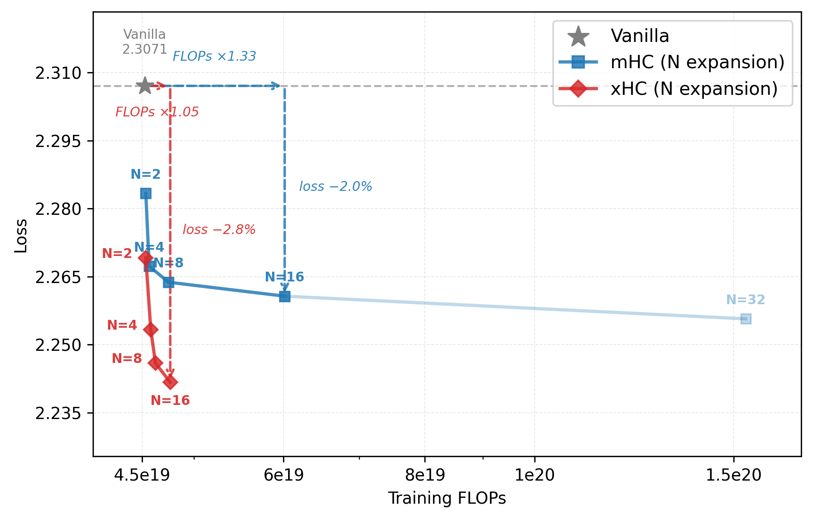
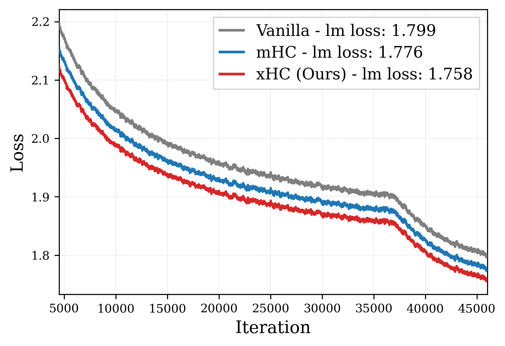
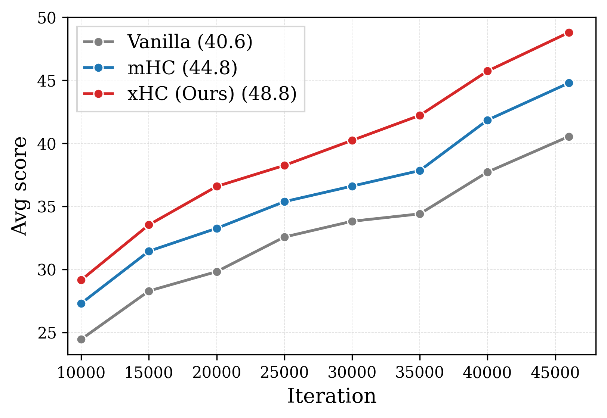
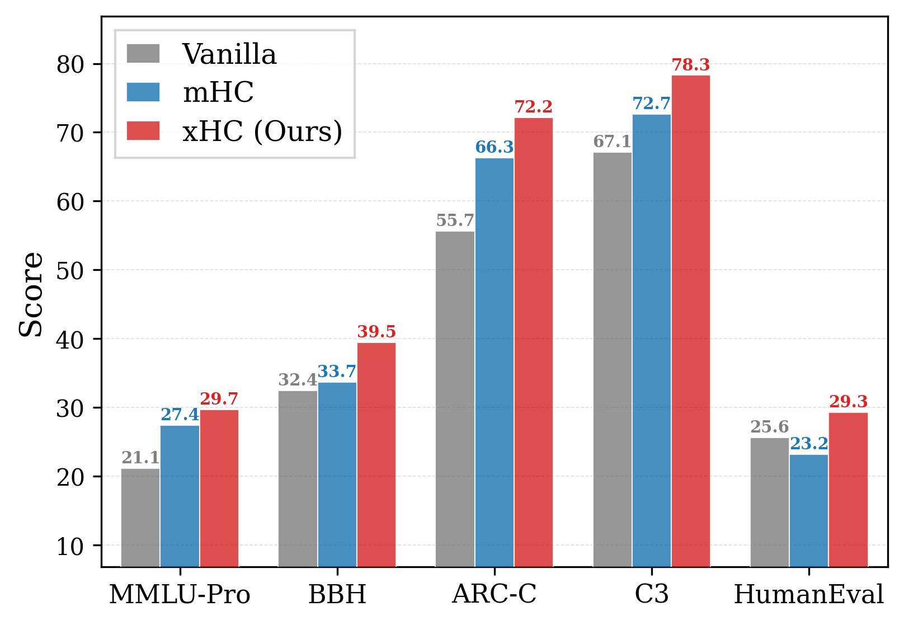
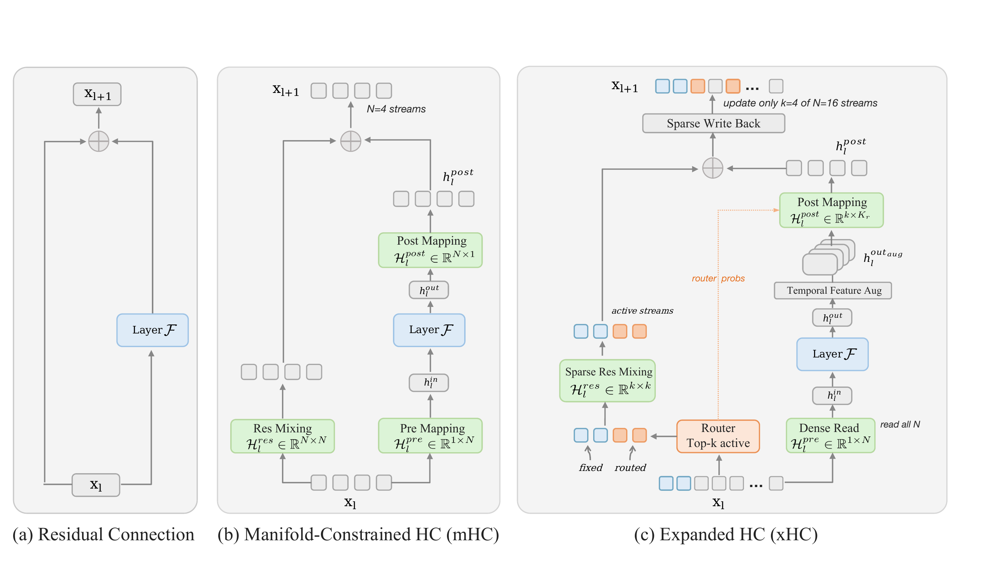
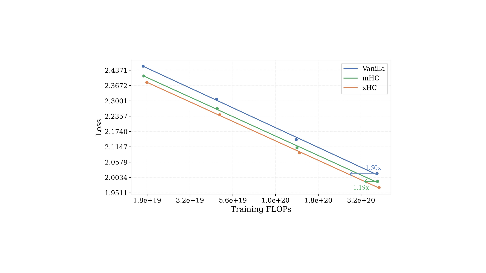
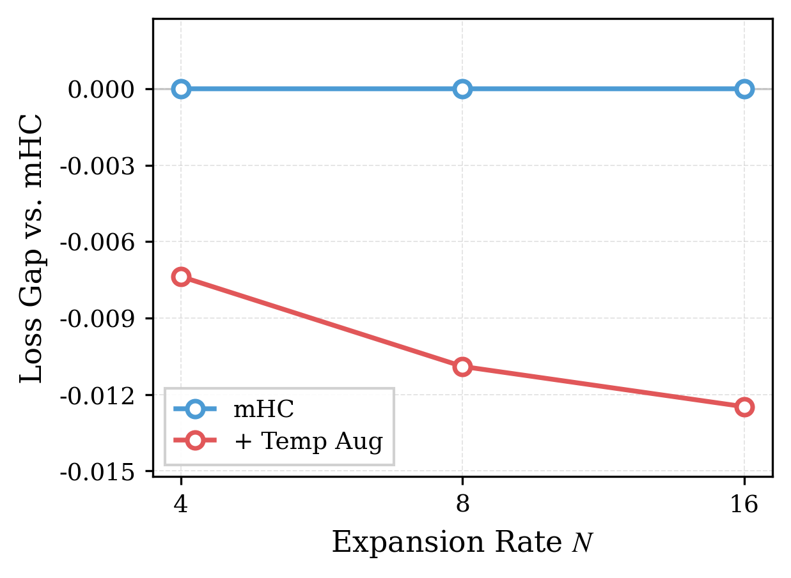
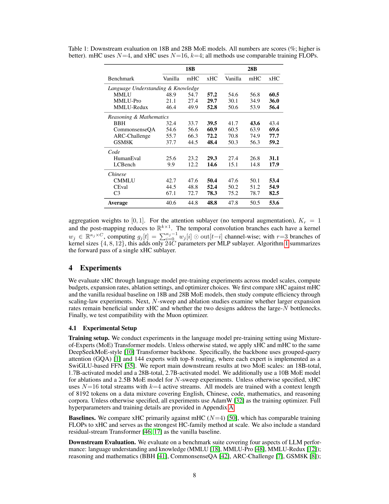
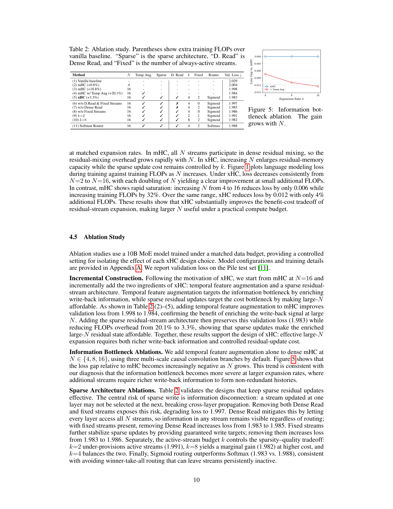
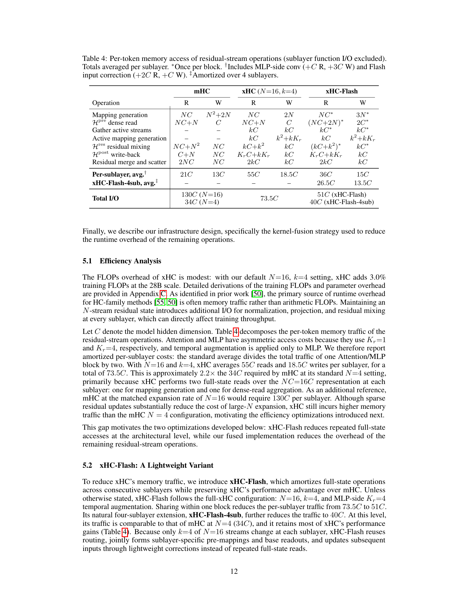

# xHC: Expanded Hyper-Connections

## TL;DR

xHC is the first Hyper-Connections (HC) method to scale the residual-stream expansion rate beyond $N=4$ in Transformers, achieving meaningful gains at $N=16$ through temporal feature augmentation (multi-scale causal convolutions enriching write-back signals) and sparse residual-stream updates (activating only $k=4$ of $N=16$ streams). On 18B and 28B MoE models, xHC improves average downstream scores by 4.0 and 3.1 points over mHC respectively, while adding only modest training FLOPs.

## Background

Hyper-Connections (HC) generalize the residual stream in Transformers from a single identity pathway to $N$ parallel streams governed by learnable mixing matrices. Manifold-Constrained HC (mHC) stabilizes this at scale via Sinkhorn-normalized residual mixing and achieves the strongest results among HC-family methods at $N=4$. The large gains from $N=1$ to $N=4$ suggest residual-stream expansion as a promising scaling axis orthogonal to model width and depth.

## Problem

Existing HC-family methods stop at $N=4$. The authors identify two bottlenecks preventing meaningful expansion beyond this point:

1. **Information bottleneck**: Each layer injects only a single write-back signal (the layer output) into all $N$ streams. As $N$ grows, additional streams become redundant because they cannot draw from diverse enough write-back components.
2. **Cost bottleneck**: In mHC, generating the $N \times N$ residual mapping $H_{\text{res}}$ from the $NC$-dimensional state costs $O(N^3 C)$, making large-$N$ expansion increasingly expensive relative to diminishing returns.

Empirically, increasing $N$ from 4 to 16 in mHC reduces loss by only 0.006 while increasing training FLOPs by 32%.

## Method

### Temporal Feature Augmentation

To enrich the write-back signal, xHC borrows local contextual information from neighboring tokens via causal depthwise 1D convolutions with kernel sizes $\{4, 8, 12\}$, producing $K_r = 4$ augmented write-back components (the original output plus 3 convolutional branches). A modified Gram–Schmidt orthogonalization ensures these components are non-redundant. This is applied only after MLP layers (attention already mixes positions).

### Sparse Residual-Stream Architecture

A router selects $k=4$ of $N=16$ streams for update at each sublayer using a fixed-plus-routed scheme (2 always-active fixed streams + 2 dynamically selected via TopK over sigmoid scores). Key design:

- **Dense read**: Every layer aggregates from all $N$ streams, preserving cross-layer information flow
- **Sparse write-back**: Residual mixing and post-mapping operate only on the $k$ active streams, reducing the dominant cost from $O(N^3 C)$ to $O(k^3 C)$

The two designs are complementary: temporal augmentation makes additional streams more informative, while sparse updates make large $N$ affordable.

### xHC-Flash

A memory-efficient variant that amortizes full-state operations across consecutive sublayers:
- Shared routing per block (single routing decision for both Attention and MLP)
- Joint pre-mapping generation from block-entry state
- Attention-side $H_{\text{res}}$ removed, with exact dense-read reuse correction
- Reduces per-sublayer memory traffic from $73.5C$ (full xHC) to $40C$ (xHC-Flash-4sub), comparable to mHC at $N=4$ ($34C$)

### Fused Kernels

Triton-based kernel fusion consolidates mapping generation (router + pre-mapping from shared flattened state), mapping application (dense pre-mapping read + sparse residual mixing fused), and post-mapping + routing-weight scaling + scatter. Backward kernels combine gradient accumulation to reduce intermediate tensors.

## Experiments

### Setup
- Models: DeepSeekMoE-style Transformers with GQA, 144 routed experts (top-8), SwiGLU FFN
- Scales: 18B-total/1.7B-activated and 28B-total/2.7B-activated for main results; 10B for ablations; 2.5B for $N$-sweeps
- Training: AdamW (WSD schedule), context length 8192, mixed English/Chinese/code/math data
- Default xHC: $N=16$, $k=4$, $m=2$ fixed streams

### Main Results (Table 1)

| Benchmark | Vanilla | mHC | xHC | Vanilla (28B) | mHC (28B) | xHC (28B) |
|-----------|---------|-----|-----|---------------|-----------|-----------|
| MMLU | 48.9 | 54.7 | **57.2** | 54.6 | 56.8 | **60.5** |
| MMLU-Pro | 21.1 | 27.4 | **29.7** | 30.1 | 34.9 | **36.0** |
| BBH | 32.4 | 33.7 | **39.5** | 41.7 | **43.6** | 43.4 |
| CommonsenseQA | 54.6 | 56.6 | **60.9** | 60.5 | 63.9 | **69.6** |
| ARC-Challenge | 55.7 | 66.3 | **72.2** | 70.8 | 74.9 | **77.7** |
| GSM8K | 37.7 | 44.5 | **48.4** | 50.3 | 56.3 | **59.2** |
| HumanEval | 25.6 | 23.2 | **29.3** | 27.4 | 26.8 | **31.1** |
| **Average** | 40.6 | 44.8 | **48.8** | 47.8 | 50.5 | **53.6** |

xHC improves the average score by +4.0 over mHC at 18B and +3.1 at 28B.

### Scaling Laws

Fitted power laws across compute budgets show xHC traces a consistently lower loss curve. To reach the same loss, the vanilla baseline requires $1.50\times$ and mHC requires $1.19\times$ the compute of xHC.

### N-Sweep

On a 2.5B MoE model, xHC shows consistent loss reduction from $N=2$ to $N=16$ at small FLOPs cost (+4%), while mHC saturates rapidly ($N=4 \to 16$ yields only 0.006 loss reduction at +32% FLOPs).

### Ablations (Table 2)

- Temporal augmentation alone on mHC at $N=16$: val loss $1.998 \to 1.984$
- Full xHC (temporal + sparse): val loss $1.983$ at only +3.3% FLOPs (vs. +20.1% for mHC $N=16$)
- Dense Read is critical: removing it increases loss from $1.983$ to $1.985$
- Fixed streams provide stability: removing them increases loss from $1.983$ to $1.986$
- Sigmoid routing outperforms Softmax ($1.983$ vs. $1.988$)

### Muon Compatibility

xHC gains transfer to Muon optimizer (without Gram–Schmidt). Average score improves from 43.1 (Muon baseline) to 49.9 (Muon + xHC).

### Efficiency (Table 5)

| Method | Val. Loss | I/O / sublayer |
|--------|-----------|----------------|
| Vanilla | 2.029 | 3C |
| mHC ($N=4$) | 2.004 | 34C |
| xHC ($N=16$, $k=4$) | **1.983** | 73.5C |
| xHC-Flash | **1.983** | 51C |
| xHC-Flash-4sub | 1.984 | 40C |

xHC-Flash-4sub achieves memory traffic comparable to mHC at $N=4$ while retaining performance.

## Critical Analysis

**Strengths:**
- Clean diagnosis of two distinct bottlenecks (information + cost) limiting HC expansion
- Complementary designs that address each bottleneck independently yet synergize well
- Strong empirical validation across two model scales, scaling laws, ablations, and optimizer compatibility
- Practical deployment path through xHC-Flash and fused kernels
- Modest FLOPs overhead (+3-4%) for substantial downstream gains

**Weaknesses:**
- All experiments use MoE models; dense Transformer validation is missing
- Only evaluated on language model pre-training benchmarks; no instruction-tuning or downstream task fine-tuning results
- The paper does not release model weights, making independent verification difficult
- Gram–Schmidt orthogonalization is removed under Muon without thorough analysis of when this is safe
- The fixed-plus-routed routing scheme (always 2 fixed + 2 routed) is not justified by ablation over different $m$ values

## Implementation Notes

- xHC applies temporal feature augmentation only after MLP layers (not attention), as attention already mixes positions and adding convolutions there destabilizes training
- Sinkhorn normalization uses 20 iterations with row-sum clamping for stability
- Gating factor $\alpha$ initialized to 0.01 for gradual transition from static to dynamic mappings
- Router uses sigmoid (not softmax) to reduce winner-take-all behavior
- Final stream reduction sums all $N$ streams before the LM head
- The code is available at https://github.com/aHapBean/xHC

## Captured Figures and Tables

**Figures:**

*Figure 1. Expansion efficiency: loss vs. FLOPs on a 2.5B MoE model. xHC achieves meaningful loss reduction from $N=2$ to $N=16$ at small FLOPs cost, while mHC saturates.*

*Figure 2a. Training loss comparison at 18B MoE scale.*

*Figure 2b. Average downstream score comparison.*

*Figure 2c. Benchmark-level gains across reasoning, knowledge, and code.*

*Figure 3. Overview of xHC architecture: standard residual (a), mHC (b), and xHC with sparse residual streams and temporal feature augmentation (c).*

*Figure 4. Scaling-law comparison. xHC traces a consistently lower loss curve than mHC and vanilla baseline.*

*Figure 5. Information bottleneck ablation. The gain from temporal augmentation grows with $N$.*

**Tables:**

*Table 1. Downstream evaluation on 18B and 28B MoE models.*

*Table 2. Ablation study on xHC components.*

*Table 4. Per-token memory access analysis.*
